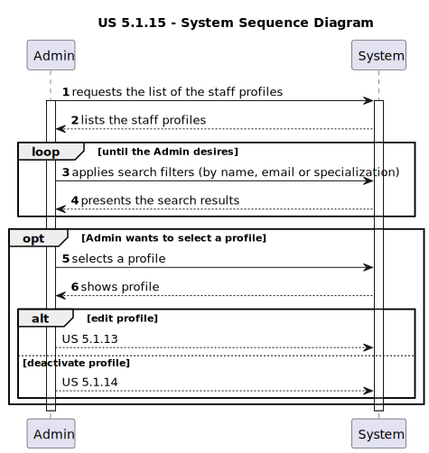
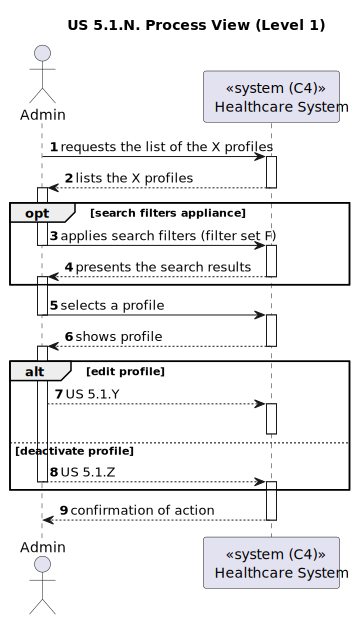
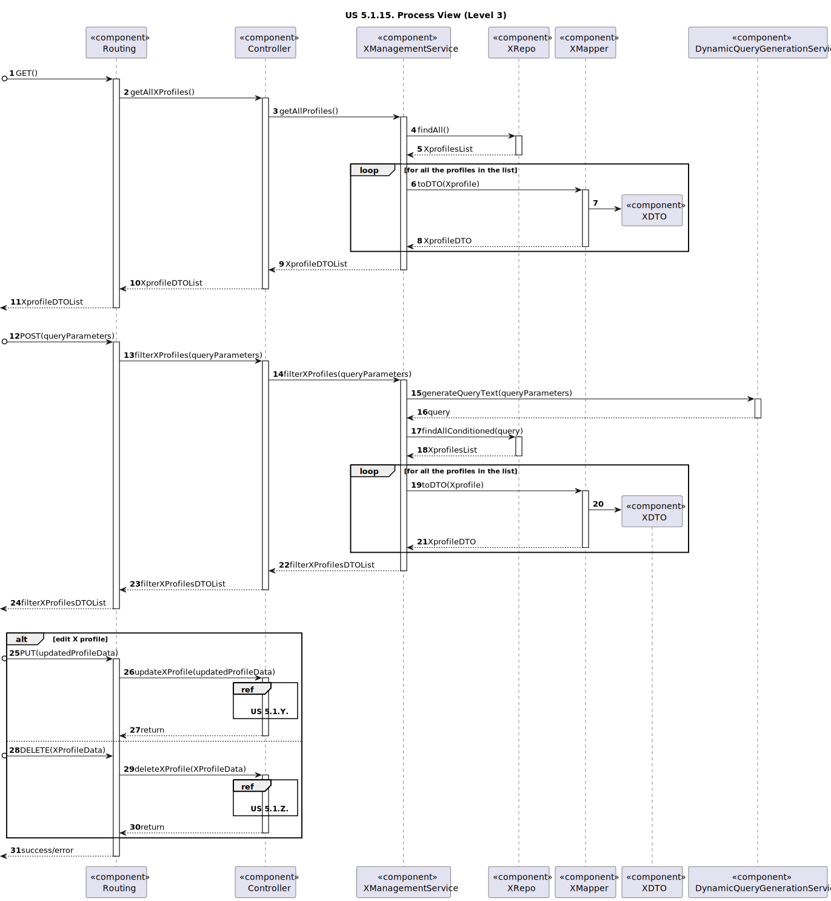

# US 5.1.15

<!-- TOC -->
* [US 5.1.15](#us-5115)
  * [1. Context](#1-context)
  * [2. Requirements](#2-requirements)
  * [3. Analysis](#3-analysis)
    * [System Sequence Diagram](#system-sequence-diagram)
  * [4. Design](#4-design)
    * [4.1. Realization](#41-realization)
    * [Process View](#process-view)
      * [Level 1](#level-1)
      * [Level 2](#level-2)
      * [Level 3](#level-3)
    * [4.3. Applied Patterns](#43-applied-patterns)
    * [4.4. Tests](#44-tests)
  * [5. Implementation](#5-implementation)
  * [6. Integration/Demonstration](#6-integrationdemonstration)
  * [7. Observations](#7-observations)
<!-- TOC -->

## 1. Context

This is the first time this user story is being presented.

## 2. Requirements

**US 5.1.15:** As an Admin, I want to list/search staff profiles, so that I can see the details, edit, and remove staff profiles.

**Acceptance Criteria:**

- **5.1.15.1.** | Admins can search staff profiles by attributes such as name, email, or specialization.

- **5.1.15.2.** | The system displays search results in a list view with key staff information (name, email, specialization).

- **5.1.15.3.** | Admins can select a profile from the list to view, edit, or deactivate.

- **5.1.15.4.** | The search results are paginated, and filters are available for refining the search results.

- **5.1.15.5.** | It is possible to apply multiple filters to a search result.

**Dependencies/References:**

This feature is dependent on the existence of staff profiles previously created by the Admin (**US 5.1.12**), as well as the functionalities
to edit (**US 5.1.13**) and remove/deactivate (**US 5.1.14**) them.

**Client Clarifications:**

> **Question:** What types of filters can be applied when searching for profiles?
>
> **Answer:** Filters can include doctor specialization, name, or email to refine search results
>
> **Client Words:** I want to list everything, so there are no filters. So I want to have a filter where I only list doctors,
> or only list doctors who belong to a specialization, whether it's a doctor or a physician. Or I want to have a combination
> of that. I want to look for whether this is a doctor or a physician, or what specialization this person is in.

## 3. Analysis

The Admin has access to all the profiles within the healthcare system, including Staff profiles, that can be consulted in
a list. In this list, the Admin selects a profile to see its details, update and remove/deactivate it.

The Admin can search profiles by the staff's name, email or specialization, and the search results are presented through
a paginated list, with search filters to refine the selection of listed profiles.

Multiple filters can be used simultaneously.

### System Sequence Diagram

The following diagram depicts the interaction between the Admin and the system.

## 4. Design

### 4.1. Realization

The logical, physical, development and scenario views diagrams are generic for all the use cases of the backoffice component.
These diagrams can be found in the [generic views diagrams compilation file](../../team-decisions/views/general-views.md).

Regarding this user story in particular, it's very similar to [US 5.1.11.](../us-5.1.11/readme.md), so diagrams of generic
process views of each level were created to represent both.

In the following diagrams, the listed variables represent the respective concepts:

* **N** is 15, represents the current user story -> US 5.1.15.
* **X** represents Staff
* **F** represents the set of filters applicable to staff (name, email, specialization)
* **Y** is 13, represents the staff profile edition user story -> US 5.1.13.
* **Z** is 14, represents the staff profile deactivation/deletion user story -> US 5.1.14.

### Process View

#### Level 1

#### Level 2

#### Level 3

### 4.3. Applied Patterns

_// To do //_

### 4.4. Tests

_// To do - layout still in development //_ 

## 5. Implementation

_// To do //_

## 6. Integration/Demonstration

_// To do //_

## 7. Observations

_// To do //_