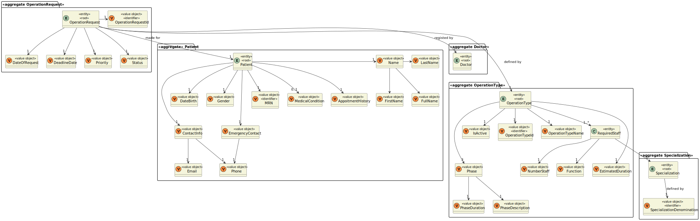

# US 5.1.17

<!-- TOC -->
* [US 5.1.17](#us-5117)
  * [1. Context](#1-context)
  * [2. Requirements](#2-requirements)
  * [3. Analysis](#3-analysis)
    * [System Sequence Diagram](#system-sequence-diagram)
    * [Domain Model](#domain-model)
  * [4. Design](#4-design)
    * [4.1. Realization](#41-realization)
    * [Process View](#process-view)
      * [Level 1](#level-1)
      * [Level 2](#level-2)
      * [Level 3](#level-3)
    * [4.3. Applied Patterns](#43-applied-patterns)
    * [4.3. Applied Patterns](#43-applied-patterns-1)
    * [4.4. Tests](#44-tests)
  * [5. Implementation](#5-implementation)
  * [6. Integration/Demonstration](#6-integrationdemonstration)
  * [7. Observations](#7-observations)
<!-- TOC -->

## 1. Context

This is the first time this user story is presented.

## 2. Requirements

**US 5.1.17:** As a Doctor, I want to update an operation requisition, so that the Patient has access to the necessary healthcare.

**Acceptance Criteria:**

- **5.1.17.1.** | Doctors can update operation requests they created (e.g., change the deadline or priority).

- **5.1.17.2.** | The system checks that only the requesting doctor can update the operation request.

- **5.1.17.3.** | The system logs all updates to the operation request (e.g., changes to priority or deadline).

- **5.1.17.4.** | Updated requests are reflected immediately in the system and notify the Planning Module of any changes.

**Dependencies/References:**

This functionality is dependent on the creation of an operation requisition (**US 5.1.16**) by a Doctor registered in the healthcare 
system (**US 5.1.12** and **US 5.1.1**).

**Client Clarifications:**

> **Question:** What information can physicians update on an operating requisition?
>
> **Answer:** Physicians can update the operating time, priority, and description text, but not change the patient.

> **Question:** An operation request has a priority attribute. What priorities exist?
>
> **Answer:** Elective, Urgent, and Emergency Surgery Classifications
>
> >**Elective Surgery:** A planned procedure that is not life-threatening and can be scheduled at a convenient time (e.g., joint replacement, cataract surgery).
> >
> >**Urgent Surgery:** Needs to be done sooner but is not an immediate emergency. Typically, within days (e.g., certain types of cancer surgeries).
> >
> >**Emergency Surgery:** Needs immediate intervention to save life, limb, or function. Typically performed within hours (e.g., ruptured aneurysm, trauma)

> **Question:** How does a Doctor suggests a deadline date for an appointment? Does it have any criteria? Or do they just wing it?
>
> **Answer:** The doctor will decide the "best" due date based on their experience. they will enter it in the system as 
> an indication so that the planning module eventually takes that into account alongside priority and other criteria

> **Question:** What does “status” refer to in the context of searching for operating requisitions?
>
> **Answer:** Status refers to whether the operation is planned or requested.

> **Question:** What is the difference between appointment, surgery, and operation?
>
> **Answer:** Surgery is a medical procedure (e.g., hip surgery), while an operation request is when a doctor schedules that surgery for a patient. An appointment is the scheduled date for the operation, determined by the planning module.

> **Question:** When does an operation request become an appointment?
>
> **Answer:** When it is scheduled by the planning/scheduling module.

## 3. Analysis

Upon the Doctor creating an operation requisition, they can also edit/update it, to ensure the patient's access to appropriate
healthcare. This constrain is checked by the system.

The information that can be edited is the following one:
- deadline
- priority
- description text

While the priority must be one of the types already in the system (Elective < Urgent < Emergency), the deadline is provided by the doctor, that defines it
based on their experience as staff.

Each single data edition is registered in the system logs and immediately reflected in the system and Planning Module.

### System Sequence Diagram

The following diagram depicts the interaction between the Doctor and the system.

### Domain Model

**Observation:** MRN refers to the medical record number.

## 4. Design

### 4.1. Realization

The logical, physical, development and scenario views diagrams are generic for all the use cases of the backoffice component.
These diagrams can be found in the [generic views diagrams compilation file](../../team-decisions/views/general-views.md).

The process view levels are here represented as they represent a process specific to each user story.

### Process View

#### Level 1

#### Level 2

#### Level 3

### 4.3. Applied Patterns

_// To do //_

### 4.3. Applied Patterns

_// To do //_

### 4.4. Tests

_// To do - layout still in development //_ 

## 5. Implementation

_// To do //_

## 6. Integration/Demonstration

_// To do //_

## 7. Observations

_// To do //_