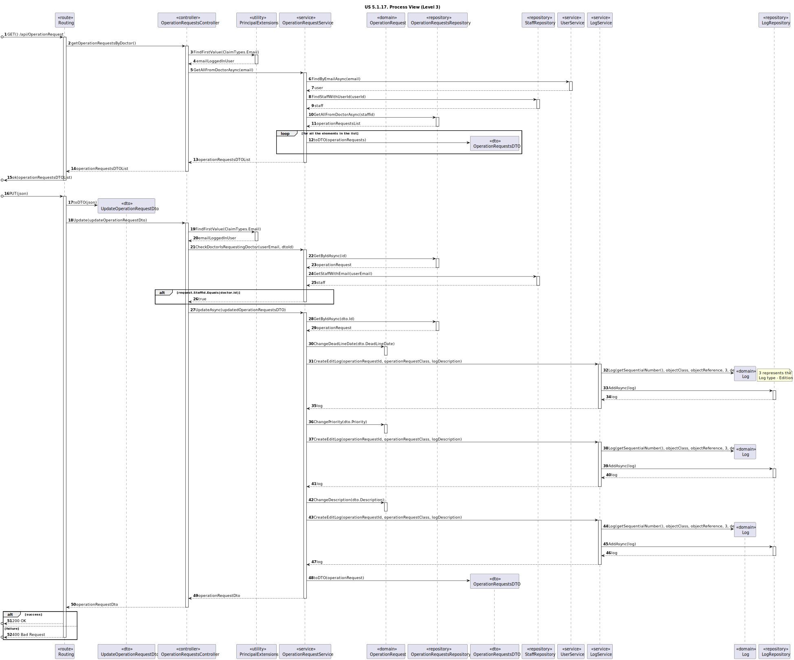

# US 5.1.17

<!-- TOC -->
* [US 5.1.17](#us-5117)
  * [1. Context](#1-context)
  * [2. Requirements](#2-requirements)
  * [3. Analysis](#3-analysis)
    * [System Sequence Diagram](#system-sequence-diagram)
    * [Domain Model](#domain-model)
  * [4. Design](#4-design)
    * [4.1. Realization](#41-realization)
    * [Process View](#process-view)
      * [Level 1](#level-1)
      * [Level 2](#level-2)
      * [Level 3](#level-3)
    * [4.3. Applied Patterns](#43-applied-patterns)
    * [4.4. Tests](#44-tests)
  * [5. Implementation](#5-implementation)
  * [6. Integration/Demonstration](#6-integrationdemonstration)
  * [7. Observations](#7-observations)
<!-- TOC -->


## 1. Context

This is the first time this user story is presented.

## 2. Requirements

**US 5.1.17:** As a Doctor, I want to update an operation requisition, so that the Patient has access to the necessary healthcare.

**Acceptance Criteria:**

- **5.1.17.1.** | Doctors can update operation requests they created (e.g., change the deadline or priority).

- **5.1.17.2.** | The system checks that only the requesting doctor can update the operation request.

- **5.1.17.3.** | The system logs all updates to the operation request (e.g., changes to priority or deadline).

- **5.1.17.4.** | Updated requests are reflected immediately in the system and notify the Planning Module of any changes.


**Dependencies/References:**

This functionality is dependent on the creation of an operation requisition (**US 5.1.16**) by a Doctor registered in the healthcare 
system (**US 5.1.12** and **US 5.1.1**).

**Client Clarifications:**

> **Question:** What information can physicians update on an operating requisition?
>
> **Answer:** Physicians can update the operating time, priority, and description text, but not change the patient.


> **Question:** An operation request has a priority attribute. What priorities exist?
>
> **Answer:** Elective, Urgent, and Emergency Surgery Classifications
>
> >**Elective Surgery:** A planned procedure that is not life-threatening and can be scheduled at a convenient time (e.g., joint replacement, cataract surgery).
> >
> >**Urgent Surgery:** Needs to be done sooner but is not an immediate emergency. Typically, within days (e.g., certain types of cancer surgeries).
> >
> >**Emergency Surgery:** Needs immediate intervention to save life, limb, or function. Typically performed within hours (e.g., ruptured aneurysm, trauma)


> **Question:** How does a Doctor suggests a deadline date for an appointment? Does it have any criteria? Or do they just wing it?
>
> **Answer:** The doctor will decide the "best" due date based on their experience. they will enter it in the system as 
> an indication so that the planning module eventually takes that into account alongside priority and other criteria


> **Question:** What does “status” refer to in the context of searching for operating requisitions?
>
> **Answer:** Status refers to whether the operation is planned or requested.


> **Question:** What is the difference between appointment, surgery, and operation?
>
> **Answer:** Surgery is a medical procedure (e.g., hip surgery), while an operation request is when a doctor schedules that surgery for a patient. An appointment is the scheduled date for the operation, determined by the planning module.


> **Question:** When does an operation request become an appointment?
>
> **Answer:** When it is scheduled by the planning/scheduling module.


> **Question:** There was a previous question, "What information can physicians update on an operating requisition?", with the following answer, "Physicians can update the operating time, priority, and description text, but not change the patient.". However, half of this answer applies to the Operation Type, instead of the Operation Request.
> Operation Requests have, at least, an ID, a Patient, an Operation Type, a Doctor, a Deadline Date, and a Priority. Considering the previous answer, the doctor cannot change the Patient ID but can change the Priority. Besides the Priority, could the doctor also update the Deadline Date or Operation Type?
>
> **Answer:** The answer was about operation requests, not operation types. I believe the term "operation time" in the original answer was the reason for this misunderstanding, as it means the expected deadline for the request, not the duration.
> Thus, the doctor can change the deadline, the priority, and the description. the doctor cannot change the operation type nor the patient


## 3. Analysis

Upon the Doctor creating an operation requisition, they can also edit/update it, to ensure the patient's access to appropriate
healthcare. This constrain is checked by the system.

**The information that can be edited is the following one:**
- deadline
- priority
- description text

**The following information that cannot be edited:**
- patient
- operation type

While the priority must be one of the types already in the system (Elective < Urgent < Emergency), the deadline is provided by the doctor, that defines it based on their experience as staff.

Each single data edition is registered in the system logs and immediately reflected in the system and Planning Module.

### System Sequence Diagram

The following diagram depicts the interaction between the Doctor and the system.


### Domain Model


**Observation:** MRN refers to the medical record number.

## 4. Design

### 4.1. Realization

The logical, physical, development and scenario views diagrams are generic for all the use cases of the backoffice component.
These diagrams can be found in the [generic views diagrams compilation file](../../team-decisions/views/general-views.md).

The process view levels are here represented as they represent a process specific to each user story.

### Process View

#### Level 1


#### Level 2


#### Level 3



### 4.3. Applied Patterns

> #### **Repository Pattern**
>
>* **Components:** StaffRepository, LogRepository, OperationRequestRepository
>
> The repositories are responsible for data access and retrieval, separating the logic for interacting with the database
> from the services and other layers. This pattern helps in abstracting the persistence logic.


> #### **DTO (Data Transfer Object) Pattern**
>
>* **Components:** UpdateOperationRequestDto, OperationRequestDTO
>
> DTOs are used to transfer data between layers, especially from the controller layer to the service layer or vice versa.
> The purpose is to carry data in a structured and decoupled way without exposing internal entity representations directly.
> This pattern does not need to follow business rules.


> #### **Facade Pattern**
>
>* **Components:** LogService, UserService, OperationRequestService
>
> These services act as a Facade to simplify interaction with lower-level components like repositories. The Controller
> interacts with these service facades, keeping the complexity hidden from the higher layers.


### 4.4. Tests

_// To do - layout still in development //_ 


## 5. Implementation

Method to update an Operation Request in the Controller:

```
// PUT: api/OperationRequest/Update
[HttpPut("Update")]
[Authorize(Policy = "Doctor")]
public async Task<ActionResult<UpdateOperationRequestDto>> Update(UpdateOperationRequestDto dto)
{
  string? userEmail = User.FindFirstValue(ClaimTypes.Email);

  if (!await _service.CheckDoctorIsRequestingDoctor(userEmail, dto.Id)){
      return BadRequest("You are not the requesting doctor for the choosen operation request.");
  }

  try
  {
      var opr = await _service.UpdateAsync(dto);

      if (opr == null)
      {
          return NotFound("An operation request with the provided ID does not exist.");
      }
      return Ok(opr);
  }
  catch (BusinessRuleValidationException ex)
  {
      return BadRequest(new { ex.Message });
  }
}
```

Method to check if the doctor accessing the operation request is the requesting doctor:

```
public async Task<bool> CheckDoctorIsRequestingDoctor(string? userEmail, string id)
{

    var request = await GetByIdAsync(new OperationRequestId(id));

    var doctor = await _repoSta.GetStaffWithEmail(userEmail);

    if (request.StaffId.Equals(doctor.Id.AsString())){
        return true;
    }

    return false;            
}
```

Method to update an Operation Request:

```
public async Task<OperationRequestDto> UpdateAsync(UpdateOperationRequestDto dto)
{
    var opRequest = await _repo.GetByIdAsync(new OperationRequestId(dto.Id));

    if (opRequest == null)
        return null;

    if (!opRequest.DeadLineDate.Equals(dto.DeadLineDate)){
        opRequest.ChangeDeadLineDate(dto.DeadLineDate);
        await _logService.CreateEditLog(opRequest.Id.ToString(), opRequest.DeadLineDate.GetType().Name, "The operation request deadline date was altered.");
    }

    if (!opRequest.Priority.Equals(dto.Priority)){
        opRequest.ChangePriority(dto.Priority);
        await _logService.CreateEditLog(opRequest.Id.ToString(), opRequest.Priority.GetType().Name, "The operation request priority was altered.");
    }

    if (!opRequest.Description.Equals(dto.Description)){
        opRequest.ChangeDescription(dto.Description);
        await _logService.CreateEditLog(opRequest.Id.ToString(), opRequest.Description.GetType().Name, "The operation request description was altered.");
    }

    await _unitOfWork.CommitAsync();

    return new OperationRequestDto(opRequest.Id.AsGuid(), opRequest.DeadLineDate.ToString(), opRequest.Priority.ToString(),
         opRequest.DateOfRequest.ToString(), opRequest.Status.ToString(), opRequest.StaffId.AsString(), opRequest.Description.DescriptionText, opRequest.PatientId.AsString(), opRequest.OperationTypeId.AsString());
}
```

Recording the changes in the system with logs:

```
public async Task<bool> CreateCreationLog(string objectReference, string objectClass, string description)
{
    try
    {
        Log log = new Log(await getSequentialNumber(), objectClass, objectReference, 2, description);
        
        await _repo.AddAsync(log);
        await _unitOfWork.CommitAsync();

        return true;
    }
    catch (Exception ex)
    {
        return false;
    }
}
```

## 6. Integration/Demonstration

This demonstration happens in Postman, where a json is sent with the updated operation request data.

Original Operation Request data:

```
{
"deadLineDate": "2024-10-24",
"priority": "Elective",
"dateOfRequest": "2024-10-20",
"status": "requested",
"staffId": "D202400001",
"description": "This patient needs to have a major surgery.",
"patientId": "202410000001",
"operationTypeId": "ACL Reconstruction Surgery"
}
```

Updating the Operation Request:


After the update, the information in the database is updated.


As stated in the [requirements](#2-requirements), only the requesting doctor can access their operation requests.
After registering and logging in as another doctor, by accessing an operation request that is not ours, the following
response is obtained:


## 7. Observations

No observations.