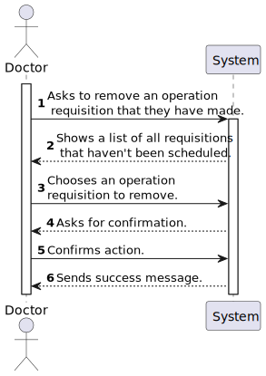

# US 5.1.18

<!-- TOC -->
- [US 5.1.18](#us-5118)
  - [1. Context](#1-context)
  - [2. Requirements](#2-requirements)
  - [3. Analysis](#3-analysis)
    - [System Sequence Diagram](#system-sequence-diagram)
    - [Domain Model](#domain-model)
  - [4. Design](#4-design)
    - [4.1. Realization](#41-realization)
    - [4.2. Class Diagram](#42-class-diagram)
    - [4.3. Applied Patterns](#43-applied-patterns)
    - [4.4. Tests](#44-tests)
  - [5. Implementation](#5-implementation)
  - [6. Integration/Demonstration](#6-integrationdemonstration)
  - [7. Observations](#7-observations)
<!-- TOC -->

## 1. Context

This is the first time this User Story is being worked on. 
This User Story is related to the Doctor.

## 2. Requirements

**US 5.1.18:** As a Doctor, I want to remove an operation requisition, so that the healthcare activities are provided as necessary. 

**Acceptance Criteria:**

- **5.1.18.1. -** Doctors can delete operation requests they created if the operation has not yet been scheduled. 

- **5.1.18.2. -** A confirmation prompt is displayed before deletion. 

- **5.1.18.3. -** Once deleted, the operation request is removed from the patient’s medical record and cannot be recovered. 

- **5.1.18.4. -** The system notifies the Planning Module and updates any schedules that were relying on this request. 

**Dependencies/References:**

- **US 5.1.1. -** US 5.1.18. is dependent on this User Story as it depends on an existing account of a staff in the system.

- **US 5.1.6. -** US 5.1.18. is dependent on this User Story as it depends on an existing account of a staff in the system with the right permissions.

- **US 5.1.12. -** US 5.1.18. is dependent on this User Story as it depends on an existing profile of a staff in the system.

- **US 5.1.16. -** US 5.1.18. is dependent on this User Story as it depends on an existing operation request in the system.

- **US 5.1.19. -** This User Story is dependent on US 5.1.18 as it needs it's functionality to work as intended.

- **US 5.1.20. -** US 5.1.18. is dependent on this User Story as it depends on an existing operation type in the system.

**Client Clarifications:**

> None yet.

## 3. Analysis

This functionality talks about the removal of a operation requisition by a doctor, and after some analysis of the documentation, acceptance criterias and client clarifications, it is our understanding that this User Story would follow this order of actions:

- The doctor is able to see the requisitions they have made and if that requisition has not been scheduled then they can ask to remove it from the system.
- After choosing to remove a certain requisition, the system will ask for a confirmation, as a lot of data will be changed if that were to happen
- The doctor can then confirm and after having done so, the system will remove the requisition from the system.
- For the sake of this User Story, removing from the system will mean removing from a patient's file and the requisition list.
- The system will then inform the Planning module of that change and updates the schedule if that were relying on this requisition.

As explained by the client and acceptance criteria, after having removed this requistion from the system, it is not possible to revert that process.

### System Sequence Diagram

## 4. Design

### 4.1. Realization

The logical, physical, development and scenario views diagrams are generic for all the use cases of the backoffice component.
These diagrams can be found in the [generic views diagrams compilation file](../../team-decisions/views/general-views.md).

The process view levels are here represented as they represent a process specific to each user story.

#### Process View

The level 1 and 2 of this view was considered not to add more information in addition to the SSD shown above.
However level 3 is shown below.

##### Process View - Level 3

### 4.2. Class Diagram

_// To do //_

### 4.3. Applied Patterns

_// To do //_

### 4.4. Tests

_// To do - layout still in development //_ 

## 5. Implementation

_// To do //_

## 6. Integration/Demonstration

_// To do //_

## 7. Observations

_// To do //_