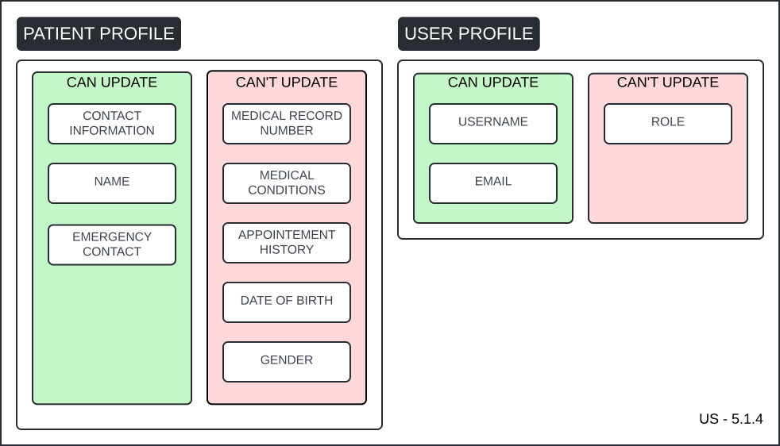
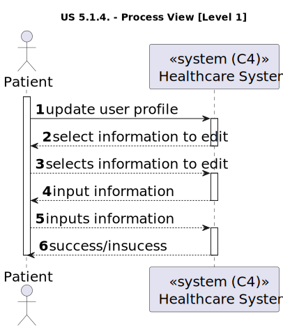
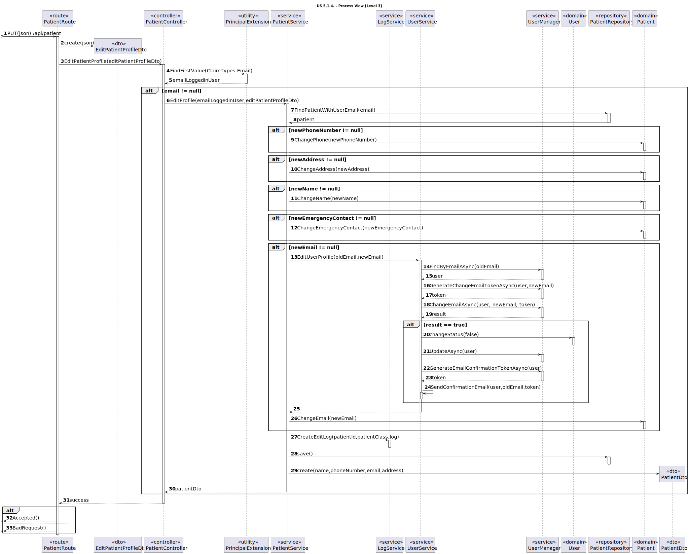

# US 5.1.4

<!-- TOC -->
- [US 5.1.4](#us-514)
  - [1. Context](#1-context)
  - [2. Requirements](#2-requirements)
  - [3. Analysis](#3-analysis)
  - [4. Design](#4-design)
    - [4.1. Realization](#41-realization)
      - [Logical View](#logical-view)
      - [Process View](#process-view)
        - [Level 1](#level-1)
        - [Level 2](#level-2)
        - [Level 3](#level-3)
      - [Development View](#development-view)
      - [Physical View](#physical-view)
<!-- TOC -->

## 1. Context

This is the first time this user story is worked on.

## 2. Requirements

**US 5.1.4:** As a Patient, I want to update my user profile, so that I can change my personal
details and preferences.

**Acceptance Criteria:**

- **5.1.4.1:** Patients can log in and update their profile details (e.g., name, contact information, preferences).

- **5.1.4.2:** Changes to sensitive data, such as email, trigger an additional verification step (e.g., confirmation email).

- **5.1.4.3:** All profile updates are securely stored in the system.

- **5.1.4.4:** The system logs all changes made to the patient's profile for audit purposes.

**Dependencies/References:**

This user story is dependent on US-5.1.3, as a patient must have a user profile in order to update it.

**Client Clarifications:**

> **Question:** Can the same user have both a patient and a healthcare profile?
>
> **Answer:** No. When it comes to patients and healthcare staff, they both have one of the rules that says that some of their, like, attributes need to be unique, and they both need their email to be unique.

> **Question:** Is the email the identifying attribute or is it the username?
>
> **Answer:** It's the username. But typically, nowadays, most of the usernames that you have in all the systems are your email.

> **Question:**  Can patients update both their user and patient profile information?
>
> **Answer:** Patients can update contact information but not medical details. Changes must be verified and validated.

> **Question:** What does the term "preferences" refer to?
>
> **Answer:** Preferences are for now related to marketing consent or not by the patient, or other related GDPR preferences

## 3. Analysis

In this functionality, the patient will have the ability to update their user profile and the non-medical information associated with their patient profile, as clarified by the client.

It's important to highlight that patients cannot update every aspect of their profiles. The following diagram illustrates which information they are allowed to modify.

It's important to highlight that patients cannot update every aspect of their profiles. The following diagram illustrates which information they are allowed to modify.

- Email
- Phone number
- Name
- Emergency Contact

A confirmation email must be sent to ensure changes to sensitive data, such as email, are legitimate.

Lastly, all the made changes must be be logged for traceability.

## 4. Design

### 4.1. Realization

The logical, physical, development and scenario views diagrams are generic for all the use cases of the backoffice component.

#### Logical View

The diagrams can be found in the [team decision views folder](../../team-decisions/views/general-views.md#1-logical-view).

#### Process View

##### Level 1

##### Level 2

_[This diagram is not relevant.]_

##### Level 3

#### Development View

The diagrams can be found in the [team decision views folder](../../team-decisions/views/general-views.md#3-development-view).

#### Physical View

The diagrams can be found in the [team decision views folder](../../team-decisions/views/general-views.md#4-physical-view).

