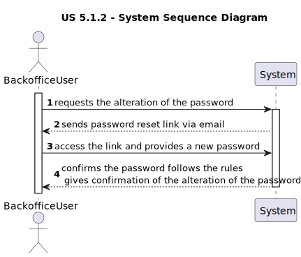
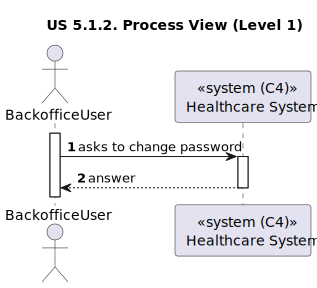
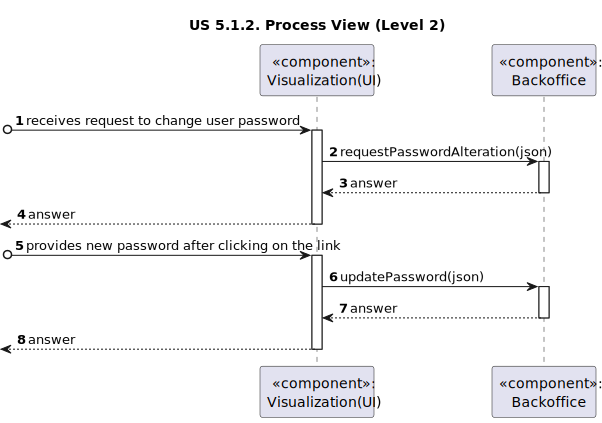
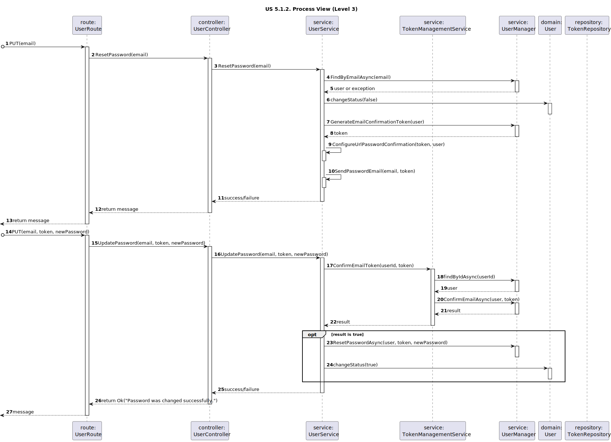

# US 5.1.2

<!-- TOC -->
* [US 5.1.2](#us-512)
  * [1. Context](#1-context)
  * [2. Requirements](#2-requirements)
  * [3. Analysis](#3-analysis)
    * [System Sequence Diagram](#system-sequence-diagram)
  * [4. Design](#4-design)
    * [4.1. Realization](#41-realization)
      * [Logical View](#logical-view)
      * [Process View](#process-view)
        * [Level 1](#level-1)
        * [Level 2](#level-2)
        * [Level 3](#level-3)
      * [Development View](#development-view)
      * [Physical View](#physical-view)
    * [4.3. Applied Patterns](#43-applied-patterns)
<!-- TOC -->

## 1. Context

This is the first time this user story is being requested.

## 2. Requirements

**US 5.1.2:** As a Backoffice User (Admin, Doctor, Nurse, Technician), I want to reset my password if I forget it, so
that I can regain access to the system securely.

**Acceptance Criteria:**

- **5.1.2.1:** Backoffice users can request a password reset by providing their email.

- **5.1.2.2:** The system sends a password reset link via email.

- **5.1.2.3:** The reset link expires after a predefined period (e.g., 24 hours) for security.

- **5.1.2.4:** Users must provide a new password that meets the system's password complexity rules.

- **5.1.2.5:** The password requirements are: 10 or more characters long, 1 or more digits, 1 or more capital letter and
1 or more special character.

**Dependencies/References:**

**5.1.1:** The Backoffice User needs to be created first, so they can change their password.

**Client Clarifications:**

> **Question:** What are the system's password requirements?
>
> **Answer:**  At least 10 characters long, at least a digit, a capital letter and a special character.

## 3. Analysis

In this functionality, the backoffice user will be able to reset their password, by providing their email. The system
will send a password reset link via email, and the user will have a predefined period to access the link and provide a
password that meets the system password complexity rules.

### System Sequence Diagram

## 4. Design

### 4.1. Realization

The logical, physical, development and scenario views diagrams are generic for all the use cases of the backoffice component.

#### Logical View

The diagrams are available in the [team decision views folder](../../team-decisions/views/general-views.md#1-logical-view).

#### Process View

##### Level 1

##### Level 2

##### Level 3

#### Development View

The diagrams are available in the [team decision views folder](../../team-decisions/views/general-views.md#3-development-view).

#### Physical View

The diagrams are available in the [team decision views folder](../../team-decisions/views/general-views.md#4-physical-view).

### 4.3. Applied Patterns

> #### **Repository Pattern**
>
>* **Components:** UserRepository, TokenRepository
>
> The repositories handle data access and retrieval, isolating the database interaction logic from services and other
> layers. This approach abstracts the persistence logic, promoting separation of concerns.

> #### **Facade Pattern**
>
>* **Components:** UserService, UserManager, TokenManagementService 
>
> These services function as a facade, simplifying the interaction with lower-level components such as repositories.
> The controller communicates with these service facades, concealing the complexity from the upper layers.
