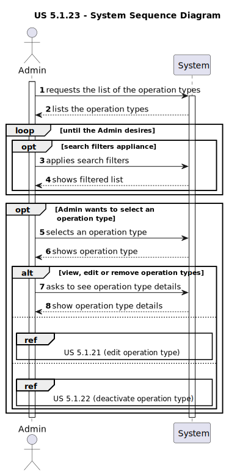

# US 5.1.23

<!-- TOC -->
* [US 5.1.23](#us-5123)
  * [1. Context](#1-context)
  * [2. Requirements](#2-requirements)
  * [3. Analysis](#3-analysis)
    * [System Sequence Diagram](#system-sequence-diagram)
  * [4. Design](#4-design)
    * [4.1. Realization](#41-realization)
    * [4.2. Class Diagram](#42-class-diagram)
    * [4.3. Applied Patterns](#43-applied-patterns)
    * [4.4. Tests](#44-tests)
  * [5. Implementation](#5-implementation)
  * [6. Integration/Demonstration](#6-integrationdemonstration)
  * [7. Observations](#7-observations)
<!-- TOC -->

## 1. Context

This is the first time this user story is being requested.

## 2. Requirements

**US 5.1.23:** As an Admin, I want to list/search operation types, so that I can se the details, edit, and remove
operation types.

**Acceptance Criteria:**

- **5.1.23.1:** Admin can search and filter operation types by name, specialization, or status (active/inactive).

- **5.1.23.2:** The system displays operation types in a searchable list with attributes such as name, required staff,
and estimated duration.

- **5.1.23.3:** Admins can select an operation type to view, edit, or deactivate it.

**Dependencies/References:**

**5.1.20:** There must exist operation types, so they can be listed and removed.
**5.1.21:** The functionality to edit operation types.
**5.1.22:** The functionality to deactivate operation types.

**Client Clarifications:**

> **Question:** What filters are you looking for in the search/list of staff and patient profiles? 
> And what about operation types?
>
> **Answer:**  Filters can include doctor specialization, name, or email to refine search results.

> **Question:** Should actions like removing an operation type be accessed only through specific methods?
>
> **Answer:** Yes, operations like removal or deactivation should be available via specific API methods.

> **Question:** Is removing an operation type the same as deactivating it?
>
> **Answer:** Yes, deactivating makes the operation type unavailable for future use but retains historical data.

> **Question:** Hello Mr. Client. The filters are And or OR. For example, if I filter for a Patient named John and
> Age 24, do you want every John who is 24 years old or every Patient who is called John or is 24 years old
>
> **Answer:** If more than one search/filter parameter is used, the combination of filters should be considered as AND.

## 3. Analysis

The main objective of this functionality is to list or search operation types, so they can be selected and check their
details, edit or remove them. To achieve that, the Admin can filter the operation types by:
- Name
- Specialization
- Status (Active/Inactive)

Once the filters are applied, the system displays operation types in a searchable list with the following attributes:
- Name
- Required Staff
- Estimated Duration

Finally, the admin can select an operation type to:
- View
- Edit
- Deactivate

### System Sequence Diagram

## 4. Design

### 4.1. Realization

_// To do //_

### 4.2. Class Diagram

_// To do //_

### 4.3. Applied Patterns

_// To do //_

### 4.4. Tests

_// To do - layout still in development //_ 

## 5. Implementation

_// To do //_

## 6. Integration/Demonstration

_// To do //_

## 7. Observations

_// To do //_