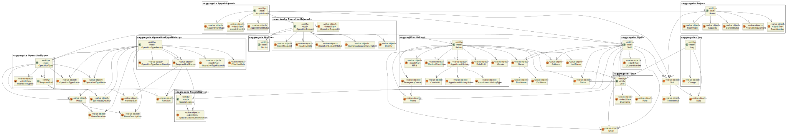
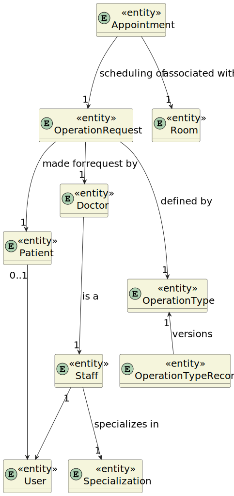

## Domain Model

### Introduction
We have identified nine key concepts that are considered aggregate root entities. These are:

* User
* Staff
* Patient
* Appointment
* OperationRequest
* OperationType
* Room
* Specialization

Each of these aggregate roots has its own attributes and relationships, serving as the primary points of interaction within the domain model and ensuring the consistency of the system's data.

### Diagram

### Simplified Diagram Version

