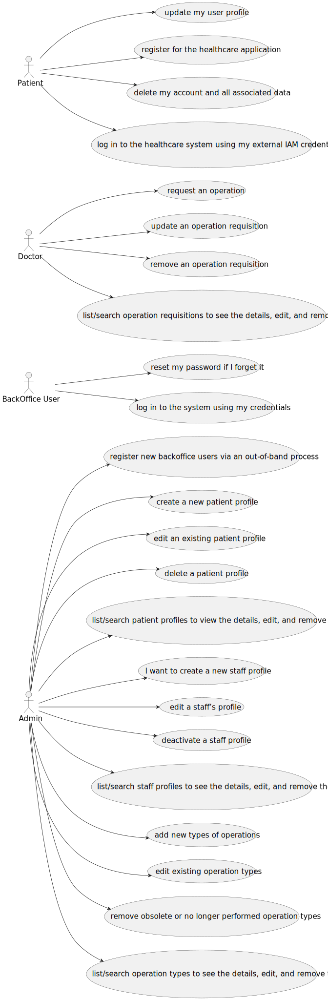

# Generic System View Diagrams

<!-- TOC -->
* [Generic System View Diagrams](#generic-system-view-diagrams)
  * [Introduction](#introduction)
  * [1. Logical View](#1-logical-view)
    * [1.1. Level 1](#11-level-1)
    * [1.2. Level 2](#12-level-2)
    * [1.3. Level 3](#13-level-3)
      * [1.3.1 Backoffice Component](#131-backoffice-component)
  * [2. Process View](#2-process-view)
  * [3. Development View](#3-development-view)
    * [3.2. Level 2](#32-level-2)
    * [3.3. Level 3](#33-level-3)
    * [3.3.1 Backoffice Module](#331-backoffice-module)
  * [4. Physical View](#4-physical-view)
    * [4.2. Level 2](#42-level-2)
  * [5. Scenario View](#5-scenario-view)
    * [5.1. Level 1](#51-level-1)
<!-- TOC -->

## Introduction

The diagrams of this project will follow a combination of two architecture representation models, C4 and 4+1.

The 4+1 View Model presents a way to describe a software system using multiple perspectives. The model is broken down into the following views:

> * **Logical view:** Focuses on the software's structure, addressing business needs and functionality.
> 
> 
> * **Process view:** Deals with the system's dynamic aspects, such as interactions and workflows.
> 
> 
> * **Development view:** Focuses on how the software is organized during development.
> 
> 
> * **Physical view:** Describes how the software is deployed and run on hardware infrastructure.
> 
> 
> * **Scenario view:** Shows how business processes interact with actors in the system through use cases and workflows. 

The C4 Model offers a hierarchical approach to visualizing software systems through four levels of detail. As you move 
through each level, the focus narrows, revealing more detail about smaller parts of the system. The levels in the C4 Model
are defined as follows:

> * **Level 1:** A high-level view of the entire system (framework).
>
> 
> * **Level 2:** A detailed description of the system's containers.
> 
> 
> * **Level 3:** A breakdown of the components within each container.
> 
> 
> * **Level 4:** A detailed look at the code or smaller parts of the components (this level will not be covered in this project).

The C4 Model organizes the system into varying levels of granularity, while the 4+1 View Model describes the system from
different perspectives. By integrating both models, the system can be represented from multiple viewpoints, each at different
levels of detail.

To visually model the system, the **Unified Modeling Language (UML)** is used.

---

## 1. Logical View

### 1.1. Level 1

### 1.2. Level 2

In the system there is only one **Backoffice API**, however it is consumed both internally and externally. The team decided
to represent it twice to make its use clearer.

### 1.3. Level 3

The third level of the logical view explores each component in detail. The backoffice is a very important component of the
system, as it communicates inside and outside of it with other applications, so its representation is a bit more complex.

#### 1.3.1 Backoffice Component

---

## 2. Process View

Process views and their respective levels will be represented in each user story **readme** file.

---

## 3. Development View

### 3.2. Level 2

### 3.3. Level 3

### 3.3.1 Backoffice Module

## 4. Physical View

The physical view will only be represented at Level 2, as it focuses on deployable units and infrastructure, while 
Levels 1 and 3 don't add much to the understanding of the system's physical architecture.

### 4.2. Level 2

---

## 5. Scenario View

### 5.1. Level 1

Since the high-level use cases already cover the essential functionality, adding more levels would only increase complexity
without adding significant value, making the system harder to maintain. 