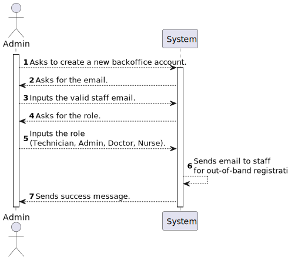
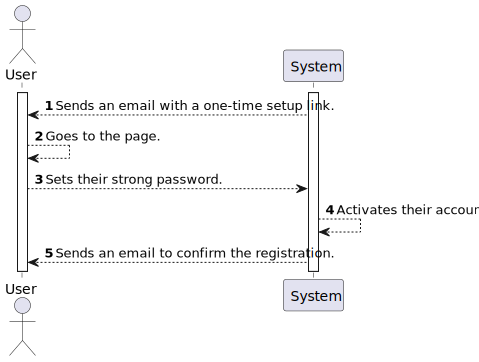

# US 5.1.1

<!-- TOC -->
- [US 5.1.1](#us-511)
  - [1. Context](#1-context)
  - [2. Requirements](#2-requirements)
  - [3. Analysis](#3-analysis)
    - [3.1 System Sequence Diagram](#31-system-sequence-diagram)
    - [3.2 Domain Model](#32-domain-model)
  - [4. Design](#4-design)
    - [4.1. Realization](#41-realization)
    - [4.2. Class Diagram](#42-class-diagram)
    - [4.3. Applied Patterns](#43-applied-patterns)
    - [4.4. Tests](#44-tests)
  - [5. Implementation](#5-implementation)
  - [6. Integration/Demonstration](#6-integrationdemonstration)
  - [7. Observations](#7-observations)
<!-- TOC -->

## 1. Context

This is the first time this User Story is being worked on. 
This User Story is related to the Admin.

## 2. Requirements

**US 5.1.1:** As an Admin, I want to register new backoffice users (e.g., doctors, nurses, technicians, admins) via an out-of-band process, so that they can access the backoffice system with appropriate permissions.

**Acceptance Criteria:**

- **5.1.1.1. -** Backoffice users (e.g., doctors, nurses, technicians) are registered by an Admin via an internal process, not via self-registration. 

- **5.1.1.2. -** Admin assigns roles (e.g., Doctor, Nurse, Technician) during the registration process.

- **5.1.1.3. -** Registered users receive a one-time setup link via email to set their password and activate their account. 

- **5.1.1.4. -** The system enforces strong password requirements for security. 

- **5.1.1.5. -** A confirmation email is sent to verify the user’s registration. 

- **5.1.1.6. -** The strong password requirements are: 10 or more characters long, 1 or more digits, 1 or more capital letter and 1 or more special character.

**Dependencies/References:**

- **US 5.1.2. -** This user story depends on US 5.1.1. as it depends on an existing account in the system.
- **US 5.1.6. -** This user story depends on US 5.1.1. as it depends on an existing account in the system so that certain permissions may be granted.
- **US 5.1.12. to 5.1.23. -** These user stories depends on US 5.1.1. as it depends on an existing account in the system with certain role-based permissions.

**Client Clarifications:**

> None yet.

## 3. Analysis

According to our analysis of this User Story and it's acceptance criterias, we have achieved the following understanding of the order of events that are supposed to happen in order for this functionality to be achieved completly:

### System Sequence Diagram - Admin

The following diagram describes the first part of this User Story, what the admin must do to start the registration process.

### System Sequence Diagram - Staff

The following diagram describes the second part of this User Story, what the staff must do to finish their registration process.

### Domain Model

_// To do //_

## 4. Design

### 4.1. Realization

_// To do //_

### 4.2. Class Diagram

_// To do //_

### 4.3. Applied Patterns

_// To do //_

### 4.4. Tests

_// To do - layout still in development //_ 

## 5. Implementation

_// To do //_

## 6. Integration/Demonstration

_// To do //_

## 7. Observations

_// To do //_