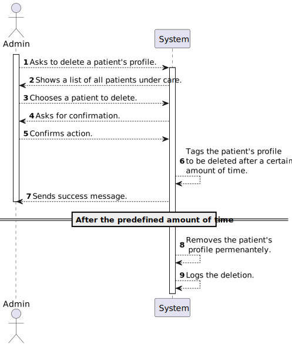

# US 5.1.10

<!-- TOC -->
- [US 5.1.10](#us-5110)
  - [1. Context](#1-context)
  - [2. Requirements](#2-requirements)
  - [3. Analysis](#3-analysis)
    - [System Sequence Diagram](#system-sequence-diagram)
    - [Domain Model](#domain-model)
  - [4. Design](#4-design)
    - [4.1. Realization](#41-realization)
    - [4.2. Class Diagram](#42-class-diagram)
    - [4.3. Applied Patterns](#43-applied-patterns)
    - [4.4. Tests](#44-tests)
  - [5. Implementation](#5-implementation)
  - [6. Integration/Demonstration](#6-integrationdemonstration)
  - [7. Observations](#7-observations)
<!-- TOC -->

## 1. Context

This is the first time this User Story is being worked on. 
This User Story is related to the Admin.

## 2. Requirements

**US 5.1.10:**  As an Admin, I want to delete a patient profile, so that I can remove patients who are no longer under care. 

**Acceptance Criteria:**

- **5.1.10.1. -** Admins can search for a patient profile and mark it for deletion. 

- **5.1.10.2. -** Before deletion, the system prompts the admin to confirm the action. 

- **5.1.10.3. -** Once deleted, all patient data is permanently removed from the system within a predefined time frame. 

- **5.1.10.4. -** The system logs the deletion for audit and GDPR compliance purposes. 

**Dependencies/References:**

- **US 5.1.3. -** US 5.1.10. is dependent on this User Story as it depends on an existing profile of a patient in the 
system.

- **US 5.1.6. -** US 5.1.18. is dependent on this User Story as it depends on an existing account of a staff in the system with the right permissions.

- **US 5.1.11. -** This User Story is dependent on US 5.1.10 as it needs it's functionality to work as intended.

**Client Clarifications:**

> None yet.

## 3. Analysis

After reviewing the documentation and carefully analyzing the acceptance criteria, we agreed upon an order of events of this User Story as follows:

- The admin will request to delete a pacient's profile.
- The admin will see a list of all patients and will be able to choose one and select to delete said profile.
- They will be given the option to confirm or cancel said action. 
- If the request goes forward then the patient's profile will be tagged for deletion and after a predetermined amount of time, it will be removed permenantely from the system.
- When the data is removed the system will log the deletion and add it to the database as said in acceptance criteria 5.1.10.4.

This order of events is also described in the System Sequence Diagram shown below:

### System Sequence Diagram

### Domain Model

_// To do //_

## 4. Design

### 4.1. Realization

_// To do //_

### 4.2. Class Diagram

_// To do //_

### 4.3. Applied Patterns

_// To do //_

### 4.4. Tests

_// To do - layout still in development //_ 

## 5. Implementation

_// To do //_

## 6. Integration/Demonstration

_// To do //_

## 7. Observations

_// To do //_