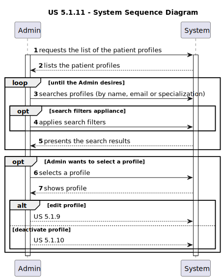

# US 5.1.11

<!-- TOC -->
* [US 5.1.11](#us-5111)
  * [1. Context](#1-context)
  * [2. Requirements](#2-requirements)
  * [3. Analysis](#3-analysis)
    * [System Sequence Diagram](#system-sequence-diagram)
  * [4. Design](#4-design)
    * [4.1. Realization](#41-realization)
    * [Process View](#process-view)
      * [Level 1](#level-1)
      * [Level 2](#level-2)
      * [Level 3](#level-3)
    * [4.3. Applied Patterns](#43-applied-patterns)
    * [4.4. Tests](#44-tests)
  * [5. Implementation](#5-implementation)
  * [6. Integration/Demonstration](#6-integrationdemonstration)
  * [7. Observations](#7-observations)
<!-- TOC -->

## 1. Context

This is the first time this user story is presented.

## 2. Requirements

**US 5.1.11:** As an Admin, I want to list/search patient profiles by different attributes, so that I can view the details, edit, and remove patient profiles.

**Acceptance Criteria:**

- **5.1.11.1.** | Admins can search patient profiles by various attributes, including name, email, date of birth, or medical record number.

- **5.1.11.2.** | The system displays search results in a list view with key patient information (name, email, date of birth).

- **5.1.11.3.** | Admins can select a profile from the list to view, edit, or delete the patient record.

- **5.1.11.4.** | The search results are paginated, and filters are available to refine the search results.

- **5.1.11.5** | It is possible to apply multiple filters to a search result.

**Dependencies/References:**

This feature is dependent on the existence of patient profiles previously created by the Admin (**US 5.1.8**), as well as the functionalities
to edit (**US 5.1.9**) and remove (**US 5.1.10**) them.

**Client Clarifications:**

> _**No client clarifications yet!**_

## 3. Analysis

The Admin has access to all the profiles within the healthcare system, including Patient profiles, that can be consulted in
a list. In this list, the Admin selects a profile to see its details, update and remove it.

The Admin can search profiles by the patient's name, email, date of birth, or medical record number, and the search results
are presented through a paginated list, with search filters to refine the selection of listed profiles.

Multiple filters can be used simultaneously.

### System Sequence Diagram

The following diagram depicts the interaction between the Admin and the system.

## 4. Design
### 4.1. Realization

The logical, physical, development and scenario views diagrams are generic for all the use cases of the backoffice component.
These diagrams can be found in the [generic views diagrams compilation file](../team-decisions/views/general-views.md).

Regarding this user story in particular, it's very similar to [US 5.1.15.](../us-5.1.15/readme.md), so diagrams of generic
process views of each level were created to represent both.

In the following diagrams, the listed variables represent the respective concepts:

* **N** is 11, represents the current user story -> US 5.1.11.
* **X** represents Patient
* **F** represents the set of filters applicable to patients (name, email, date of birth, or medical record number)
* **Y** is 9, represents the patient profile edition user story -> US 5.1.9.
* **Z** is 10, represents the patient profile deactivation/deletion user story -> US 5.1.10.

### Process View

#### Level 1

#### Level 2

#### Level 3

### 4.3. Applied Patterns

_// To do //_

### 4.4. Tests

_// To do - layout still in development //_

## 5. Implementation

_// To do //_

## 6. Integration/Demonstration

_// To do //_

## 7. Observations

_// To do //_