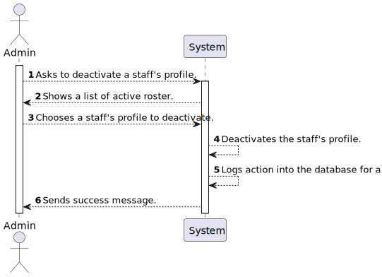

# US 5.1.14

<!-- TOC -->
- [US 5.1.14](#us-5114)
  - [1. Context](#1-context)
  - [2. Requirements](#2-requirements)
  - [3. Analysis](#3-analysis)
    - [System Sequence Diagram](#system-sequence-diagram)
    - [Domain Model](#domain-model)
  - [4. Design](#4-design)
    - [4.1. Realization](#41-realization)
    - [4.2. Class Diagram](#42-class-diagram)
    - [4.3. Applied Patterns](#43-applied-patterns)
    - [4.4. Tests](#44-tests)
  - [5. Implementation](#5-implementation)
  - [6. Integration/Demonstration](#6-integrationdemonstration)
  - [7. Observations](#7-observations)
<!-- TOC -->

## 1. Context

This is the first time this User Story is being worked on. 
This User Story is related to the Admin.

## 2. Requirements

**US 5.1.14:** As an Admin, I want to deactivate a staff profile, so that I can remove them from the hospital’s active roster without losing their historical data. 

**Acceptance Criteria:**

- **5.1.14.1. -** Admins can search for and select a staff profile to deactivate. 

- **5.1.14.2. -** Deactivating a staff profile removes them from the active roster, but their historical data (e.g., appointments) remains accessible. 

- **5.1.14.3. -** The system confirms deactivation and records the action for audit purposes. 

**Dependencies/References:**

- **US 5.1.1. -** US 5.1.14. is dependent on this User Story as it depends on an existing account of a staff in the system.

- **US 5.1.6. -** US 5.1.14. is dependent on this User Story as it depends on an existing account of a staff in the system with the right permissions.

- **US 5.1.12. -** US 5.1.14. is dependent on this User Story as it depends on an existing profile of a staff in the system.

- **US 5.1.15. -** This User Story is dependent on US 5.1.14 as it needs it's functionality to work as intended.

**Client Clarifications:**

> None yet.

## 3. Analysis

This functionality talks about the deactivation of the profile of a staff member, and after some analysis of the documentation, acceptance criterias and client clarifications, it is our understanding that this User Story would follow this order of actions:

- The admin would go to a management page and would request to see a list of the active roster of staff and their profiles.
- After analyzing the list and deciding on the staff profile, the admin will select the profile and deactivate it.
- The system will then deactivate the profile and save that change onto the database, while also removing the staff in question from the active roster as to not cause further confusion to the Planning module.
- After having deactivated the staff account, the system will log that action for audit purposes as explained by acceptance criteria 5.1.14.3

It is important to note that for the sake of this project, **historical data** is considered to be:
**All types of appointments and/or requests made and/or taken part by the staff.**

### System Sequence Diagram

### Domain Model

_// To do //_

## 4. Design

### 4.1. Realization

_// To do //_

### 4.2. Class Diagram

_// To do //_

### 4.3. Applied Patterns

_// To do //_

### 4.4. Tests

_// To do - layout still in development //_ 

## 5. Implementation

_// To do //_

## 6. Integration/Demonstration

_// To do //_

## 7. Observations

_// To do //_