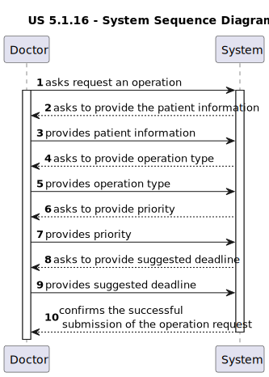
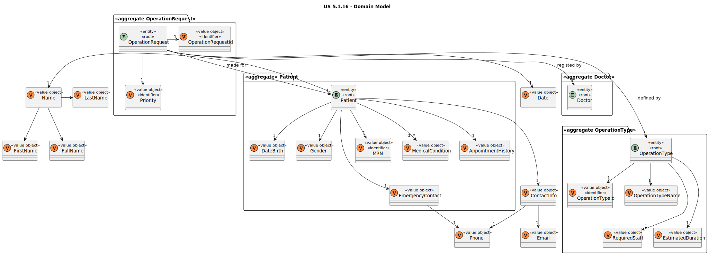

# US 5.1.16

<!-- TOC -->
* [US 5.1.16](#us-5116)
  * [1. Context](#1-context)
  * [2. Requirements](#2-requirements)
  * [3. Analysis](#3-analysis)
    * [System Sequence Diagram](#system-sequence-diagram)
    * [Domain Model](#domain-model)
  * [4. Design](#4-design)
    * [4.1. Realization](#41-realization)
    * [4.2. Class Diagram](#42-class-diagram)
    * [4.3. Applied Patterns](#43-applied-patterns)
    * [4.4. Tests](#44-tests)
  * [5. Implementation](#5-implementation)
  * [6. Integration/Demonstration](#6-integrationdemonstration)
  * [7. Observations](#7-observations)
<!-- TOC -->

## 1. Context

This is the first time this user story is being requested.

## 2. Requirements

**US 5.1.16:** As a Doctor, I want to request an operation, so that the Patient has access to the necessary healthcare.

**Acceptance Criteria:**

- **5.1.16.1.** Doctors can create an operation request by selecting the patient, operation type, priority, and
suggested deadline.

- **5.1.16.2.** The system validates that the operation type matches the doctor's specialization.

- **5.1.16.3** The operation request includes:

  - Patient ID
  - Doctor ID
  - Operation Type
  - Deadline
  - Priority

- **5.1.16.4** The system confirms successful submission of the operation request and logs the request in the patient's
medical history.

**Dependencies/References:**

This user story does not have dependencies.

**Client Clarifications:**

> **Question:** Is it mandatory for patients to have a user account to schedule a surgery?
>
> **Answer:** No, patients are not required to have a user account. The system administrator creates patient profiles.

> **Question:** What is the difference between appointment, surgery, and operation?
>
> **Answer:** Surgery is a medical procedure (e.g., hip surgery), while an operation request is when a doctor
> schedules that surgery for a patient. An appointment is the scheduled date for the operation, determined by the
> planning module

> **Question:** Can the same doctor who requests a surgery perform it?
>
> **Answer:**  Not necessarily. The planning module may assign different doctors based on availability and optimization.

> **Question:** In the project document it mentions that each operation has a priority. How is an operation's priority
> defined? Do they have priority levels defined? Is it a scale? Or any other system?
>
> **Answer:** Elective Surgery: A planned procedure that is not life-threatening and can be scheduled at a convenient
> time (e.g., joint replacement, cataract surgery).
> Urgent Surgery: Needs to be done sooner but is not an immediate emergency. Typically, within days
> (e.g., certain types of cancer surgeries).
> Emergency Surgery: Needs immediate intervention to save life, limb, or function. Typically performed within hours
> (e.g., ruptured aneurysm, trauma).

> **Question:** How does a Doctor suggests a deadline date for an appointment? Does it have any criteria? Or do they
> just wing it?
>
> **Answer:** The doctor will decide the "best" due date based on their experience. they will enter it in the system as
> an indication so that the planning module eventually takes that into account alongside priority and other criteria.

> **Question:** "The appointment type should match the staff’s specializations and room availability (...)". Can you
> explain this part of the project documentation?
> We'd assume that appointment type would be something like a consultation, a surgery or a meeting, and specialization
> would be Dermatology, Neurology, Pediatrics, etc...
> Is it supposed to match the operation type? Or that in itself is a different concept? Like Biopsy, Heart Surgery and
> so on...
>
> **Answer:** This system only deals with surgeries, thus the appointments are "scheduled surgeries". If the operation
> type indicates that an orthopedic doctor and nurse are needed, the scheduling cannot be done for staff that do not
> have that specialization.

## 3. Analysis

The main objective of this functionality is to create operation requests. To achieve that, the Doctor needs to select the
following information:
- Patient
- Operation Type
- Priority
- Suggested Deadline

Then the system checks if the operation type matches the doctor's specialization. As a result, the operation request
should include:
- Patient ID
- Doctor ID
- Operation Type
- Deadline
- Priority

Finally, the system confirms that the operation request submission as successful and logs the request in the patient's
medical history.

### System Sequence Diagram

### Domain Model

## 4. Design

### 4.1. Realization

_// To do //_

### 4.2. Class Diagram

_// To do //_

### 4.3. Applied Patterns

_// To do //_

### 4.4. Tests

_// To do - layout still in development //_ 

## 5. Implementation

_// To do //_

## 6. Integration/Demonstration

_// To do //_

## 7. Observations

_// To do //_