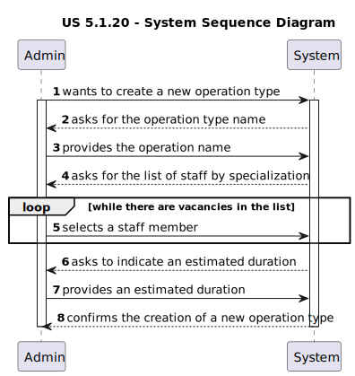

# US 5.1.20

<!-- TOC -->
* [US 5.1.20](#us-5120)
  * [1. Context](#1-context)
  * [2. Requirements](#2-requirements)
  * [3. Analysis](#3-analysis)
    * [System Sequence Diagram](#system-sequence-diagram)
  * [4. Design](#4-design)
    * [4.1. Realization](#41-realization)
    * [4.2. Class Diagram](#42-class-diagram)
    * [4.3. Applied Patterns](#43-applied-patterns)
    * [4.4. Tests](#44-tests)
  * [5. Implementation](#5-implementation)
  * [6. Integration/Demonstration](#6-integrationdemonstration)
  * [7. Observations](#7-observations)
<!-- TOC -->

## 1. Context

This is the first time this user story is presented.

## 2. Requirements

**US 5.1.20:**  As an Admin, I want to add new types of operations, so that I can reflect the available medical procedures 
in the system.

**Acceptance Criteria:**

- 5.1.20.1. | Admins can add new operation types with attributes like: Operation Name, Required Staff by Specialization,
Estimated Duration.

- 5.1.20.2. | The system validates that the operation name is unique.

- 5.1.20.3. | The system logs the creation of new operation types and makes them available for scheduling immediately.

**Dependencies/References:**

This functionality does not have dependencies.

**Client Clarifications:**

> **Question:** Will there be a list of specializations in the system?
>
> **Answer:** Yes, a predefined list of specializations will be provided, but the system should allow for future additions.

## 3. Analysis

The system has a predefined operation types list that  reflect the available procedures at the clinic/hospital. The Admin
has the permissions to add new ones as it is required, with the following attributes:

- **Operation Name** | it has to be unique
- **Required Staff by Specialization** | a list of the healthcare professionals needed to proceed with the surgery
- **Estimated Duration** | in hours

After the operation type has been created, the system registers the event in the system logs.

### System Sequence Diagram

The following diagram depicts the interaction between the Admin and the system.

## 4. Design

### 4.1. Realization

_// To do //_

### 4.2. Class Diagram

_// To do //_

### 4.3. Applied Patterns

_// To do //_

### 4.4. Tests

_// To do - layout still in development //_ 

## 5. Implementation

_// To do //_

## 6. Integration/Demonstration

_// To do //_

## 7. Observations

_// To do //_