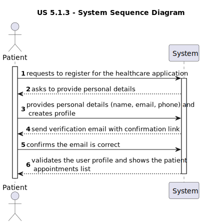

# US 5.1.3

<!-- TOC -->
* [US 5.1.3](#us-513)
  * [1. Context](#1-context)
  * [2. Requirements](#2-requirements)
  * [3. Analysis](#3-analysis)
    * [System Sequence Diagram](#system-sequence-diagram)
    * [Domain Model](#domain-model)
  * [4. Design](#4-design)
    * [4.1. Realization](#41-realization)
    * [4.2. Class Diagram](#42-class-diagram)
    * [4.3. Applied Patterns](#43-applied-patterns)
    * [4.4. Tests](#44-tests)
  * [5. Implementation](#5-implementation)
  * [6. Integration/Demonstration](#6-integrationdemonstration)
  * [7. Observations](#7-observations)
<!-- TOC -->

## 1. Context

This is the first time this user story is being requested.

## 2. Requirements

**US 5.1.3:** As a Patient, I want to register for the healthcare application, so that I can create a user profile and
book appointments online.

**Acceptance Criteria:**

- **5.1.3.1:** Patients can self-register using the external IAM system.

- **5.1.3.2:** During registration, patients provide personal details (e.g., name, email, phone) and create a profile.

- **5.1.3.3:** The system validates the email address by sending a verification email with a confirmation link.

- **5.1.3.4:** Patients cannot list their appointments without completing the registration process.

**Dependencies/References:**

**5.1.8:** The Admin must create first the patient record, so that the patient can register using the same email.

**Client Clarifications:**

> **Question:** How are duplicate patient profiles handled when registered by both the patient and admin?
>
> **Answer:** The system checks the email for uniqueness. The admin must first create the patient record, and then the
> patient can register using the same email.

> **Question:** Can the same user have both a patient and a healthcare profile?
>
> **Answer:** No. When it comes to patients and healthcare staff, they both have one of the rules that says that some of
> their, like, attributes need to be unique, and they both need their email to be unique.

> **Question:** Is the email the identifying attribute or is it the username?
>
> **Answer:** It's the username. But typically, nowadays, most of the usernames that you have in all the systems are your
> email.

> **Question:** The user has contact information, email and phone, they are booth obligatory?
>
> **Answer:** Yes.

## 3. Analysis

This functionality has the objective of allowing the patient to register for the healthcare application, so he can create
their respective profile and book appointments.

The first process is for the patient to register itself using the external IAM, but also to provides some personal 
information, such as:
- name
- email
- phone number

After this registration, will occur the verification of the email address, by sending a verification email with a 
confirmation link.

### System Sequence Diagram

### Domain Model

_// To do //_

## 4. Design

### 4.1. Realization

_// To do //_

### 4.2. Class Diagram

_// To do //_

### 4.3. Applied Patterns

_// To do //_

### 4.4. Tests

_// To do - layout still in development //_ 

## 5. Implementation

_// To do //_

## 6. Integration/Demonstration

_// To do //_

## 7. Observations

_// To do //_