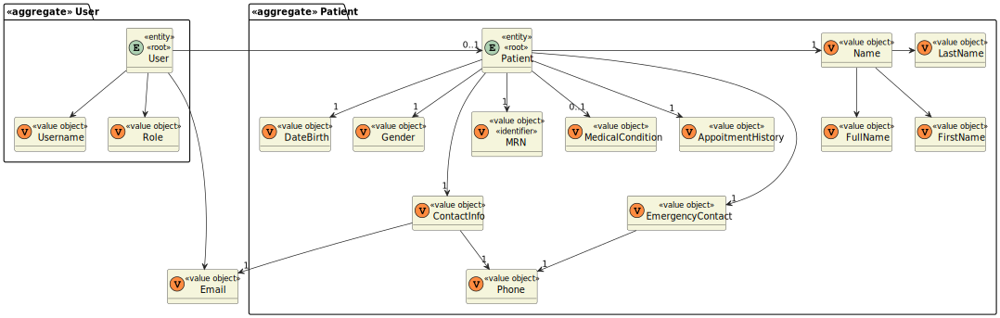

# US 5.1.5

<!-- TOC -->
* [US 5.1.5](#us-515)
  * [1. Context](#1-context)
  * [2. Requirements](#2-requirements)
  * [3. Analysis](#3-analysis)
    * [Domain Model](#domain-model)
  * [4. Design](#4-design)
    * [4.1. Realization](#41-realization)
    * [4.2. Class Diagram](#42-class-diagram)
    * [4.3. Applied Patterns](#43-applied-patterns)
    * [4.4. Tests](#44-tests)
  * [5. Implementation](#5-implementation)
  * [6. Integration/Demonstration](#6-integrationdemonstration)
  * [7. Observations](#7-observations)
<!-- TOC -->

## 1. Context

* This is the first time this user story is being requested, related to the GDPR (General Data Protection Regulation).

* General Data Protection Regulation (GDPR) is a regulation regarding the information privacy in the European Union (EU)
and the European Economic Area (EEA). It's an important component of EU privacy law and human rights law, governing the 
transfer of personal data outside the EU and EEA. It plays a crucial role in EU privacy and human rights laws, especially
when it comes to managing the transfer of personal data outside these regions. The primary objectives of GDPR are to give
individuals more control over their personal data and to streamline privacy regulations for businesses operating internationally.

## 2. Requirements

**US 5.1.5:** As a Patient, I want to delete my account and all associated data, so that I can exercise my right to be forgotten as per GDPR.

**Acceptance Criteria:**

- **5.1.5.1.** | Patients can request to delete their account through the profile settings.

- **5.1.5.2.** | The system sends a confirmation email to the patient before proceeding with account deletion.

- **5.1.5.3.** | Upon confirmation, all personal data is permanently deleted from the system within the legally required time frame (30 days).

- **5.1.5.4.** | Patients are notified once the deletion is complete, and the system logs the action for GDPR compliance.

- **5.1.5.5.** | Some anonymized data may be retained for legal or research purposes, but all identifiable information is erased.

- **5.1.5.6.** | Before proceeding with the creation of a new profile, the system checks if the associated email is unique.

**Dependencies/References:**

This feature is related to the creation on a patient's account (**US 5.1.3**) and its profile creation (**US 5.1.8**) too.

**Client Clarifications:**

> **Question:** How are duplicate patient profiles handled when registered by both the patient and admin?
>
> **Answer:** The system checks the email for uniqueness. The admin must first create the patient record, and then the patient can register using the same email.

> **Question:** What happens to patient data after the profile is deleted?
>
> **Answer:** Patient data must be retained for a legally mandated period before being anonymized or deleted.

## 3. Analysis

This functionality centers around the patient's profile and their personal data, which contains plenty of information, such as:

>**Identifiable Data**
>- name
>- phone number
>- email
>
>**Non-Identifiable Data**
>- appointment history
>- medical records
>- settings/preferences

Once on the profile page, the patient can request to delete their account through the settings.

Upon initiating the request, the system sends a confirmation email to the patient's registered email address. After the
patient verifies the request, the system begins by permanently deleting all personal data within the legally defined time
frame of 30 days.

Some anonymized data can be retained for legal or research purposes, but none of this information will identify the patient
in any way.
Upon concluding the account deletion, the system logs the action following GDPR requirements, ensuring compliance and
auditability.

### Domain Model

**Observation:** MRN refers to the medical record number.

## 4. Design

### 4.1. Realization

_// To do //_

### 4.2. Class Diagram

_// To do //_

### 4.3. Applied Patterns

_// To do //_

### 4.4. Tests

_// To do - layout still in development //_ 

## 5. Implementation

_// To do //_

## 6. Integration/Demonstration

_// To do //_

## 7. Observations

_// To do //_