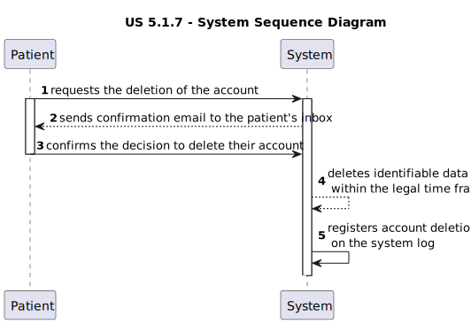

# US 5.1.7

<!-- TOC -->
* [US 5.1.7](#us-517)
  * [1. Context](#1-context)
  * [2. Requirements](#2-requirements)
  * [3. Analysis](#3-analysis)
    * [System Sequence Diagram](#system-sequence-diagram)
    * [Domain Model](#domain-model)
  * [4. Design](#4-design)
    * [4.1. Realization](#41-realization)
    * [4.2. Class Diagram](#42-class-diagram)
    * [4.3. Applied Patterns](#43-applied-patterns)
    * [4.4. Tests](#44-tests)
  * [5. Implementation](#5-implementation)
  * [6. Integration/Demonstration](#6-integrationdemonstration)
  * [7. Observations](#7-observations)
<!-- TOC -->

## 1. Context

* This is the first time this user story is presented.

* Identity and Access Management (IAM) is a system that manages and controls the access to a company's resources by entities,
that have their identities verified and their access permissions are clearly defined and enforced.

* Single Sign-on (SSO) is an authentication scheme that combines multiple applications log in screens and allows the user 
to log in a single time to access the resources and services of those applications.

## 2. Requirements

**US 5.1.7:**  As a Patient, I want to log in to the healthcare system using my external IAM credentials, so that I can
access my appointments, medical records, and other features securely.

**Acceptance Criteria:**

- 5.1.7.1. | Patients log in via an external Identity and Access Management (IAM) provider (e.g., Google, Facebook, or 
- hospital SSO).

- 5.1.7.2. | After successful authentication via the IAM, patients are redirected to the healthcare system with a valid session.

- 5.1.7.3 | Patients have access to their appointment history, medical records, and other features relevant to their profile.

- 5.1.7.4 | Sessions expire after a defined period of inactivity, requiring re-authentication.

**Dependencies/References:**

This functionality is dependent on the creation of a patient profile by the Admin (5.1.8).

**Client Clarifications:**

> **Question:** 
>
> **Answer:** 

## 3. Analysis

In this feature, patients can log in to the healthcare system using an external Identity and Access Management (IAM) provider.
The patient's identity is verified by the external IAM service, and upon successful authentication, they are granted a 
valid session within the healthcare system.

The patient has then access to their account and profile, along with all their data.

After a defined time of inactivity has been detected, the session is closed, requiring the patient to authenticate again.

> define inactivity

### System Sequence Diagram

The following diagram depicts the interaction between the user (Patient) and the system.

### Domain Model

_// To do //_

## 4. Design

### 4.1. Realization

_// To do //_

### 4.2. Class Diagram

_// To do //_

### 4.3. Applied Patterns

_// To do //_

### 4.4. Tests

_// To do - layout still in development //_ 

## 5. Implementation

_// To do //_

## 6. Integration/Demonstration

_// To do //_

## 7. Observations

_// To do //_