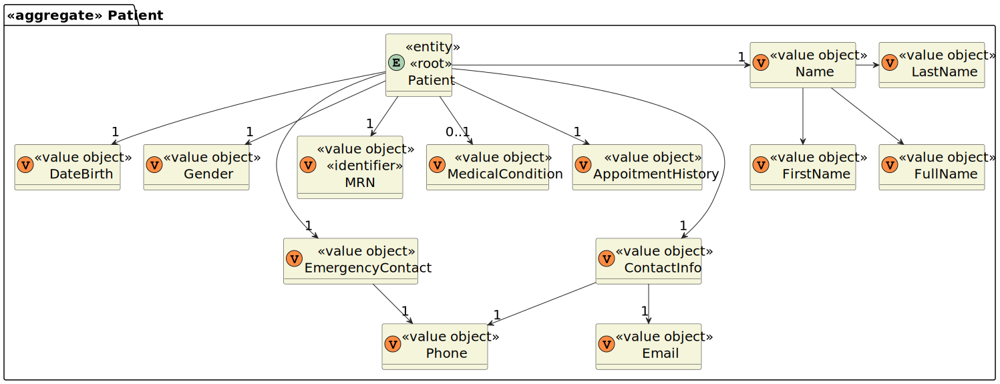

# US 5.1.8

<!-- TOC -->
- [US 5.1.8](#us-518)
  - [1. Context](#1-context)
  - [2. Requirements](#2-requirements)
  - [3. Analysis](#3-analysis)
    - [Domain Model](#domain-model)
  - [4. Design](#4-design)
    - [4.1. Realization](#41-realization)
    - [4.2. Class Diagram](#42-class-diagram)
    - [4.3. Applied Patterns](#43-applied-patterns)
    - [4.4. Tests](#44-tests)
  - [5. Implementation](#5-implementation)
  - [6. Integration/Demonstration](#6-integrationdemonstration)
  - [7. Observations](#7-observations)
<!-- TOC -->

## 1. Context

This is the first time this user story is worked on.

## 2. Requirements

**US 5.1.8:** As an Admin, I want to create a new patient profile, so that I can register their personal details and medical history.

**Acceptance Criteria:**

- 5.1.8.1:  Admins can input patient details such as first name, last name, date of birth, contact information, and medical history.

- 5.1.8.2: A unique patient ID (Medical Record Number) is generated upon profile creation.

- 5.1.8.3: The system validates that the patient’s email and phone number are unique.
 
- 5.1.8.4: The profile is stored securely in the system, and access is governed by role-based permissions.

**Dependencies/References:**

This user story does not have dependencies.

**Client Clarifications:**

> **Question:** How are duplicate patient profiles handled when registered by both the patient and admin?
>
> **Answer:** The system checks the email for uniqueness. The admin must first create the patient record, and then the patient can register using the same email.

> **Question:** Can a user have both patient and healthcare staff profiles?
>
> **Answer:** No, a user cannot have both profiles. Staff and patients have separate identifications.

> **Question:**  It is specified that the admin can input some of the patient's information (name, date of birth, contact information, and medical history.). Do they also input the omitted information (gender, emergency contact and allergies/medical condition)? 
>
> **Answer:** _Waiting for client clarifications._

> **Question:** What's the difference between Medical Records and Appointment History?
>
> **Asnwer:** The appointment history in this case is the list of surgeries the patient has had in the past and the scheduled or requested operations. A medical record is a comprehensive and organized collection of information about a patient's medical history, diagnoses, treatments, and healthcare interactions.

> **Question:** In an allergy record, is it necessary to include the date of diagnosis and the name of the doctor who made it?
What defines an allergy and one medical condition?
>
> **Asnwer:** Allergies is is a free text field. the doctor will fill it in as best-suited

> **Question:** Can you give an example of a Patient's medical record?
>
> **Asnwer:** Since this system is mostly concerned with surgery, the medical record information is mostly free text. (see: [patient medical record example](patient-record-example.txt) )

> **Question:** Does the medical history that the admin inputs refer to the patient's medical record, or is it referring to the appointment history?
>
> **Answer:** _Waiting for client clarifications._

## 3. Analysis

In this functionality, the admin can create a patient profile by registering their personal details and medical history. The admin is required to input the following information:

- Name (first and last name)
- Date of birth
- Contact information (email and phone number)
- Medical history
- … _(pending clarifications)_

Upon creating the profile, a unique medical record number will be generated and assigned to the patient, serving as the identifiable attribute for each profile.

It's important to note that the patient profile must be created before the patient can register themselves as a user. As specified in the acceptance criteria, the contact information (email and phone number) must be unique. Therefore, the system must verify that no other profile or user already exists with the same email or phone number.

### Domain Model

**Note:** MRN refers to the medical record number.

## 4. Design

### 4.1. Realization

_// To do //_

### 4.2. Class Diagram

_// To do //_

### 4.3. Applied Patterns

_// To do //_

### 4.4. Tests

_// To do - layout still in development //_ 

## 5. Implementation

_// To do //_

## 6. Integration/Demonstration

_// To do //_

## 7. Observations

_// To do //_