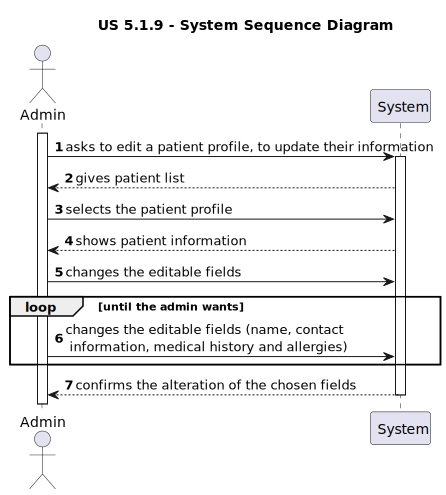
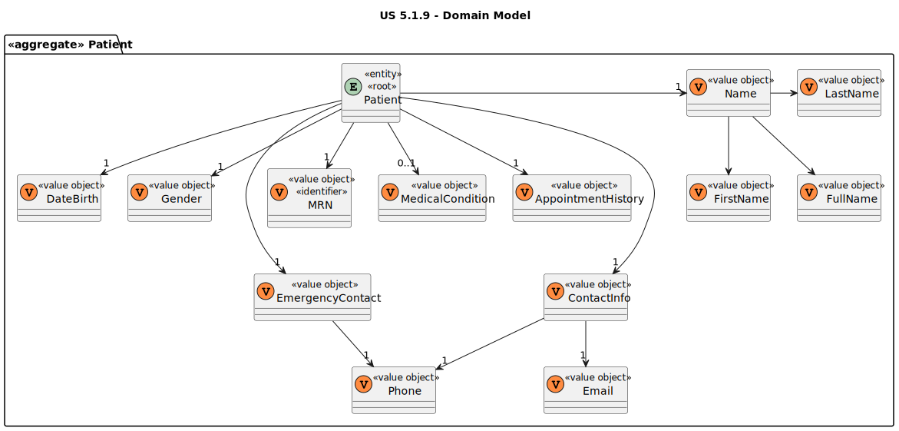

# US 5.1.9

<!-- TOC -->
* [US 5.1.9](#us-519)
  * [1. Context](#1-context)
  * [2. Requirements](#2-requirements)
  * [3. Analysis](#3-analysis)
    * [System Sequence Diagram](#system-sequence-diagram)
    * [Domain Model](#domain-model)
  * [4. Design](#4-design)
    * [4.1. Realization](#41-realization)
    * [4.2. Class Diagram](#42-class-diagram)
    * [4.3. Applied Patterns](#43-applied-patterns)
    * [4.4. Tests](#44-tests)
  * [5. Implementation](#5-implementation)
  * [6. Integration/Demonstration](#6-integrationdemonstration)
  * [7. Observations](#7-observations)
<!-- TOC -->

## 1. Context

This is the first time this user story is being requested.

## 2. Requirements

**US 5.1.9:** As an Admin, I want to edit an existing patient profile, so that I can update their information when needed.

**Acceptance Criteria:**

- **5.1.9.1.** Admins can search for and select a patient profile to edit.

- **5.1.9.2.** Editable fields include name, contact information, medical history, and allergies.

- **5.1.9.3:** Changes to sensitive data (e.g., contact information) trigger an email notification to the patient.

- **5.1.9.4:** The system logs all profile changes for auditing purposes.

**Dependencies/References:**

**5.1.8:** The Admin must create first the patient record, so that it can be edited.

**Client Clarifications:**

> **Question:** In an allergy record, is it necessary to include the date of diagnosis and the name of the doctor who made it?
> What defines an allergy and one medical condition?
>
> **Answer:** Allergies is a free text field. The doctor will fill it in as best-suited.

> **Question:** As I understand it, a patient's profile has plenty of information about the user, such as name, contact
> information (phone and email), preferences, appointment history, medical records, etc.
>
> What data do you consider to be identifiable? Are medical and appointment records deemed identifiable from your 
> perspective? What data from the user's profile can be retained in the system after the legal time frame related to the
> GDPR has passed?
>
> Also, how much time do you want to be set as the time frame for deletion and retention of data in the system? Is the 
> user informed on how many days are left for the deletion of its data? Like by email or somewhere in the UI of their
> account?
>
> **Answer:** It is part of the team's work for the GDPR module to define the policy

> **Question:** In the context of US 5.1.9, second acceptance criteria "Changes to sensitive data (e.g., contact
> information) trigger an email notification to the patient.", what classifies as "sensitive data".
>
> **Answer:** 

## 3. Analysis

This functionality centers in the edit of a patient profile by the Admin, so he can update the patient information.

First the Admin will search for the patient profile he wants to edit and then select it. Then can be selected the follow
editable fields:
- name
- contact information (email and phone)
- medical history
- allergies

In the case of choosing to change sensitive data, such as contact information, triggers and email notification to the
patient. 

The system will log all the profile changes for auditing purposes.

### System Sequence Diagram

### Domain Model

## 4. Design

### 4.1. Realization

_// To do //_

### 4.2. Class Diagram

_// To do //_

### 4.3. Applied Patterns

_// To do //_

### 4.4. Tests

_// To do - layout still in development //_ 

## 5. Implementation

_// To do //_

## 6. Integration/Demonstration

_// To do //_

## 7. Observations

_// To do //_