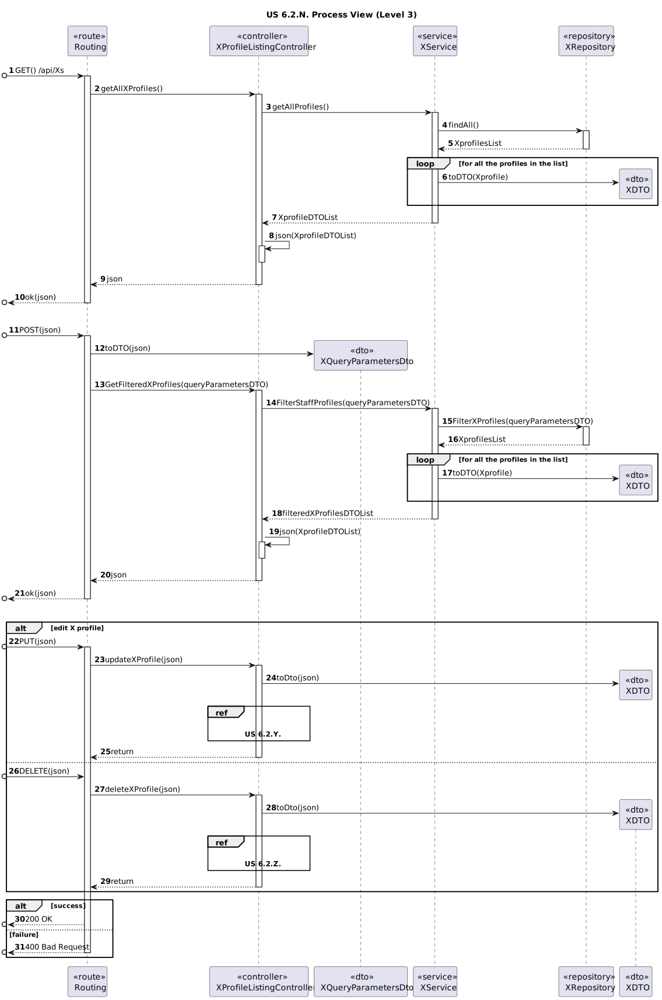

# US 6.2.13

<!-- TOC -->
* [US 6.2.13](#us-6213)
  * [1. Context](#1-context)
  * [2. Requirements](#2-requirements)
  * [3. Analysis](#3-analysis)
    * [System Sequence Diagram](#system-sequence-diagram)
  * [4. Design](#4-design)
    * [4.1. Realization](#41-realization)
    * [Process View](#process-view)
      * [Level 1](#level-1)
      * [Level 2](#level-2)
      * [Level 3](#level-3)
    * [4.3. Applied Patterns](#43-applied-patterns)
      * [4.1.3 Development View](#413-development-view)
      * [4.1.4 Physical View](#414-physical-view)
<!-- TOC -->

## 1. Context

This is the first time this user story is being presented.

## 2. Requirements

**US 6.2.13:** As an Admin, I want to list/search staff profiles, so that I can see the details, edit, and remove staff profiles.

**Acceptance Criteria:**

- **6.2.13.1.** | Admins can search staff profiles by attributes such as name, email, or specialization.

- **6.2.13.2.** | The system displays search results in a list view with key staff information (name, email, specialization).

- **6.2.13.3.** | Admins can select a profile from the list to view, edit, or deactivate.

- **6.2.13.4.** | The search results are paginated, and filters are available for refining the search results.

- **6.2.13.5.** | It is possible to apply multiple filters to a search result.

**Dependencies/References:**

This functionality is dependent on the listing and filtering of staff profiles (5.1.15).

**Client Clarifications:**

> **Question:** What types of filters can be applied when searching for profiles?
>
> **Answer:** Filters can include doctor specialization, name, or email to refine search results
>
> **Client Words:** I want to list everything, so there are no filters. So I want to have a filter where I only list doctors,
> or only list doctors who belong to a specialization, whether it's a doctor or a physician. Or I want to have a combination
> of that. I want to look for whether this is a doctor or a physician, or what specialization this person is in.

> **Question:** Is the system is intended to differentiate specializations for each type of staff? In other words, do we
> have to validate that specialization x can only be assigned, for example, to a member of staff who is a doctor, or do
> we consider that any specialization existing in the system can be assigned to any staff and that it is up to the person
> responsible for creating the profiles to assign valid specializations according to the role of the staff.
>
> **Answer:** Specializations are independent of whether the professional is a doctor or a nurse.

> **Question:** Regarding the specializations, do doctors, nurses, and technicians share the same group of specializations,
> or does each type of professional have distinct, role-specific specializations? Could you clarify how these specializations
> are categorized?
>
> **Answer:** They share the same set of specializations. 

## 3. Analysis

The Admin has access to all the profiles within the healthcare system, including Staff profiles, that can be consulted in
a list. In this list, the Admin selects a profile to see its details, update and remove/deactivate it.

The Admin can search profiles by the staff's name, email or specialization, and the search results are presented through
a paginated list, with search filters to refine the selection of listed profiles.

Multiple filters can be used simultaneously, with combinations of different attributes and filters conjunctions such as 
"AND" or "OR" can be selected to refine even more the search results.

### System Sequence Diagram

The following diagram depicts the interaction between the Admin and the system.

## 4. Design

### 4.1. Realization

The logical, physical, development and scenario views diagrams are generic for all the use cases of the backoffice component.
These diagrams can be found in the [generic views diagrams compilation file](../../team-decisions/views/general-views.md).

Regarding this user story in particular, it's very similar to [US 6.2.9.](../us-6.2.9/readme.md), so diagrams of generic
process views of each level were created to represent both.

In the following diagrams, the listed variables represent the respective concepts:

* **N** is 13, represents the current user story -> US 6.2.13.
* **X** represents Staff
* **F** represents the set of filters applicable to staff (name, email, specialization)
* **Y** is 11, represents the staff profile edition user story -> US 6.2.11
* **Z** is 12, represents the staff profile deactivation/deletion user story -> US 6.2.12

### Process View

#### Level 1

#### Level 2

#### Level 3

- _Visualization_

- _MDBackoffice_

### 4.3. Applied Patterns

> #### **Repository Pattern**
>
>* **Components:** StaffRepository
>
> The repositories are responsible for data access and retrieval, separating the logic for interacting with the database
> from the services and other layers. This pattern helps in abstracting the persistence logic.

> #### **DTO (Data Transfer Object) Pattern**
>
>* **Components:** StaffDTO, QueryParametersDTO
>
> DTOs are used to transfer data between layers, especially from the controller layer to the service layer or vice versa.
> The purpose is to carry data in a structured and decoupled way without exposing internal entity representations directly.
> This pattern does not need to follow business rules.

> #### **Facade Pattern**
>
>* **Components:** StaffService
>
> These services act as a Facade to simplify interaction with lower-level components like repositories. The Controller
> interacts with these service facades, keeping the complexity hidden from the higher layers.

#### 4.1.3 Development View

The diagrams can be found in the [team decision views folder](../../team-decisions/views/general-views.md#3-development-view).

#### 4.1.4 Physical View

The diagrams can be found in the [team decision views folder](../../team-decisions/views/general-views.md#4-physical-view).