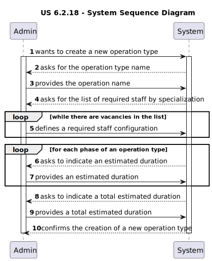
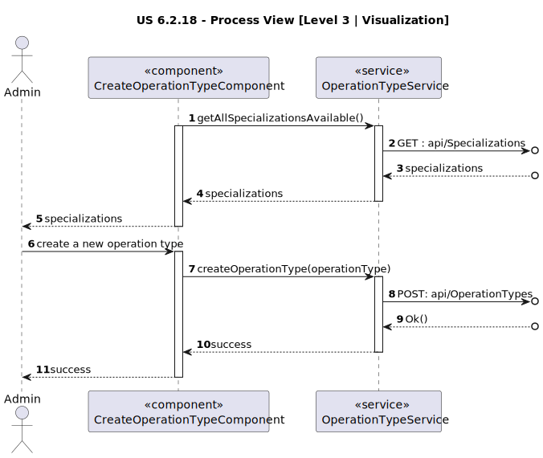

# US 6.2.20

<!-- TOC -->
* [US 6.2.20](#us-6220)
  * [1. Context](#1-context)
  * [2. Requirements](#2-requirements)
  * [3. Analysis](#3-analysis)
    * [System Sequence Diagram](#system-sequence-diagram)
  * [4. Design](#4-design)
    * [4.1. Realization](#41-realization)
    * [Process View](#process-view)
      * [Level 1](#level-1)
      * [Level 2](#level-2)
      * [Level 3](#level-3)
    * [4.3. Applied Patterns](#43-applied-patterns)
      * [4.1.3 Development View](#413-development-view)
      * [4.1.4 Physical View](#414-physical-view)
<!-- TOC -->

## 1. Context

This is the first time this user story is presented.

## 2. Requirements

**US 6.2.18:**  As an Admin, I want to add new types of operations, so that I can reflect the available medical procedures 
in the system.

**Acceptance Criteria:**

- 6.2.18.1. | Admins can add new operation types with attributes like: Operation Name, Required Staff by Specialization,
Estimated Duration.

- 6.2.18.2. | The system validates that the operation name is unique.

- 6.2.18.3. | The system logs the creation of new operation types and makes them available for scheduling immediately.

- 6.2.18.4. | The patient must have access to the operation type history and past appointments much link with the issued operation type version when they were created.

**Dependencies/References:**

This functionality is dependent on the creation of new operation types (5.1.20).

**Client Clarifications:**

> **Question:** Will there be a list of specializations in the system?
>
> **Answer:** Yes, a predefined list of specializations will be provided, but the system should allow for future additions.

> **Question:** The document you provided divides surgical times into "specific phases of the surgery," whereas the main
> statement only mentions recording the total surgery time. Should the system, therefore, store and specify the time spent
> on each phase of the surgery, or is it sufficient to only record the total surgery time without detailing the time 
> distribution across each phase?
>
> **Answer:** When describing an operation type, the system must record the time for each phase.

> **Question:** In the document with the surgeries, they all have 3 phases and respective duration:
>
>-Anesthesia/patient preparation
>
>-Surgery
>
>-Cleaning
> 
>Can we assume while creating a new operation type, that the surgery must always have this 3 phases?
>
> **Answer:** Yes.

> **Question:** When creating a new type of operation, we have a name, 3 time phases of the Surgery, a “required” list of
> (specialties, quantity). This new type of operation must not have a specialty other than those required so that, according
> to 5.1.16 AC2, a doctor can only book surgery in his specialty?
>
> The process is to create the new type of operation and then add it to the list of required specialties?
> 
> **Answer:** Yes. The type of operation is associated with a given specialty. The list of specialties is an integral part
> of the type of operation. Creation is carried out in a single step and not in two steps as you suggest.

> **Question:** Can the name of the operation be edited and can the name be the same as a deactivated operation?
>
> **Answer:** The name of the operation type must be unique. even if an operation type is "deactivated" it still exists 
> in the system and as such no other operation type can have the same name.

> **Question:** You want to log all updates to the operation request. Do you plan to have this info available in the app
> or is this just for audit purposes?
>
> **Answer:** The history of the operation type definition is part of the application's data. If the user needs to view
> the details of an operation that was performed last year, they need to be able to see the operation configuration that
> was in place at that time.

> **Question:** What is the process for handling the editing of operations, specifically regarding their type and history?
>
> **Answer:** When editing an operation, the system needs to maintain the history of the original operation type. The 
> challenge is that operation names must be unique, and you may want to track versions of operations over time. One approach
> is to use an auxiliary table to store operation history, ensuring you can track changes and retrieve past data, much 
> like how VAT changes in invoices are handled.

> **Question:** What are the technical options for managing reference data that changes over time, like VAT rates?
>
> **Answer:** There are two main approaches:
> 1. **Store exact values**: In this method, when creating an invoice, you save the exact VAT value in the invoice record, ensuring that past invoices reflect the VAT rate at the time they were issued.
> 2. **Versioned reference data**: You maintain a versioned VAT table, with columns for the effective start and end dates, ensuring that the system uses the correct VAT rate for any given period. This allows for tracking changes over time without altering historical data.

> **Question:** In US 5.1.22, when editing an operation, what happens to the scheduled ones? Do they get updated accordingly and rescheduled, or do they remain the same?
> Also regarding 6.2.20 and 5.1.21 Can the name be edited and can the name be the same as a deactivated operation?
>
> **Answer:** The name of the operation type must be unique. even if an operation type is "deactivated" it still exists in the system and as such no other operation type can have the same name.
> When editing an operation type there is the need to indicate a date when that configuration will be put in place. If there are operations of that type, scheduled after that date, the system should ideally start a rescheduling.

## 3. Analysis

The system has a predefined operation types list that  reflect the available procedures at the clinic/hospital. The Admin
has the permissions to add new ones as it is required, with the following attributes:

- **Operation Name** | it has to be unique
- **Required Staff by Specialization** | a list of the healthcare professionals needed to proceed with the surgery and each of their specializations and function
- **Estimated Duration** | in minutes
- **Phases (Anesthesia/patient preparation, Surgery, Cleaning)** | each step that constitutes the operation and the time in minutes each one takes

After the operation type has been created, the system registers the event in the system logs.

An operation type can also be deactivated when it no longer is a type of procedure done in the hospital. It can also be
reactivated. However, even if an operation type is inactive, no new operation types can have its name.

The patients have access to the operation type logs - creation and editing history.

### System Sequence Diagram

The following diagram depicts the interaction between the Admin and the system.

## 4. Design

### 4.1. Realization

The logical, physical, development and scenario views diagrams are generic for all the use cases of the backoffice component.
These diagrams can be found in the [generic views diagrams compilation file](../../team-decisions/views/general-views.md).

The process view levels are here represented as they represent a process specific to each user story.

### Process View

#### Level 1

#### Level 2

#### Level 3

- _Visualization_

- _MDBackoffice_

### 4.3. Applied Patterns

> #### **Repository Pattern**
>
>* **Components:** OperationTypeRepository, SpecializationRepository, LogRepository, OperationTypeRecordRepository
>
> The repositories are responsible for data access and retrieval, separating the logic for interacting with the database
> from the services and other layers. This pattern helps in abstracting the persistence logic.

> #### **DTO (Data Transfer Object) Pattern**
>
>* **Components:** SpecializationDTO, FunctionDTO, SpecializationAndFunctionResponseDTO, OperationTypeDTO
>
> DTOs are used to transfer data between layers, especially from the controller layer to the service layer or vice versa.
> The purpose is to carry data in a structured and decoupled way without exposing internal entity representations directly.
> This pattern does not need to follow business rules.

> #### **Facade Pattern**
>
>* **Components:** OperationTypeService, SpecializationService, OperationTypeRecordService, LogService 
>
> These services act as a Facade to simplify interaction with lower-level components like repositories. The Controller
> interacts with these service facades, keeping the complexity hidden from the higher layers.

#### 4.1.3 Development View

The diagrams can be found in the [team decision views folder](../../team-decisions/views/general-views.md#3-development-view).

#### 4.1.4 Physical View

The diagrams can be found in the [team decision views folder](../../team-decisions/views/general-views.md#4-physical-view).