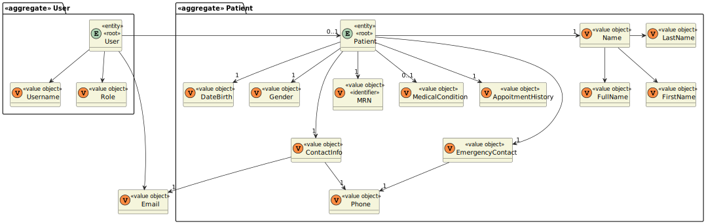

# US 7.2.11

<!-- TOC -->
* [US 7.2.11](#us-7211)
  * [1. Context](#1-context)
  * [2. Requirements](#2-requirements)
  * [3. Analysis](#3-analysis)
    * [Domain Model](#domain-model)
  * [4. Design](#4-design)
    * [4.1. Realization](#41-realization)
    * [Process View](#process-view)
      * [Level 1](#level-1)
      * [Level 2](#level-2)
      * [Level 3](#level-3)
    * [4.3. Applied Patterns](#43-applied-patterns)
      * [4.1.3 Development View](#413-development-view)
      * [4.1.4 Physical View](#414-physical-view)
<!-- TOC -->

## 1. Context

* This is the first time this user story is being requested, related to the GDPR (General Data Protection Regulation).

* General Data Protection Regulation (GDPR) is a regulation regarding the information privacy in the European Union (EU)
and the European Economic Area (EEA). It's an important component of EU privacy law and human rights law, governing the 
transfer of personal data outside the EU and EEA. It plays a crucial role in EU privacy and human rights laws, especially
when it comes to managing the transfer of personal data outside these regions. The primary objectives of GDPR are to give
individuals more control over their personal data and to streamline privacy regulations for businesses operating internationally.

## 2. Requirements

**US 7.2.11:** As a Patient, I want to delete my account and all associated data, so that I can exercise my right to be forgotten as per GDPR.

**Acceptance Criteria:**

- **7.2.11.1.** | Patients can request to delete their account through the profile settings.

- **7.2.11.2.** | The system sends a confirmation email to the patient before proceeding with account deletion.

- **7.2.11.3.** | Upon confirmation, all personal data is permanently deleted from the system within the legally required time frame (30 days).

- **7.2.11.4.** | Patients are notified once the deletion is complete, and the system logs the action for GDPR compliance.

- **7.2.11.5.** | Some anonymized data may be retained for legal or research purposes, but all identifiable information is erased.

**Dependencies/References:**

This functionality is dependent on the creation of a patient profile by the Admin (5.1.8) and the feature of deleting a
patient's account (US 5.1.5).

**Client Clarifications:**

> **Question:** How are duplicate patient profiles handled when registered by both the patient and admin?
>
> **Answer:** The system checks the email for uniqueness. The admin must first create the patient record, and then the patient can register using the same email.

> **Question:** What happens to patient data after the profile is deleted?
>
> **Answer:** Patient data must be retained for a legally mandated period before being anonymized or deleted.

> **Question:** The document states "Some anonymized data may be retained for legal or research purposes, but all identifiable
> information is erased". Which information should be retained?
>
> **Answer:** It is part of the team's responsibility in the scope of the GDPR module to define the policy.

> **Question:** Can you clarify the username and email requirements?
>
> **Answer:** The username is the "official" email address of the user.
>
> For backoffice users, this is the mechanographic number of the collaborator, e.g., D240003 or N190345, and the DNS domain
> of the system. For instance, Doctor Manuela Fernandes has email "D180023@myhospital.com". The system must allow for an
> easy configuration of the DNS domain (e.g., environment variable).
>
> For patients, the username is the email address provided in the patient record and used as identity in the external IAM.
> for instance patient Carlos Silva has provided his email csilva98@gmail.com the first time he entered the hospital. That
> email address will be his username when he self-registers in the system.

## 3. Analysis

This functionality centers around the patient's profile and their personal data, which contains plenty of information, such as:

>**Identifiable Data**
>- name
>- phone number
>- email
>
>**Non-Identifiable Data**
>- gender
>- birthday
>- appointment history
>- medical conditions/records
>- settings/preferences

Once on the profile page, the patient can request to delete their account through the settings.

Upon initiating the request, the system sends a confirmation email to the patient's registered email address. After the
patient verifies the request, the system begins by permanently deleting all personal data within the legally defined time
frame of 30 days.

Some anonymized data can be retained for legal or research purposes, but none of this information will identify the patient
in any way.

Upon concluding the account deletion, the system logs the action following GDPR requirements, ensuring compliance and
auditability.

### Domain Model

**Observation:** MRN refers to the medical record number.

## 4. Design

### 4.1. Realization

The logical, physical, development and scenario views diagrams are generic for all the use cases of the backoffice component.
These diagrams can be found in the [generic views diagrams compilation file](../../team-decisions/views/general-views.md).

The process view levels are here presented as they represent a process specific to each user story.

### Process View

#### Level 1

#### Level 2

As this level does not add any additional information regarding the user story's execution flow from level 1's diagram, 
it's diagram was deemed irrelevant.

#### Level 3

- _Visualization_ 
  

- _MDBackoffice_
  

  
### 4.3. Applied Patterns

> #### **Repository Pattern**
>
>* **Components:** TokenRepository, PatientRepository, LogRepository
>
> The repositories are responsible for data access and retrieval, separating the logic for interacting with the database
> from the services and other layers. This pattern helps in abstracting the persistence logic.

> #### **DTO (Data Transfer Object) Pattern**
>
>* **Components:** TokenDTO, EmailMessageDTO
>
> DTOs are used to transfer data between layers, especially from the controller layer to the service layer or vice versa.
> The purpose is to carry data in a structured and decoupled way without exposing internal entity representations directly.
> This pattern does not need to follow business rules.

> #### **Facade Pattern**
>
>* **Components:** UserService, UserManager, TokenService, PatientService, EmailService, LogService
>
> These services act as a Facade to simplify interaction with lower-level components like repositories. The Controller 
> interacts with these service facades, keeping the complexity hidden from the higher layers.

#### 4.1.3 Development View

The diagrams can be found in the [team decision views folder](../../team-decisions/views/general-views.md#3-development-view).

#### 4.1.4 Physical View

The diagrams can be found in the [team decision views folder](../../team-decisions/views/general-views.md#4-physical-view).