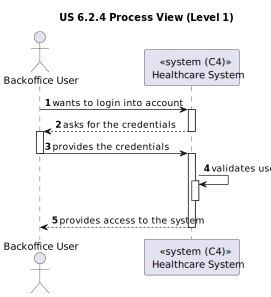
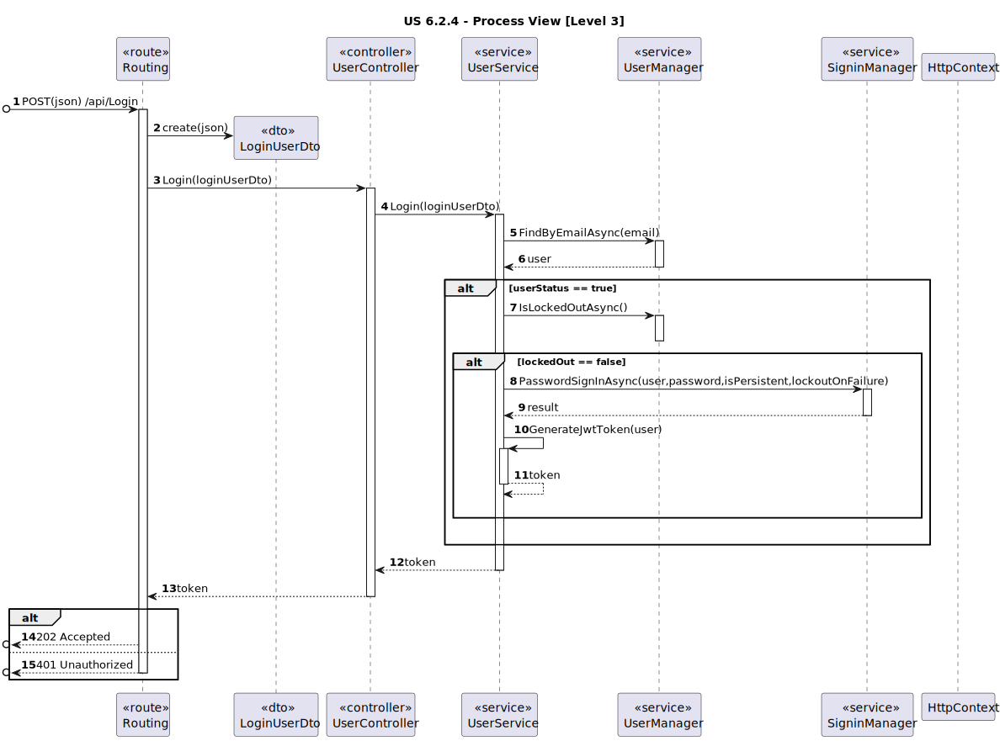

# US 6.2.4

<!-- TOC -->
* [US 6.2.4](#us-624)
  * [1. Context](#1-context)
  * [2. Requirements](#2-requirements)
  * [3. Analysis](#3-analysis)
  * [4. Design](#4-design)
    * [4.1. Realization](#41-realization)
    * [Process View](#process-view)
      * [Level 1](#level-1)
      * [Level 2](#level-2)
      * [Level 3](#level-3)
    * [4.3. Applied Patterns](#43-applied-patterns)
<!-- TOC -->

## 1. Context

This is the first time this user story is worked on.

## 2. Requirements

**US 6.2.4:** As a (non-authenticated) Backoffice User, I want to log in to the system using my credentials, so that I 
can access the backoffice features according to my assigned role.

**Acceptance Criteria:**

- 6.2.4.1: Backoffice users log in using their username and password.

- 6.2.4.2: Role-based access control ensures that users only have access to features appropriate to their role (e.g., doctors can manage appointments, admins can manage users and settings).

- 6.2.4.3:  After five failed login attempts, the user account is temporarily locked, and a notification is
sent to the admin.

- 6.2.4.4:  Login sessions expire after a period of inactivity to ensure security.

**Dependencies/References:**

This user story is related to US-5.1.1, as the backoffice user must be registered by the admin beforehand.

**Client Clarifications:**

> **Question**: What defines session inactivity?
>
> **Answer**: Inactivity is defined as no interaction with the API. After 20 minutes of inactivity, the session should disconnect.

> **Question**: What happens when a user fails to log in more than five times, and what is the process for unlocking their account?
>
> **Answer**: After five failed login attempts, the system will temporarily lock the account. The process for unlocking 
> the account is typically handled outside the system by an administrator, who would verify that the failed attempts were
> not made with malicious intent. However, this unlocking process is not part of the current system.

## 3. Analysis

In this user story, backoffice users, such as doctors, nurses, admins, and technicians, can log into the system using their
credentials (username and password) to access features based on their assigned roles. Role-based access control ensures 
that each user only has access to the specific functionalities relevant to their position.

A security measure is implemented where, after five failed login attempts, the user account is temporarily locked, and the
admin is notified. Additionally, to maintain security, login sessions are disconnected after 20 minutes of inactivity, 
defined as no interaction with the API.

## 4. Design

### 4.1. Realization

The logical, physical, development and scenario views diagrams are generic for all the use cases of the backoffice component.
These diagrams can be found in the [generic views diagrams compilation file](../../team-decisions/views/general-views.md).

The process view levels are here represented as they represent a process specific to each user story.

### Process View

#### Level 1

#### Level 2

As this level does not add any additional information regarding the user story's execution flow from level 1's diagram,
it's diagram was deemed irrelevant.

#### Level 3

* Login successful before 5 attempts

* Login unsuccessful after 5 attempts

### 4.3. Applied Patterns

> #### **Repository Pattern**
>
>* **Components:** UserRepository
>
> The repositories are responsible for data access and retrieval, separating the logic for interacting with the database
> from the services and other layers. This pattern helps in abstracting the persistence logic.

> #### **DTO (Data Transfer Object) Pattern**
>
>* **Components:** UserDTO, EmailDTO
>
> DTOs are used to transfer data between layers, especially from the controller layer to the service layer or vice versa.
> The purpose is to carry data in a structured and decoupled way without exposing internal entity representations directly.
> This pattern does not need to follow business rules.

> #### **Facade Pattern**
>
>* **Components:** AuthenticationService, EmailService
>
> These services act as a Facade to simplify interaction with lower-level components like repositories. The Controller
> interacts with these service facades, keeping the complexity hidden from the higher layers.
