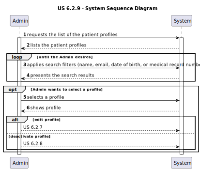
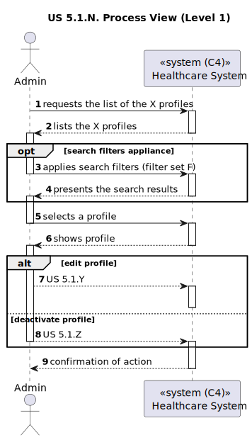
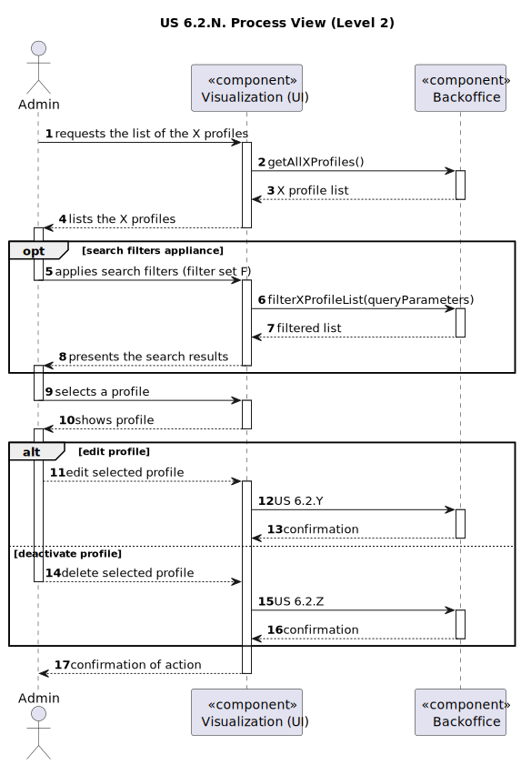
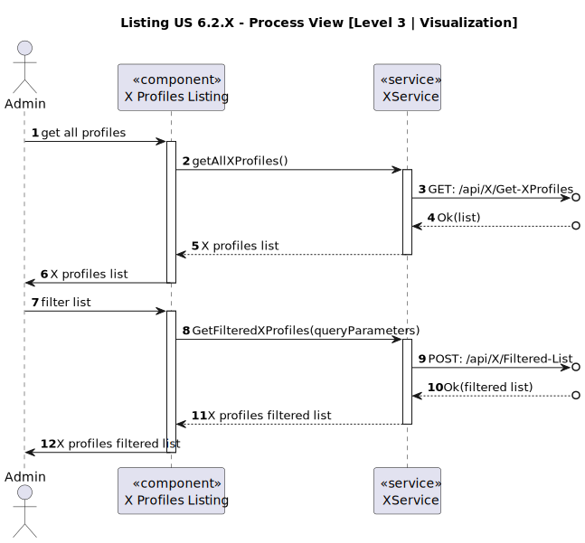
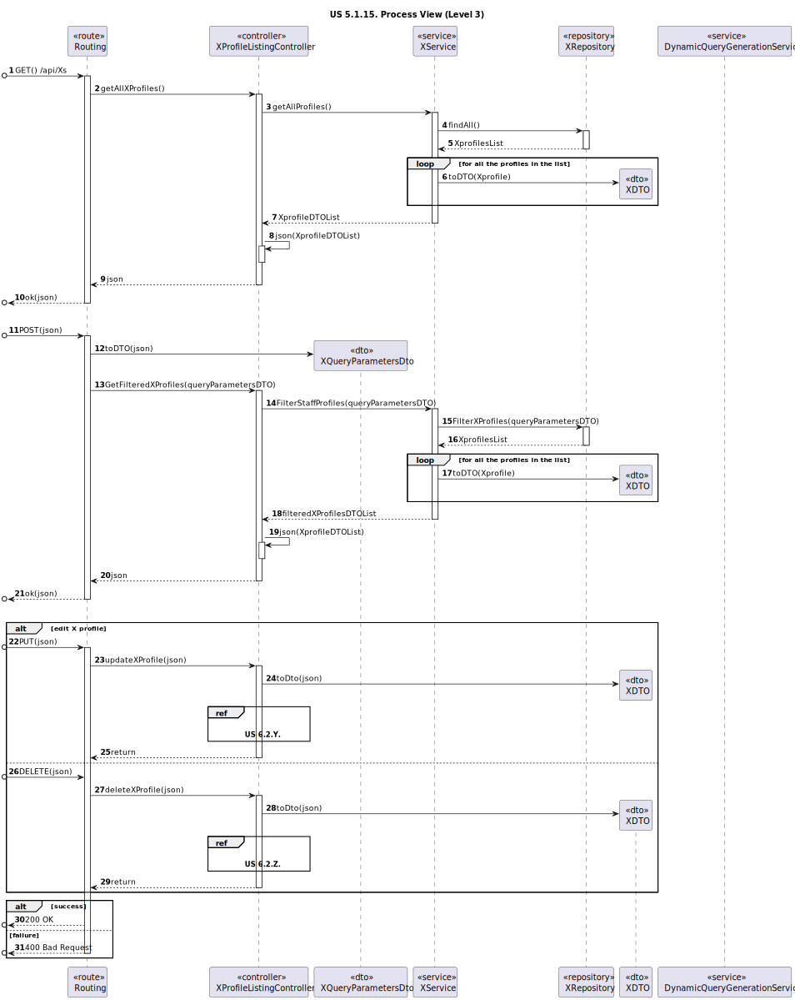

# US 6.2.9

<!-- TOC -->
* [US 6.2.9](#us-629)
  * [1. Context](#1-context)
  * [2. Requirements](#2-requirements)
  * [3. Analysis](#3-analysis)
    * [System Sequence Diagram](#system-sequence-diagram)
  * [4. Design](#4-design)
    * [4.1. Realization](#41-realization)
    * [Process View](#process-view)
      * [Level 1](#level-1)
      * [Level 2](#level-2)
      * [Level 3](#level-3)
    * [4.3. Applied Patterns](#43-applied-patterns)
      * [4.1.3 Development View](#413-development-view)
      * [4.1.4 Physical View](#414-physical-view)
<!-- TOC -->

## 1. Context

This is the first time this user story is presented.

## 2. Requirements

**US 6.2.9:** As an Admin, I want to list/search patient profiles by different attributes, so that I can view the details, edit, and remove patient profiles.

**Acceptance Criteria:**

- **6.2.9.1.** | Admins can search patient profiles by various attributes, including name, email, date of birth, or medical record number.

- **6.2.9.2.** | The system displays search results in a list view with key patient information (name, email, date of birth).

- **6.2.9.3.** | Admins can select a profile from the list to view, edit, or delete the patient record.

- **6.2.9.4.** | The search results are paginated, and filters are available to refine the search results.

- **6.2.9.5** | It is possible to apply multiple filters to a search result.

**Dependencies/References:**

This functionality is dependent on the listing and filtering of patient profiles (5.1.11).

**Client Clarifications:**

> **Question:** There are plenty of filters for the doctors profiles, however I'm struggling to see what filters can be 
> applied to the patients profiles listing. They can be searched by name, email, date of birth, or medical record number,
> but everyone has the same role, no specialization, and so on.
>
> Can you be a bit more detailed on the filters you're looking to be applied in the patients listings?
>
> **Answer:** Users should be able to search students by: name, AND/OR email, AND/OR phone number, AND/OR medical record
> number, AND/OR date of birth, AND/OR gender listing of users should have the same filters available

> **Question:** The filters are And or OR. For example, if I filter for a Patient named John and Age 24, do you want every
> John who is 24 years old or every Patient who is called John or is 24 years old.
>
> **Answer:** If more than one search/filter parameter is used, the combination of filters should be considered as AND.

## 3. Analysis

The Admin has access to all the profiles within the healthcare system, including Patient profiles, that can be consulted
in a list. In this list, the Admin selects a profile to see its details, update and remove it.

The Admin can search profiles by the patient's name, email, date of birth, or medical record number, and the search results
are presented through a paginated list, with search filters to refine the selection of listed profiles.

Multiple filters can be used simultaneously, with combinations of different attributes and filters conjunctions such as 
"AND" or "OR" can be selected to refine even more the search results.

### System Sequence Diagram

The following diagram depicts the interaction between the Admin and the system.

## 4. Design
### 4.1. Realization

The logical, physical, development and scenario views diagrams are generic for all the use cases of the backoffice component.
These diagrams can be found in the [generic views diagrams compilation file](../../team-decisions/views/general-views.md).

Regarding this user story in particular, it's very similar to [US 6.2.13.](../us-6.2.13/readme.md), so diagrams of generic
process views of each level were created to represent both.

In the following diagrams, the listed variables represent the respective concepts:

* **N** is 9, represents the current user story -> US 6.2.9.
* **X** represents Patient
* **F** represents the set of filters applicable to patients (name, email, date of birth, or medical record number)
* **Y** is 7, represents the patient profile edition user story -> US 6.2.7
* **Z** is 8, represents the patient profile deactivation/deletion user story -> US 6.2.8

### Process View

#### Level 1

#### Level 2

#### Level 3

- _Visualization_

- _MDBackoffice_

### 4.3. Applied Patterns

> #### **Repository Pattern**
>
>* **Components:** PatientRepository
>
> The repositories are responsible for data access and retrieval, separating the logic for interacting with the database
> from the services and other layers. This pattern helps in abstracting the persistence logic.

> #### **DTO (Data Transfer Object) Pattern**
>
>* **Components:** PatientDTO, QueryParametersDTO
>
> DTOs are used to transfer data between layers, especially from the controller layer to the service layer or vice versa.
> The purpose is to carry data in a structured and decoupled way without exposing internal entity representations directly.
> This pattern does not need to follow business rules.

> #### **Facade Pattern**
>
>* **Components:** PatientService
>
> These services act as a Facade to simplify interaction with lower-level components like repositories. The Controller
> interacts with these service facades, keeping the complexity hidden from the higher layers.

#### 4.1.3 Development View

The diagrams can be found in the [team decision views folder](../../team-decisions/views/general-views.md#3-development-view).

#### 4.1.4 Physical View

The diagrams can be found in the [team decision views folder](../../team-decisions/views/general-views.md#4-physical-view).