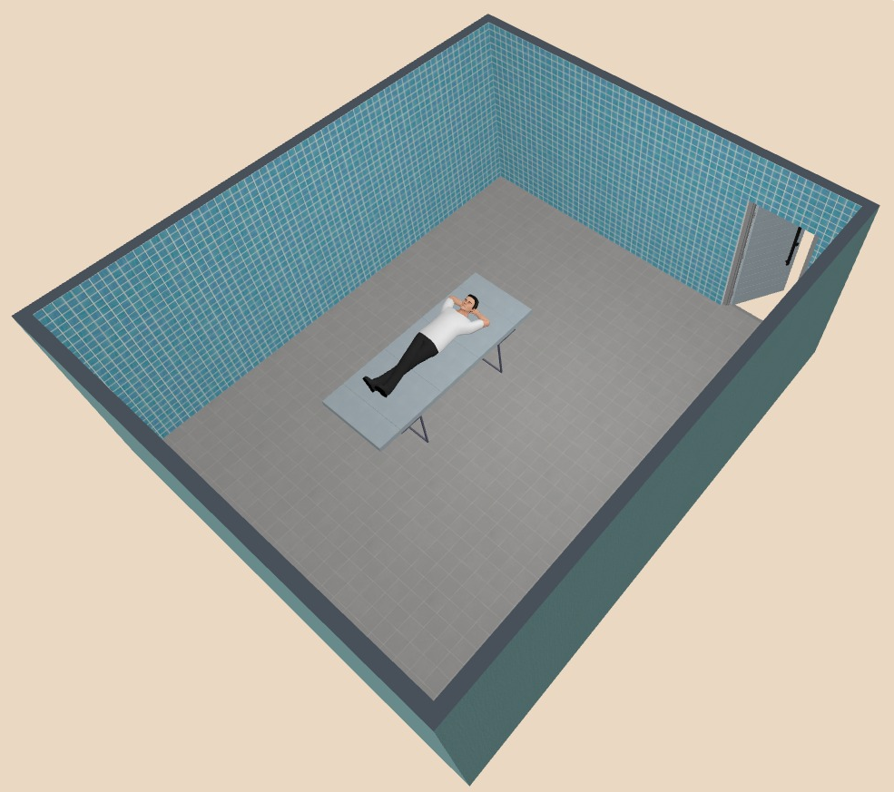
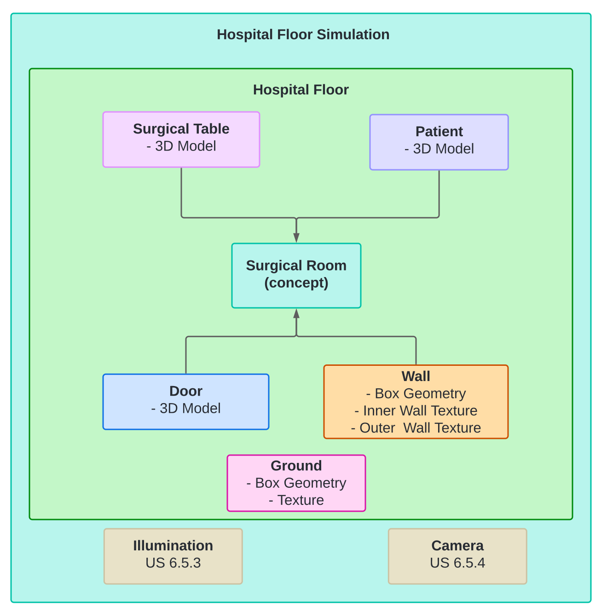
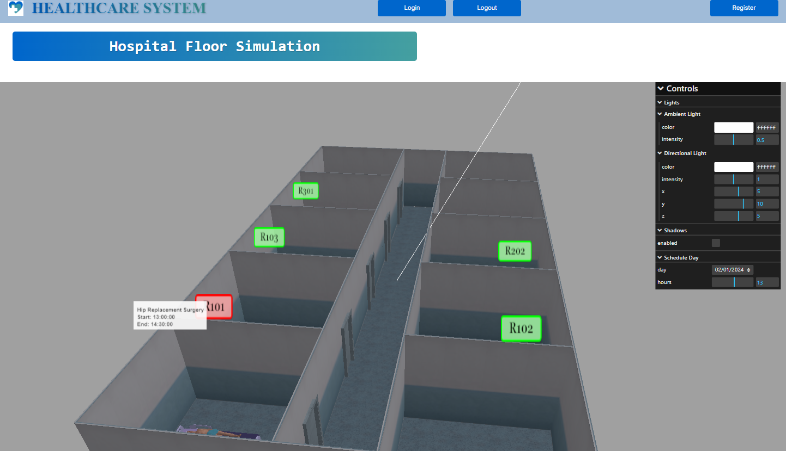

# US 6.5.1

<!-- TOC -->
* [US 6.5.1](#us-651)
  * [1. Context](#1-context)
  * [2. Requirements](#2-requirements)
  * [3. Analysis](#3-analysis)
  * [4. Design](#4-design)
    * [4.1. Realization](#41-realization)
  * [5. Implementation](#5-implementation)
  * [6. Observations](#6-observations)
<!-- TOC -->


## 1. Context

This is the first time this user story is worked on.

## 2. Requirements

**US 6.5.1:** As a healthcare staff member, I want to see a 3D representation of the hospital/clinic floor.

**Acceptance Criteria:**

- 6.5.1.1: Its description should be imported from a JSON (JavaScript Object Notation) formatted file.

- 6.5.1.2: The floor must consist of several surgical rooms.

- 6.5.1.3: Each room must be enclosed by walls and include a door and a surgical table.

- 6.5.1.4: There should be no representation of the ceiling.

- 6.5.1.5: If a room is being used at any given time, a 3D model of a human body should be lying on the table.

- 6.5.1.6: Must be implemented in an higher-level API such as Three.js, WebGL or Babylon.js.

**Dependencies/References:**

This functionality has no dependencies, however it will be the base for other features, such has the implementation of 
textures (US 6.5.2), dynamic lighting (US 5.6.3) and camara movements via mouse (US 6.2.4).

**Client Clarifications:**

> **Question:** When should the human body be lying on the table? if at this precise moment there is a surgery going on? or if there are surgeries going to happen that day?
>
> **Answer:** If and only if there is a surgery going on on that precise room at that precise moment.

## 3. Analysis

This component can will be implemented using a higher-level API, three.js.

The hospital floor visualization comprises a set of rooms, each equipped with a door, walls, and a surgical table.
This representation must be described in a JSON file with the following information:

>- ground texture
>- wall texture
>- surgical bed model url
>- door model url
>- door texture url
>- patient model url
>- size of the hospital floor (width and height)
>- layout (matrix with cell types referring to different objects/elements)

The file must include any other items the team decides to introduce into the 3D representation.
No ceiling is used in the floor, ensure a clear view of all the components.

This file is to be loaded when a staff wants to check which rooms are available and their scheduled operations.

The following image represents the type of 3D visualization the team is aiming for:



## 4. Design

### 4.1. Realization

This functionality will use Three.js, a JavaScript library and API designed for creating and displaying animated 3D graphics
in a web browser using WebGL, compatible across different browsers.

This model will be composed of the following javascript classes:

* wall template - initializes a box geometry with its textures
* floor template - initializes a box geometry with its textures
* hospital floor template - compiles clones of many instances to generate the hospital floor
* surgical table template - loads a 3D model of a surgical table and its textures
* door template - loads a 3D model of a door and its textures
* patient template - loads a 3D model of a human and its textures
* hospital floor simulation template - initializes the 3D visualization and other components that will be incorporated later

Lights, textures and mouse based camara movements related classes will be added later by other user stories.

The following diagram goes in-depth about each instance attributes/transformations.



## 5. Implementation

The layout of the simulation is defined by the following json:

```
{
"groundTextureUrl": "hospital_ground.png",
"wallTextureUrl": "hospital_wall.png",
"bedModel" : "hospital_bed.glb",
"doorModelUrl": "door_glb.glb",
"doorTextureUrl": "door_texture.png",
"patientModel" : "patient.glb",
"size": { "width": 20, "height": 10 },
"layout": [
[2, 2, 2, 2, 2, 2, 2, 2, 2, 2, 2, 2, 2, 2, 2, 2, 2, 2, 2, 2, 0],
[1, 0, 0, 0, 1, 0, 0, 0, 1, 0, 0, 0, 1, 0, 0, 0, 1, 0, 0, 0, 1],
[1, 0, 7, 0, 1, 0, 7, 0, 1, 0, 7, 0, 1, 0, 7, 0, 1, 0, 7, 0, 1],
[1, 0, 0, 0, 1, 0, 0, 0, 1, 0, 0, 0, 1, 0, 0, 0, 1, 0, 0, 0, 1],
[3, 2, 2, 2, 3, 2, 2, 2, 3, 2, 2, 2, 3, 2, 2, 2, 3, 2, 2, 2, 1],
[1, 0, 5, 0, 0, 0, 5, 0, 0, 0, 5, 0, 0, 0, 5, 0, 0, 0, 5, 0, 1],
[3, 2, 2, 2, 2, 2, 2, 2, 2, 2, 2, 2, 2, 2, 2, 2, 2, 2, 2, 2, 1],
[1, 0, 8, 0, 1, 0, 8, 0, 1, 0, 8, 0, 1, 0, 8, 0, 1, 0, 8, 0, 1],
[1, 0, 0, 0, 1, 0, 0, 0, 1, 0, 0, 0, 1, 0, 0, 0, 1, 0, 0, 0, 1],
[1, 0, 4, 0, 1, 0, 4, 0, 1, 0, 4, 0, 1, 0, 4, 0, 1, 0, 4, 0, 1],
[3, 2, 2, 2, 3, 2, 2, 2, 3, 2, 2, 2, 3, 2, 2, 2, 3, 2, 2, 2, 1]
]
}
```

The simulation is within an Angular component, and some elements of the simulation have their one classes, such as:

* **Sprite**

```
import * as THREE from "three";

interface TextSpriteParameters {
    fontsize?: number;
    fontface?: string;
    borderThickness?: number;
    borderColor?: { r: number; g: number; b: number; a: number };
    backgroundColor?: { r: number; g: number; b: number; a: number };
}

export default class Sprite {
    object: THREE.Group;
    text: string;
    available : boolean;

    constructor(roomID : string, occupied : boolean) {
        this.object = new THREE.Group();
        this.text = roomID;
        this.available = occupied;

        

        let spritey = this.makeTextSprite(this.text, {
            fontsize: 24,
            fontface: "Georgia",
            borderColor: this.getBorderColorRegardingOccupancy(),
            backgroundColor: this.getBaseColorRegardingOccupancy()
        } );
        spritey.name = "Sprite"

        this.object.add(spritey);
    }

    getBorderColorRegardingOccupancy() : any{
        if (this.available) {
            return { r: 0, g: 255, b: 0, a: 1.0 };
        }
        return { r: 255, g: 0, b: 0, a: 1.0 };
    }

    getBaseColorRegardingOccupancy() : any{
        if (this.available) {
            return { r: 100, g: 255, b: 100, a: 0.8 };
        }
        return { r: 255, g: 100, b: 100, a: 0.8 };
    }

    makeTextSprite(message: string, parameters: TextSpriteParameters = {}): THREE.Sprite {
        const fontface = parameters.fontface || "Arial";
        const fontsize = parameters.fontsize || 18;
        const borderThickness = parameters.borderThickness || 4;
        const borderColor = parameters.borderColor || { r: 0, g: 0, b: 0, a: 1.0 };
        const backgroundColor = parameters.backgroundColor || { r: 255, g: 255, b: 255, a: 1.0 };

        // Create a canvas element to draw the text and background
        const canvas = document.createElement('canvas');
        const context = canvas.getContext('2d')!;
        context.font = `Bold ${fontsize}px ${fontface}`;

        // Measure the text width
        const metrics = context.measureText(message);
        const textWidth = metrics.width;

        // Draw the background color
        context.fillStyle = `rgba(${backgroundColor.r},${backgroundColor.g},${backgroundColor.b},${backgroundColor.a})`;

        // Draw the border color
        context.strokeStyle = `rgba(${borderColor.r},${borderColor.g},${borderColor.b},${borderColor.a})`;
        context.lineWidth = borderThickness;

        // Draw rounded rectangle with text
        this.roundRect(context, borderThickness / 2, borderThickness / 2, textWidth + borderThickness, fontsize * 1.4 + borderThickness, 6);

        // Set text color and draw text
        context.fillStyle = "rgba(0, 0, 0, 1.0)";
        context.fillText(message, borderThickness, fontsize + borderThickness);

        // Create a texture from the canvas
        const texture = new THREE.Texture(canvas);
        texture.needsUpdate = true;

        // Create sprite material with the texture
        const spriteMaterial = new THREE.SpriteMaterial({ map: texture });
        const sprite = new THREE.Sprite(spriteMaterial);
        sprite.scale.set(2.5, 2.5, 2.5);
        return sprite;
    }

    updateColor(): void {
        const borderColor = this.getBorderColorRegardingOccupancy();
        const backgroundColor = this.getBaseColorRegardingOccupancy();
    
        // Get the text from the sprite
        const textSprite = this.object.getObjectByName("Sprite") as THREE.Sprite;
        if (!textSprite || !(textSprite.material instanceof THREE.SpriteMaterial)) {
            console.warn("Text sprite or its material is not available.");
            return;
        }
    
        // Create a new canvas and redraw the texture
        const canvas = document.createElement('canvas');
        const context = canvas.getContext('2d')!;
        context.font = "Bold 24px Georgia";
    
        // Measure text width
        const metrics = context.measureText(this.text);
        const textWidth = metrics.width;
    
        const borderThickness = 4; // Thickness of the border
        const fontSize = 24; // Font size for the text
    
        // Draw background with rounded corners
        context.fillStyle = `rgba(${backgroundColor.r},${backgroundColor.g},${backgroundColor.b},${backgroundColor.a})`;
        context.strokeStyle = `rgba(${borderColor.r},${borderColor.g},${borderColor.b},${borderColor.a})`;
        context.lineWidth = borderThickness;
    
        this.roundRect(
            context,
            borderThickness / 2,
            borderThickness / 2,
            textWidth + borderThickness,
            fontSize * 1.4 + borderThickness,
            6 // Corner radius
        );
    
        // Draw text
        context.fillStyle = "rgba(0, 0, 0, 1.0)";
        context.fillText(this.text, borderThickness, fontSize + borderThickness);
    
        // Create a new texture from the canvas
        const newTexture = new THREE.Texture(canvas);
        newTexture.needsUpdate = true;
    
        // Update the sprite material's texture
        textSprite.material.map = newTexture;
        textSprite.material.needsUpdate = true;
        }

    // Function to draw rounded rectangles
    roundRect(ctx: CanvasRenderingContext2D, x: number, y: number, w: number, h: number, r: number): void {
        ctx.beginPath();
        ctx.moveTo(x + r, y);
        ctx.lineTo(x + w - r, y);
        ctx.quadraticCurveTo(x + w, y, x + w, y + r);
        ctx.lineTo(x + w, y + h - r);
        ctx.quadraticCurveTo(x + w, y + h, x + w - r, y + h);
        ctx.lineTo(x + r, y + h);
        ctx.quadraticCurveTo(x, y + h, x, y + h - r);
        ctx.lineTo(x, y + r);
        ctx.quadraticCurveTo(x, y, x + r, y);
        ctx.closePath();
        ctx.fill();
        ctx.stroke();
    }
}
```

* **User Interface**

```
import * as THREE from "three";
import { GUI } from "three/addons/libs/lil-gui.module.min.js";

interface TimeSettings {
    hours: number;
}

interface SheduleDay {
    day: string;
}

export default class UserInterface {
    gui: GUI;
    timeSettings: TimeSettings;
    selectedDay : SheduleDay;

    constructor(scene: THREE.Scene, renderer: THREE.WebGLRenderer, document : any, scheduledDays : string[]) {
        // Helper function to update object color
        const colorCallback = (object: THREE.Light, color: string): void => {
            object.color.set(color);
        };

        this.gui = new GUI({ hideable: false } as any);
        const guiDomElement = this.gui.domElement;
        guiDomElement.style.position = 'absolute';
        guiDomElement.style.right = '45px';
        guiDomElement.style.top = '237px';
        guiDomElement.style.zIndex = '1';

        // Create the lights folder
        const lightsFolder = this.gui.addFolder("Lights");

        // Create the ambient light folder
        const ambientLightFolder = lightsFolder.addFolder("Ambient Light");

        // Create an ambient light instance
        const ambientLight = new THREE.AmbientLight(0xffffff, 0.5); // Default white light with medium intensity
        scene.add(ambientLight); // Assuming `scene` is your Three.js scene

        // Add GUI controls for the ambient light
        const ambientColor = { color: `#${ambientLight.color.getHexString()}` };
        ambientLightFolder.addColor(ambientColor, "color").onChange(color => colorCallback(ambientLight, color));
        ambientLightFolder.add(ambientLight, "intensity", 0.0, 1.0, 0.01);

        // Create the directional light folder
        const directionalLightFolder = lightsFolder.addFolder("Directional Light");

        // Create a directional light instance
        const directionalLight = new THREE.DirectionalLight(0xffffff, 1); // Default white light with full intensity
        directionalLight.position.set(5, 10, 5); // Set initial position
        scene.add(directionalLight); // Add the light to the scene

        // Object for GUI controls
        const directionalLightSettings = {
            color: `#${directionalLight.color.getHexString()}`,
            x: directionalLight.position.x,
            y: directionalLight.position.y,
            z: directionalLight.position.z,
        };

        // Add GUI controls for the directional light
        directionalLightFolder.addColor(directionalLightSettings, "color").onChange(color => {
            directionalLight.color.set(color);
        });
        directionalLightFolder.add(directionalLight, "intensity", 0.0, 2.0, 0.1); // Intensity control
        directionalLightFolder.add(directionalLightSettings, "x", -20, 20, 0.1);
        directionalLightFolder.add(directionalLightSettings, "y", -20, 20, 0.1);
        directionalLightFolder.add(directionalLightSettings, "z", -20, 20, 0.1);

        // Create the working day time folder
        this.timeSettings = { hours: 0 }; // Starting at 0 (midnight)
        this.selectedDay = { day : scheduledDays[0]};
        const timeFolder = this.gui.addFolder("Schedule Day");

        const dayControl = timeFolder.add(this.selectedDay, 'day', scheduledDays);
        dayControl.listen();
        const daySelect = dayControl.domElement.querySelector('select');
        if (daySelect) {
            daySelect.style.fontSize = '14px';
        }
        
        timeFolder.add(this.timeSettings, "hours", 0, 24, 0.5);
    }

    setVisibility(visible: boolean): void {
        if (visible) {
            this.gui.show();
        } else {
            this.gui.hide();
        }
    }
}
```

* **Ground**

```
import * as THREE from "three";

export default class Ground {
  public object: THREE.Mesh;

  constructor(textureUrl : string, size : THREE.Vector2) {

    // Load the texture
    const texture = new THREE.TextureLoader().load(textureUrl);
    texture.colorSpace = THREE.SRGBColorSpace;
    texture.wrapS = THREE.RepeatWrapping;
    texture.wrapT = THREE.RepeatWrapping;
    texture.repeat.set(size.width, size.height);
    texture.magFilter = THREE.LinearFilter;
    texture.minFilter = THREE.LinearMipmapLinearFilter;

    // Create the plane geometry
    const geometry = new THREE.PlaneGeometry(size.width, size.height);

    // Create the material with the texture
    const material = new THREE.MeshPhongMaterial({ color: 0x90adbf, map: texture, side: THREE.DoubleSide });

    // Create the mesh
    this.object = new THREE.Mesh(geometry, material);
    this.object.rotation.x = -Math.PI / 2.0;
    this.object.position.y = 0;

    // Configure shadows
    this.object.castShadow = false;
    this.object.receiveShadow = true;
  }
}
```

* **Wall**

```
import * as THREE from "three";

export default class Wall {
    object: THREE.Group;

    constructor(textureUrl: string) {
        // Load texture
        const texture = new THREE.TextureLoader().load(textureUrl);
        texture.colorSpace = THREE.SRGBColorSpace;
        texture.magFilter = THREE.LinearFilter;
        texture.minFilter = THREE.LinearMipmapLinearFilter;
        texture.wrapS = THREE.RepeatWrapping;
        texture.wrapT = THREE.RepeatWrapping;
        texture.repeat.set(1, 1);

        // Create a group to hold the wall
        this.object = new THREE.Group();

        // Create wall geometry and material
        const geometry = new THREE.BoxGeometry(1, 3.5, 0.05);
        const material = new THREE.MeshPhongMaterial({ color: 0xffffff, map: texture });
        const wall = new THREE.Mesh(geometry, material);

        // Enable shadows
        wall.castShadow = true;
        wall.receiveShadow = true;

        // Add wall to the group
        this.object.add(wall);
    }
}
```


In the simulation, a raycaster is integrated, which allows to detect patients. When a patient model is intersected, a
tooltip with the information of the surgery occurring at the moment appears. The sprite with the room ID also changes 
color to symbolize its occupancy.

The user interface (lil-gui), has a folder ('Scheduled Day'), which has an array of dates that were retrieved from the database,
and a slider which goes from 0 to 24 (referring to hours in a day), which an increment of 0.5 (30 minutes).




## 6. Observations

Some references:

* https://discourse.threejs.org/t/threejs-tooltip/18256/3
* https://stemkoski.github.io/Three.js/