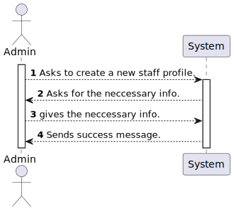
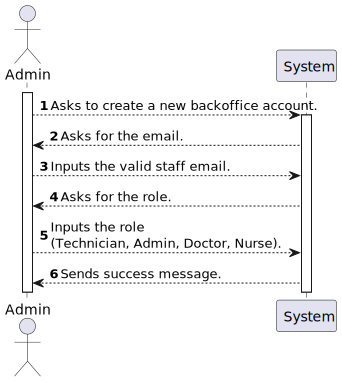
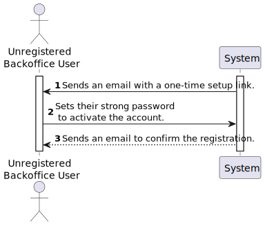

# US 5.1.1

<!-- TOC -->
- [US 5.1.1](#us-511)
  - [1. Context](#1-context)
  - [2. Requirements](#2-requirements)
  - [3. Analysis](#3-analysis)
    - [3.1 System Sequence Diagram](#31-system-sequence-diagram)
    - [3.2 Domain Model](#32-domain-model)
  - [4. Design](#4-design)
    - [4.1. Realization](#41-realization)
    - [4.2. Class Diagram](#42-class-diagram)
    - [4.3. Applied Patterns](#43-applied-patterns)
    - [4.4. Tests](#44-tests)
  - [5. Implementation](#5-implementation)
  - [6. Integration/Demonstration](#6-integrationdemonstration)
  - [7. Observations](#7-observations)
<!-- TOC -->

## 1. Context

This is the second time this User Story is being worked on. 
This User Story is related to the Admin.
New documentation will be added and the integration of IAM registering will be documented here.

## 2. Requirements

**US 5.1.1:** As an Admin, I want to register new backoffice users (e.g., doctors, nurses, technicians, admins) via an out-of-band process, so that they can access the backoffice system with appropriate permissions.

**Acceptance Criteria:**

- **5.1.1.1. -** Backoffice users (e.g., doctors, nurses, technicians) are registered by an Admin via an internal process, not via self-registration. 

- **5.1.1.2. -** Admin assigns roles (e.g., Doctor, Nurse, Technician) during the registration process.

- **5.1.1.3. -** Registered users receive a one-time setup link via email to set their password and activate their account. 

- **5.1.1.4. -** The system enforces strong password requirements for security. 

- **5.1.1.5. -** A confirmation email is sent to verify the user’s registration. 

- **5.1.1.6. -** The strong password requirements are: 10 or more characters long, 1 or more digits, 1 or more capital letter and 1 or more special character.

**Dependencies/References:**

- **US 5.1.2. -** This user story depends on US 5.1.1. as it depends on an existing account in the system.
- **US 5.1.6. -** This user story depends on US 5.1.1. as it depends on an existing account in the system so that certain permissions may be granted.
- **US 5.1.12. to 5.1.23. -** These user stories depends on US 5.1.1. as it depends on an existing account in the system with certain role-based permissions.

**Client Clarifications:**

> Question: What are the system's password requirements?
>
> Answer: At least 10 characters long, at least a digit, a capital letter and a special character.

> Question: Dear Client,
Chapter 3.2 says that "Backoffice users are registered by the admin in the IAM through an out-of-band process.", but US 5.1.1 says that "Backoffice users are registered by an Admin via an internal process, not via self-registration.".
Can you please clarify if backoffice users registration uses the IAM system? And if the IAM system is the out-of-band process?
>
> Answer: What this means is that backoffice users can not self-register in the system like the patients do. the admin must register the backoffice user. If you are using an external IAM (e.g., Google, Azzure, Linkedin, ...) the backoffice user must first create their account in the IAM provider and then pass the credential info to the admin so that the user account in the system is "linked" wit the external identity provider.

> Question: In IAM external system, if a patient is signed in with a google account and later uses other external system like Facebook, and both have different credentials, what happens?
>
> Answer: Assume the system only supports one IAM.

> Question: Greetings,
Regarding the creation of staff users and profiles, I know there's been a lot of questions about this matter, but my team just got very confused about this whole process, so I felt the need to ask for some clarification.
>
>There are 2 separate use cases regarding backoffice users: One for the creation of the user account and another one for the creation of the staff's profile.
>
>- Is there a fixed order for these operations to take place? Does the admin always create the profile first or can he create the user first aswell?
>
>- If the profile is created first, for example, should the user be created automaticaly or should the admin create the user afterwards, having to do 2 distinct operations?
>
> Answer: Recommended Flow:
Order of operations: The system should support profile first. The admin should then create the user account. the account and user profile are linked by the professional email address or username (depending on the IAM provider).
>Distinct Operations: The operations should remain distinct, even if they are performed in quick succession. This ensures that each step (creating user credentials and creating a staff profile) is carefully tracked and managed.
>Validation: The system should ensure that a staff profile and user account are both created and linked before the staff member can access the system. 

> Question: What does the client define as an out-of-band process?
>
> Answer: This applies mainly to the use of an external IAM module. it means the creation of the account is done at the IAM, thus is done outside of the system we are building.

## 3. Analysis

According to our analysis of this User Story and it's acceptance criterias, we have achieved the following understanding of the order of events that are supposed to happen in order for this functionality to be achieved completly:

### System Sequence Diagram

The following diagrams describe the first part of this User Story, what the admin must do to start the registration process.

#### Create a Profile for the Staff

#### Create a User for the Staff

### System Sequence Diagram - Staff

The following diagram describes the second part of this User Story, what the staff must do to finish their registration process.

## 4. Design

### 4.1. Realization

The logical, physical, development and scenario views diagrams are generic for all the use cases of the backoffice component.
These diagrams can be found in the [generic views diagrams compilation file](../../team-decisions/views/general-views.md).

The process view levels are here represented as they represent a process specific to each user story.

#### Process View

The level 1 and 2 of this view was considered not to add more information in addition to the SSD shown above.
However level 3 is shown below.

#### 4.1.1 Process View - Admin

##### Create Staff Profile

##### Create User

#### 4.1.2 Process View - Staff

### 4.2. Domain Model Excerpt

### 4.3. Applied Patterns

> #### **Repository Pattern**
>
>* **Components:** UserRepository, StaffRepository
>
> The repositories handle data access and retrieval, isolating the database interaction logic from services and other 
> layers. This approach abstracts the persistence logic, promoting separation of concerns.

> #### **DTO (Data Transfer Object) Pattern**
>
>* **Components:** CreatingStaffDto, ConfirmEmailUserDto, RegisterUserDto
>
> DTOs are utilized to transfer data between layers, particularly from the controller layer to the service layer and 
> vice versa. Their main purpose is to convey data in a structured and decoupled manner without revealing the internal 
> representations of entities. Additionally, this pattern is not required to adhere to business rules.

> #### **Facade Pattern**
>
>* **Components:** UserService, OperationTypeService
>
> These services function as a facade, simplifying the interaction with lower-level components such as repositories. 
> The controller communicates with these service facades, concealing the complexity from the upper layers.
