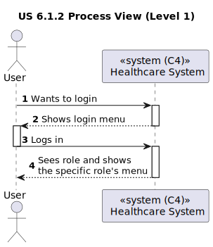
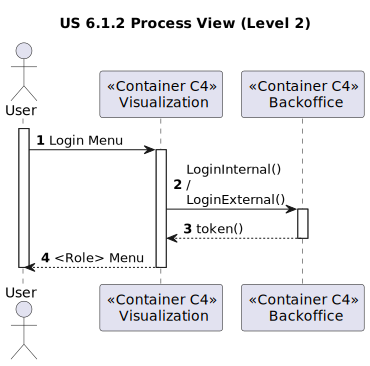
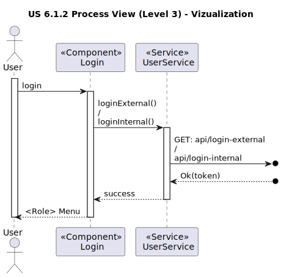
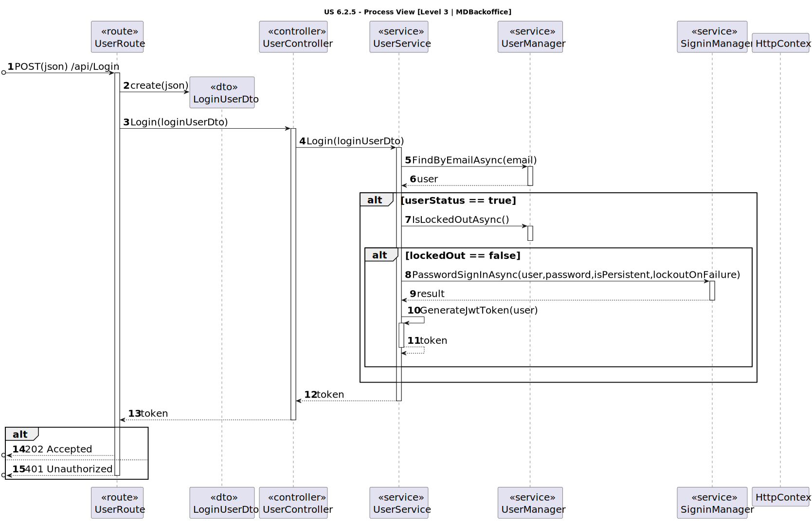

# US 6.1.2

<!-- TOC -->
- [US 6.1.2](#us-612)
  - [1. Context](#1-context)
  - [2. Requirements](#2-requirements)
  - [3. Analysis](#3-analysis)
  - [4. Design](#4-design)
    - [4.1. Realization](#41-realization)
      - [Logical View](#logical-view)
      - [Process View](#process-view)
        - [Level 1](#level-1)
        - [Level 2](#level-2)
        - [Level 3](#level-3)
      - [Development View](#development-view)
      - [Physical View](#physical-view)
<!-- TOC -->

## 1. Context

This is the first time this US is being worked on. This US refers to the User.

## 2. Requirements

**US 6.1.2:** As user I want the application menu to adjust according to my role so that it only presents me the options I may access.

**Acceptance Criteria:**

- **6.1.2.1:** The menu should be done in Angular.

- **6.1.2.1:** There will be a menu for each staff role and for the patient.

**Dependencies/References:**

- **US 5.1.1 to 5.1.23 -** These USs depend on this US as they will be only accessed if the user is the correct one, therefore, using the correct menu.

- **US 6.2.1 to 6.2.21 -** These USs depend on this US as they will be only accessed if the user is the correct one, therefore, using the correct menu.

- **US 6.3.1 to 6.3.3 -** These USs depend on this US as they will be only accessed if the user is the correct one, therefore, using the correct menu.

- **US 6.5.1 to 6.5.4 -** These USs depend on this US as they will be only accessed if the user is the correct one, therefore, using the correct menu.

**Client Clarifications:**

> **Question:** 
Bom Dia,
Gostaríamos de saber se a US 6.1.2 possui algum tipo de critério de aceitação ou se fica a cargo do grupo a implementação e características de cada menu.
Cumprimentos,
José Afonso.
>
> **Answer:** podem escolher livremente a implementação do menu e a sua estrutura

> **Question:** 
Bom dia, 
Para a US 6.1.2, a US de criar menus específicos para um user dependendo do seu role, o cliente aceitaria um menu para staff e outro para pacientes apenas ou considera que prefere um menu para cada role?
Cumprimentos,
José Afonso.
>
> **Answer:** podem escolher livremente a estrutura de menus

> **Question:** 
Bom dia,
Gostaríamos de lhe perguntar se tem algum grupo de funções ou aparência que espera para as UIs das USs passadas ou se fica a cargo da equipa que desenvolve os aspetos estéticos da aplicação.
Cumprimentos,
José Santos.
>
> **Answer:** A componente estética é de livre escolha da equipa. tentem seguir as boas práticas de aplicações web e usabilidade

## 3. Analysis

After a lot of consideration, this US's order of events appear to be:

- 1. A User logs into the system
- 2. The system uses the login info to determine which role the user has been assigned
- 3. The system answers with the correct menu (Admin's menu for the Admin, Techinician's menu for the Technician, etc)

This US will involve then the creation of a menu for each staff role and for the patient.

## 4. Design

### 4.1. Realization

The logical, physical, development and scenario views diagrams are generic for all the use cases of the backoffice component.

#### 4.1.1 Logical View

The diagrams can be found in the [team decision views folder](../../team-decisions/views/general-views.md#1-logical-view).

#### 4.1.2 Process View

##### Level 1

##### Level 2

##### Level 3

- _Visualization_ 

- _MDBackoffice_

#### 4.1.3 Development View

The diagrams can be found in the [team decision views folder](../../team-decisions/views/general-views.md#3-development-view).

#### 4.1.4 Physical View

The diagrams can be found in the [team decision views folder](../../team-decisions/views/general-views.md#4-physical-view).
