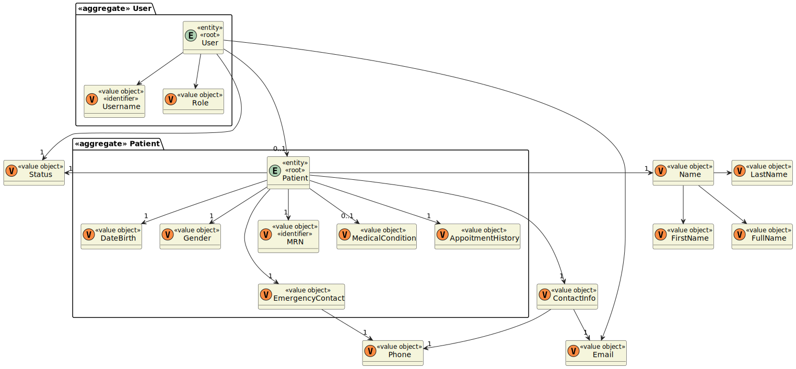

# US 6.2.1

<!-- TOC -->
- [US 6.2.1](#us-621)
  - [1. Context](#1-context)
  - [2. Requirements](#2-requirements)
  - [3. Analysis](#3-analysis)
  - [4. Design](#4-design)
    - [4.1. Realization](#41-realization)
      - [Logical View](#logical-view)
      - [Process View](#process-view)
        - [Level 1](#level-1)
        - [Level 2](#level-2)
        - [Level 3](#level-3)
      - [Development View](#development-view)
      - [Physical View](#physical-view)
<!-- TOC -->

## 1. Context

This is the first time this US is being worked on.
This US pertains to the Admin.

## 2. Requirements

**US 6.2.1:** As a Patient, I want to register for the healthcare application, so that I can create a user profile and book appointments online.

**Acceptance Criteria:**

- **6.2.1.1:** Patients can self-register using the external IAM system.

- **6.2.1.2:** During registration, patients provide personal details (e.g., name, email, phone) and create a profile.

- **6.2.1.3:** The system validates the email address by sending a verification email with a confirmation link.

- **6.2.1.4:** Patients cannot list their appointments without completing the registration process.

- **6.2.1.5:** The menu should be done in Angular.

**Dependencies/References:**

**5.1.8:** The Admin must create first the patient record, so that the patient can register using the same email.

**Client Clarifications:**

> **Question:** How are duplicate patient profiles handled when registered by both the patient and admin?
>
> **Answer:** The system checks the email for uniqueness. The admin must first create the patient record, and then the
> patient can register using the same email.

> **Question:** Can the same user have both a patient and a healthcare profile?
>
> **Answer:** No. When it comes to patients and healthcare staff, they both have one of the rules that says that some of
> their, like, attributes need to be unique, and they both need their email to be unique.

> **Question:** Is the email the identifying attribute or is it the username?
>
> **Answer:** It's the username. But typically, nowadays, most of the usernames that you have in all the systems are your
> email.

> **Question:** The user has contact information, email and phone, they are booth obligatory?
>
> **Answer:** Yes.

## 3. Analysis

This functionality has the objective of allowing the patient to register for the healthcare application, so he can create
their respective profile and book appointments.

The first process is for the patient to register itself using the external IAM, but also to provides some personal 
information, such as:
- name
- email
- phone number

After this registration, will occur the verification of the email address, by sending a verification email with a 
confirmation link.

### System Sequence Diagram

### Domain Model

## 4. Design

### 4.1. Realization

The logical, physical, development and scenario views diagrams are generic for all the use cases of the backoffice component.
These diagrams can be found in the [generic views diagrams compilation file](../../team-decisions/views/general-views.md).

The process view levels are here represented as they represent a process specific to each user story.

#### Process View

The level 1 and 2 of this view was considered not to add more information in addition to the SSD shown above.
However level 3 is shown below.

#### 4.1.1 Process View - Admin

##### Create Staff Profile

##### Create User

#### 4.1.2 Process View - Patient

### 4.2. Applied Patterns

> #### **Repository Pattern**
>
>* **Components:** UserRepository, PatientRepository
>
> The repositories handle data access and retrieval, isolating the database interaction logic from services and other 
> layers. This approach abstracts the persistence logic, promoting separation of concerns.

> #### **DTO (Data Transfer Object) Pattern**
>
>* **Components:** CreatingPatientDto, ConfirmEmailUserDto, RegisterUserDto
>
> DTOs are utilized to transfer data between layers, particularly from the controller layer to the service layer and 
> vice versa. Their main purpose is to convey data in a structured and decoupled manner without revealing the internal 
> representations of entities. Additionally, this pattern is not required to adhere to business rules.

> #### **Facade Pattern**
>
>* **Components:** UserService, PatientService
>
> These services function as a facade, simplifying the interaction with lower-level components such as repositories. 
> The controller communicates with these service facades, concealing the complexity from the upper layers.

