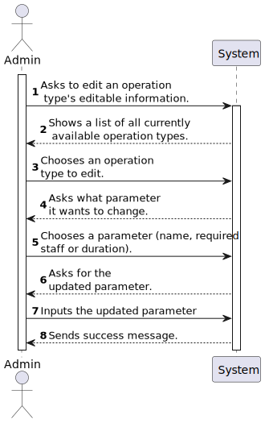

# US 6.2.19

<!-- TOC -->
- [US 6.2.19](#us-6219)
  - [1. Context](#1-context)
  - [2. Requirements](#2-requirements)
  - [3. Analysis](#3-analysis)
  - [4. Design](#4-design)
    - [4.1. Realization](#41-realization)
      - [Logical View](#logical-view)
      - [Process View](#process-view)
        - [Level 1](#level-1)
        - [Level 2](#level-2)
        - [Level 3](#level-3)
      - [Development View](#development-view)
      - [Physical View](#physical-view)
<!-- TOC -->

## 1. Context

This is the first time this US is being worked on.
This US pertains to the Admin.

## 2. Requirements

**US 6.2.19:** As Admin, I want to edit existing operation types so that I can update or correct information about the procedure.

**Acceptance Criteria:**

- **6.2.19.1. -** Admins can search for and select an existing operation type to edit. 

- **6.2.19.2. -** Editable fields include operation name, required staff by specialization, and estimated duration, both each phase and total. 

- **6.2.19.3. -** Changes are reflected in the system immediately for future operation requests. 

- **6.2.19.4. -** Historical data is maintained, but new operation requests will use the updated operation type information. 

- **6.2.19.5:** The menu should be done in Angular.

**Dependencies/References:**

- **US 5.1.1. -** US 6.2.19. is dependent on this User Story as it depends on an existing account of a staff in the system.

- **US 5.1.20. -** US 6.2.19. is dependent on this User Story as it depends on an existing operation type in the system.

- **US 5.1.23. -** This User Story is dependent on US 6.2.19 as it needs it's functionality to work as intended.

**Client Clarifications:**

> None yet.

## 3. Analysis

This functionality talks about the updating or editting of an existing operation type, and after some analysis of the documentation (most common operation types), acceptance criterias and client clarifications, it is our understanding that this User Story would follow this order of actions:

- The admin would request to see the list of current available operation types.
- After choosing an operation type, it can choose to edit the operation's **editable data**.
- After having done so the system will update the operation requirements for future requests.
- Finally, the system will inform the Admin of a succeful change.

It is important to note that for the sake of this project, **editable data of the operation type is:** 
- **Operation Type's Name**
- **Required Staff and their Specialization**
- **Estimated Total Duration**
- **Estimated Phases Duration**

As explained by the acceptance criterias, **the changes only affect future requests** and all data relevant to old operations is still kept while the **new requests have updated information.**

### System Sequence Diagram

## 4. Design

### 4.1. Realization

The logical, physical, development and scenario views diagrams are generic for all the use cases of the backoffice component.
These diagrams can be found in the [generic views diagrams compilation file](../../team-decisions/views/general-views.md).

The process view levels are here represented as they represent a process specific to each user story.

#### Process View

The level 1 and 2 of this view was considered not to add more information in addition to the SSD shown above.
However level 3 is shown below.

##### Process View - Level 3

### 4.2. Domain Model Excerpt

