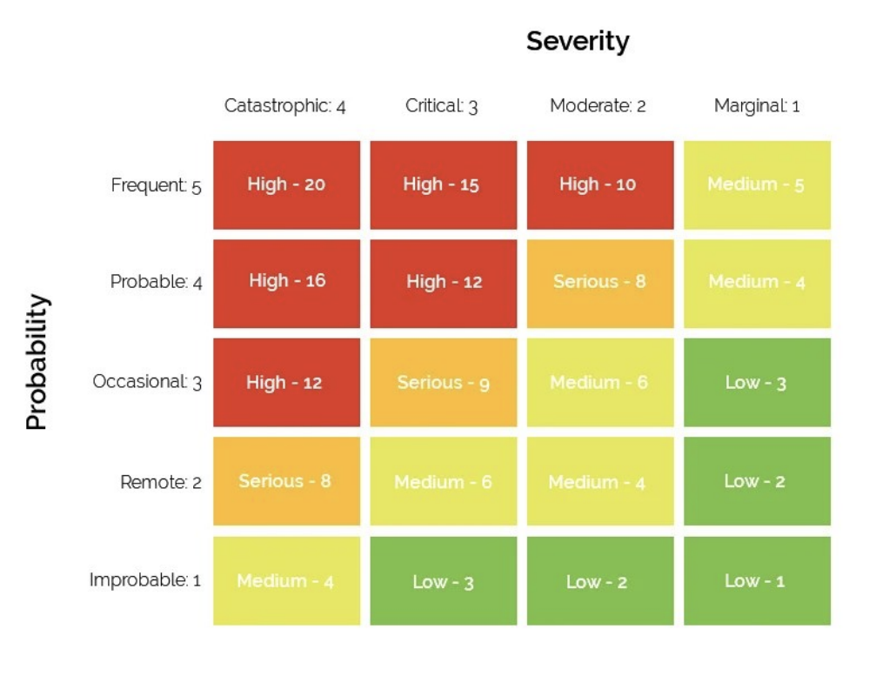

# US 6.4.4

<!-- TOC -->
- [US 6.4.4](#us-644)
  - [1. Context](#1-context)
  - [2. Requirements](#2-requirements)
  - [3. Analysis](#3-analysis)
  - [4. Design](#4-design)
    - [4.1. Realization](#41-realization)
      - [Logical View](#logical-view)
      - [Process View](#process-view)
        - [Level 1](#level-1)
        - [Level 2](#level-2)
        - [Level 3](#level-3)
      - [Development View](#development-view)
      - [Physical View](#physical-view)
<!-- TOC -->

## 1. Context

This is the first time this US is being worked on.
This US pertains to the Admin.

## 2. Requirements

**US 6.4.4:** As an Administrator, I want to identify and quantify the risks involved in the recommended solution.

**Acceptance Criteria:**

**US 6.4.4.1 -** The assessment of risks should be done with the *Risk Assessment Risk Matrix* given to us in the documentation for ASIST.

**Dependencies/References:**

The entire project is dependent on an evaluation of the risks, especially considering the fact that this system handles a lot of User info.

**Client Clarifications:**

>None yet.

## 3. Analysis

For this US, we'll use the *Risk Assessment Risk Matrix* to identify and quantify the risks:

It will enable us to accurately find the more problematic areas or errors that should be immediately solved due to their risk to the system's and the user's security.

## 4. Design

### 4.1. Realization

This section will be for the Risk Assessment of the system.

