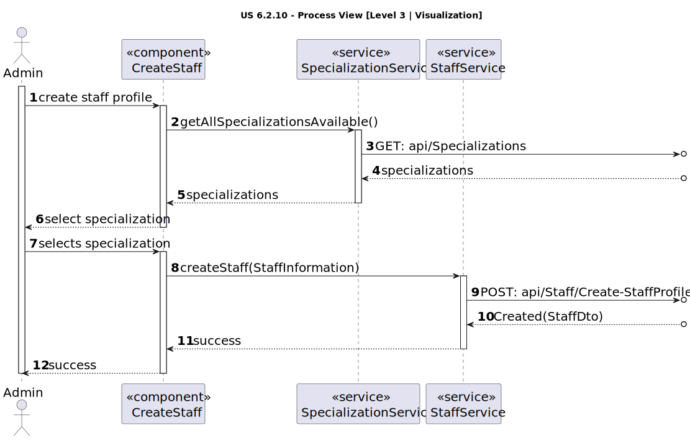

# US 6.2.10

<!-- TOC -->
- [US 6.2.10](#us-6210)
  - [1. Context](#1-context)
  - [2. Requirements](#2-requirements)
  - [3. Analysis](#3-analysis)
    - [Domain Model](#domain-model)
  - [4. Design](#4-design)
    - [4.1. Realization](#41-realization)
      - [Logical View](#logical-view)
      - [Process View](#process-view)
        - [Level 1](#level-1)
        - [Level 2](#level-2)
        - [Level 3](#level-3)
      - [Development View](#development-view)
      - [Physical View](#physical-view)
<!-- TOC -->

## 1. Context

This is the second time this user story is being addressed; the focus for this sprint is to implement a user interface for it.

## 2. Requirements

**US 6.2.10:**  As an Admin, I want to create a new staff profile, so that I can add them to the hospital’s roster.

**Acceptance Criteria:**

- 6.2.10.1: Admins can input staff details such as first name, last name, contact information, and specialization.

- 6.2.10.2: A unique staff ID (License Number) is generated upon profile creation.

- 6.2.10.3: The system ensures that the staff’s email and phone number are unique.

- 6.2.10.4: The profile is stored securely, and access is based on role-based permissions.

**Dependencies/References:**

This user story does not have dependencies.

**Client Clarifications:**

> **Question:** Can a user have both patient and healthcare staff profiles?
>
> **Answer:** No, a user cannot have both profiles. Staff and patients have separate identifications.

> **Question:** Are healthcare staff IDs unique across roles?
>
> **Answer:** Yes, staff IDs are unique and not role-specific (e.g., a doctor and nurse can share the same ID format).

> **Question:** Will there be a list of specializations in the system?
>
> **Answer:** Yes, a predefined list of specializations will be provided, but the system should allow for future additions.

> **Question:** Related to the staff license number, will it be generated, would you like it to be generated in any particular format or algorithm of your choice?
>
> **Answer:** Staff id are unique and generated by the system. License numbers are unique but are not generated by the system.
>
> Staff id follows the format: "(N | D | O)yyyynnnnn", for example:
> 
>  N202401234, where:
> 
> **N** is for nurse, **D** is for doctor, **O** is for other.
> **yyyy** is the year of recruitment, and **nnnnn** is a sequential number.
>
>
>License numbers are assigned by the professional guild. The admin will enter the license number and the system records it

## 3. Analysis

In this functionality, the admin can create a staff profile by inputting the following information:

- Name (first and last name)
- Contact information (email and phone number)
- Specialization
- License Number

It’s important to note that specializations are selected from a predefined list, so the admin will need to choose one of the available options.

Upon creating the profile, a unique staff id will be generated and assigned to the staff member, which will serve as the identifiable attribute for each profile.
This id is not role-specific, meaning all staff will share the same ID format:
> (N | D | O)yyyynnnnn
> 
> * **N** is for nurse, **D** is for doctor, **O** is for other.
> * **yyyy** is the year of recruitment
> * **nnnnn** is a sequential number.

Finally, as specified in the acceptance criteria, the contact information (email and phone number) must be unique. Consequently, the system must verify that no other profile exists with the same email or phone number.

### Domain Model

## 4. Design

### 4.1. Realization

The logical, physical, development and scenario views diagrams are generic for all the use cases of the backoffice component.

#### Logical View

The diagrams can be found in the [team decision views folder](../../team-decisions/views/general-views.md#1-logical-view).

#### Process View

##### Level 1

##### Level 2

##### Level 3

- _Visualization_ 

- _MDBackoffice_ 

#### Development View

The diagrams can be found in the [team decision views folder](../../team-decisions/views/general-views.md#3-development-view).

#### Physical View

The diagrams can be found in the [team decision views folder](../../team-decisions/views/general-views.md#4-physical-view).

