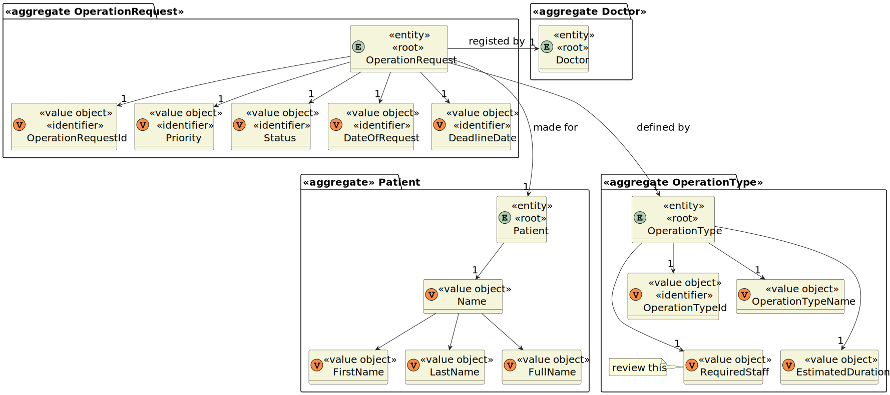
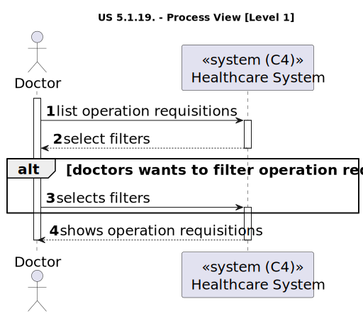
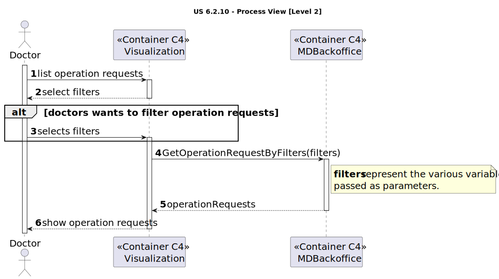
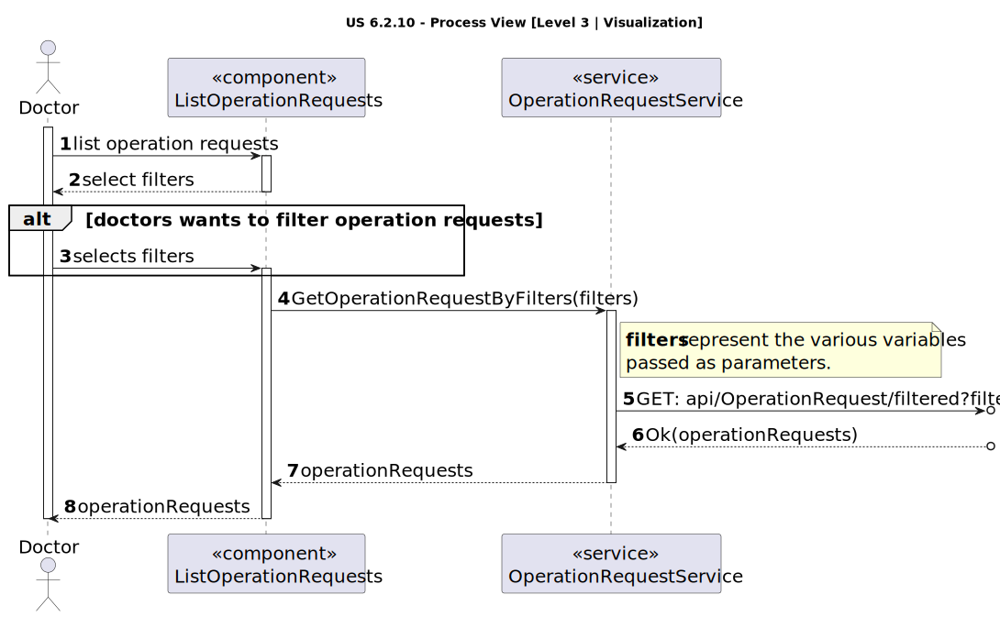
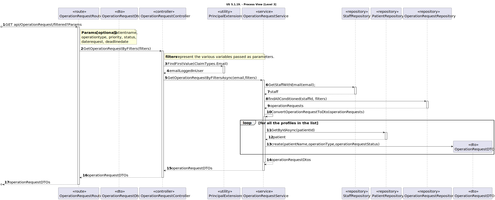

# US 6.2.17

<!-- TOC -->
- [US 6.2.17](#us-6217)
  - [1. Context](#1-context)
  - [2. Requirements](#2-requirements)
  - [3. Analysis](#3-analysis)
    - [Domain Model](#domain-model)
  - [4. Design](#4-design)
    - [4.1. Realization](#41-realization)
      - [Logical View](#logical-view)
      - [Process View](#process-view)
        - [Level 1](#level-1)
        - [Level 2](#level-2)
        - [Level 3](#level-3)
      - [Development View](#development-view)
      - [Physical View](#physical-view)
<!-- TOC -->

## 1. Context

This is the second time this user story is being addressed; the focus for this sprint is to implement a user interface for it.

## 2. Requirements

**US 6.2.17:** As a Doctor, I want to list/search operation requisitions, so that I see the details, edit, and remove operation requisitions.

**Acceptance Criteria:**

- 6.2.17.1: Doctors can search operation requests by patient name, operation type, priority, and status.

- 6.2.17.2: The system displays a list of operation requests in a searchable and filterable view.

- 6.2.17.3: Each entry in the list includes operation request details (e.g., patient name, operation type,
status).

- 6.2.17.1: Doctors can select an operation request to view, update, or delete it.

**Dependencies/References:**

This user story is connected to user stories 6.2.17 and 6.2.18, as they pertain to the update and delete functionalities, respectively. As a result, this user story will be directly related, since it needs to be capable of selecting an operation request for updating or deleting.

**Client Clarifications:**

> **Question:** One of the acceptance criteria mentions that doctors can search for operation requests by status. What does "status" refer to in this context?
>
> **Answer:** Status refers to whether the operation is planned or requested.

> **Question:** When listing operation requests, should only those associated with the specific doctor be displayed?
>
> **Answer:** A doctor can see the operation requests they have submitted as well as the operation requests of a certain patient. An Admin will be able to list all operation requests and filter by doctor it should be possible to filter by date of request, priority and expected due date.

## 3. Analysis

In this feature, operation requests will be displayed for the doctor to select from, allowing them to view, [update](../us-6.2.17/readme.md) or [delete](../us-6.2.18/readme.md) specific requests.  The displayed operation requests will only include those submitted by the doctor.
As clarified by the client, in addition to the doctor, an Admin will have the capability to list all operation requests and filter them specifically by doctor.

With this functionality, both the doctor and the admin will be able to filter operation requests based on the following criteria:

- Patient Name
- Operation Type
- Priority:
  - Elective Surgery: A scheduled procedure that is not life-threatening and can be arranged at a convenient time (e.g., joint replacement, cataract surgery).
  - Urgent Surgery: Requires timely intervention but is not an immediate emergency, typically within a few days (e.g., certain cancer surgeries).
  - Emergency Surgery: Demands immediate action to preserve life, limb, or function, generally performed within hours (e.g., ruptured aneurysm, trauma).
- Status:
  - Indicates whether the operation is planned or merely requested.
- Date of Request
- Deadline Date

Each entry in the list will include essential operation details, such as the patient's name, the type of operation, and its status.

It is crucial for the doctor to always have the option to select any operation request from the list to execute one of the following actions: view, update, or delete. The last two actions are part of features [US-6.2.17](../us-6.2.17/readme.md) and [US-6.2.18](../us-6.2.18/readme.md) respectively. The view action will provide all relevant information regarding the selected operation request, ensuring the doctor has access to complete and accurate details.

### Domain Model

**Note:** Some attributes of the aggregate _Patient_ have been omitted. To view the complete domain model, click [here](../team-decisions/domain-model.svg).

## 4. Design

### 4.1. Realization

The logical, physical, development and scenario views diagrams are generic for all the use cases of the backoffice component.

#### Logical View

The diagrams can be found in the [team decision views folder](../../team-decisions/views/general-views.md#1-logical-view).

#### Process View

##### Level 1

##### Level 2

##### Level 3

- _Visualization_ 

- _MDBackoffice_ 

#### Development View

The diagrams can be found in the [team decision views folder](../../team-decisions/views/general-views.md#3-development-view).

#### Physical View

The diagrams can be found in the [team decision views folder](../../team-decisions/views/general-views.md#4-physical-view).

