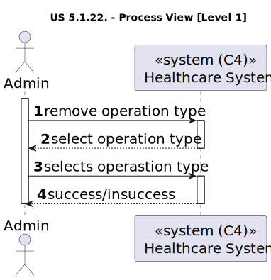
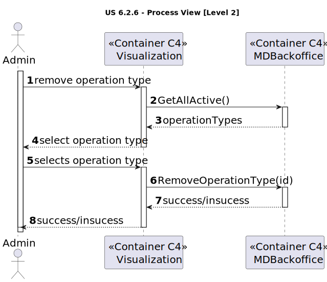
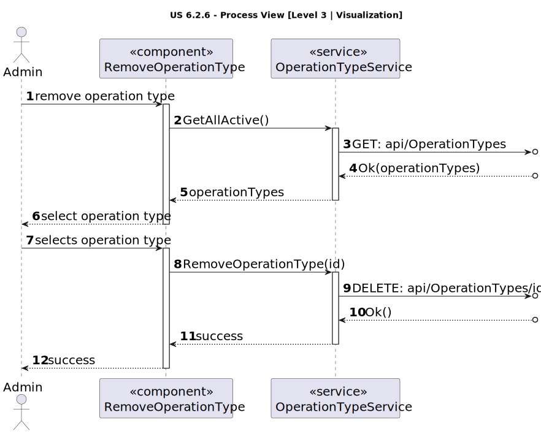
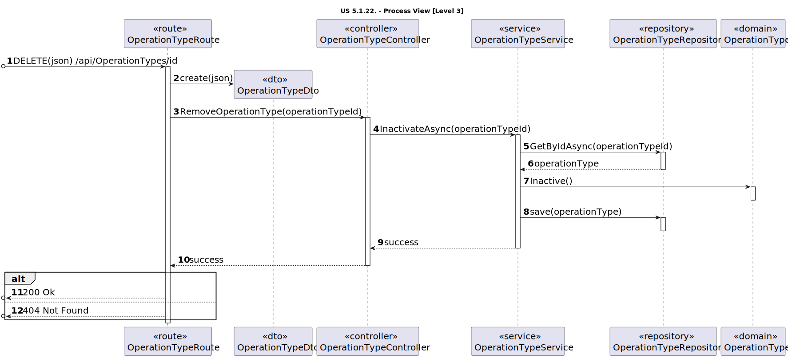

# US 6.2.20

<!-- TOC -->
- [US 6.2.20](#us-6220)
  - [1. Context](#1-context)
  - [2. Requirements](#2-requirements)
  - [3. Analysis](#3-analysis)
  - [4. Design](#4-design)
    - [4.1. Realization](#41-realization)
      - [Logical View](#logical-view)
      - [Process View](#process-view)
        - [Level 1](#level-1)
        - [Level 2](#level-2)
        - [Level 3](#level-3)
      - [Development View](#development-view)
      - [Physical View](#physical-view)
<!-- TOC -->

## 1. Context

This is the second time this user story is being addressed; the focus for this sprint is to implement a user interface for it.
 
## 2. Requirements

**US 6.2.20:** As an Admin, I want to remove obsolete or no longer performed operation types, so that the system stays current with hospital practices.

**Acceptance Criteria:**

- 6.2.20.1: Admins can search for and mark operation types as inactive (rather than deleting them) to preserve historical records.

- 6.2.20.2: Inactive operation types are no longer available for future scheduling but remain in historical data.

- 6.2.20.3: A confirmation prompt is shown before deactivating an operation type.

**Dependencies/References:**

This user story is related to US-6.2.23, as it involves selecting an operation type for removal.

**Client Clarifications:**

> **Question:** The acceptance criteria refer to deactivating the operation type. In this context, is "removing" being used to describe the deactivation of a specific operation type, or is there a mix-up?
>
> **Answer:** Yes, deactivating makes the operation type unavailable for future use but retains historical data.

## 3. Analysis

This feature primarily involves deactivating a specific operation type, preventing it from being selected when creating future operation requests. However, if there are existing operations of that type, no changes will be made, thereby preserving the historical data.

Keeping this in mind, all active operation types will be displayed for the admin to select from. Additionally, before proceeding with the deactivation, a confirmation prompt will appear, showing the selected operation type to verify whether the admin truly wishes to deactivate it. Upon confirmation, the deactivation process will proceed.

## 4. Design

### 4.1. Realization

The logical, physical, development and scenario views diagrams are generic for all the use cases of the backoffice component.

#### Logical View

The diagrams can be found in the [team decision views folder](../../team-decisions/views/general-views.md#1-logical-view).

#### Process View

##### Level 1

##### Level 2

##### Level 3

- _Visualization_ 

- _MDBackoffice_

#### Development View

The diagrams can be found in the [team decision views folder](../../team-decisions/views/general-views.md#3-development-view).

#### Physical View

The diagrams can be found in the [team decision views folder](../../team-decisions/views/general-views.md#4-physical-view).
