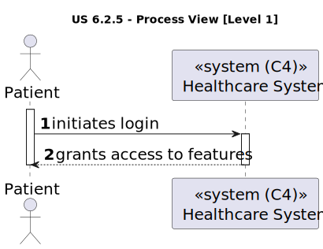
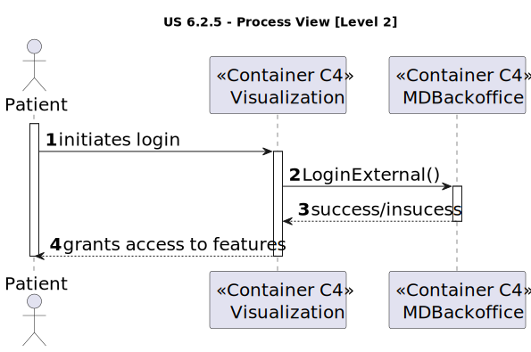
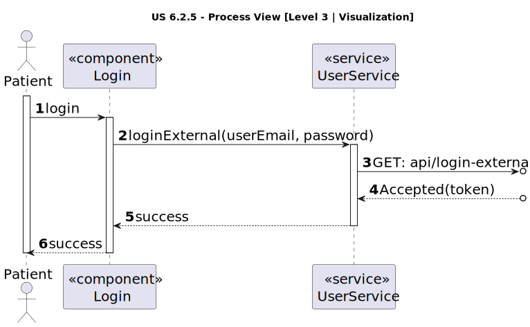

# US 6.2.5

<!-- TOC -->
- [US 6.2.5](#us-625)
  - [1. Context](#1-context)
  - [2. Requirements](#2-requirements)
  - [3. Analysis](#3-analysis)
  - [4. Design](#4-design)
    - [4.1. Realization](#41-realization)
      - [4.1.1 Logical View](#411-logical-view)
      - [4.1.2 Process View](#412-process-view)
        - [Level 1](#level-1)
        - [Level 2](#level-2)
        - [Level 3](#level-3)
      - [4.1.3 Development View](#413-development-view)
      - [4.1.4 Physical View](#414-physical-view)
<!-- TOC -->

## 1. Context

- This is the second time this user story is being addressed; the focus for this sprint is to implement a user interface for it.

- Identity and Access Management (IAM) is a system that manages and controls the access to a company's resources by entities,
that have their identities verified and their access permissions are clearly defined and enforced.

- Single Sign-on (SSO) is an authentication scheme that combines multiple applications log in screens and allows the user
to log in a single time to access the resources and services of those applications.

## 2. Requirements

**US 6.2.5:**  As a Patient, I want to log in to the healthcare system using my external IAM credentials, so that I can
access my appointments, medical records, and other features securely.

**Acceptance Criteria:**

- 6.2.5.1. | Patients log in via an external Identity and Access Management (IAM) provider (e.g., Google, Facebook, or hospital SSO).

- 6.2.5.2. | After successful authentication via the IAM, patients are redirected to the healthcare system with a valid session.

- 6.2.5.3 | Patients have access to their appointment history, medical records, and other features relevant to their profile.

- 6.2.5.4 | Sessions expire after a defined period of inactivity, requiring re-authentication.

- 6.2.5.5 | If the credentials used in the IAM correspond to a staff profile, the patient cannot register in the healthcare system.

**Dependencies/References:**

This functionality is dependent on the creation of a patient profile by the Admin (5.1.8).

**Client Clarifications:**

> **Question:** How are duplicate patient profiles handled when registered by both the patient and admin?
>
> **Answer:** The system checks the email for uniqueness. The admin must first create the patient record, and then the patient can register using the same email.

> **Question:** In IAM external system, if a patient is signed in with a Google account and later uses other external system like Facebook, and both have different credentials, what happens?
>
> **Answer:** Assume the system only supports one IAM.

> **Question:** How much time does it take of inactivity to automatically log off of an account? What do you define as inactivity? Like no input from the mouse?
>
> **Answer:** Inactivity is defined as no interaction with the API. After 20 minutes of inactivity, the session should disconnect.

> **Question:** Can users hold multiple roles?
>
> **Answer:** No, each user can have only one role.

> **Question:** Can a user have both patient and healthcare staff profiles?
>
> **Answer:** No, a user cannot have both profiles. Staff and patients have separate identifications.

> **Question:** Can you clarify the username and email requirements?
>
> **Answer:** The username is the "official" email address of the user.
>
> For backoffice users, this is the mechanographic number of the collaborator, e.g., D240003 or N190345, and the DNS domain
> of the system. For instance, Doctor Manuela Fernandes has email "<D180023@myhospital.com>". The system must allow for an
> easy configuration of the DNS domain (e.g., environment variable).
>
> For patients, the username is the email address provided in the patient record and used as identity in the external IAM.
> for instance patient Carlos Silva has provided his email <csilva98@gmail.com> the first time he entered the hospital. That
> email address will be his username when he self-registers in the system.

## 3. Analysis

In this feature, patients can log in to the healthcare system using the available internal Identity and Access Management
(IAM) provider and its credentials.
The patient's identity is verified, and upon successful authentication, they are granted a valid session.

The patient has then access to their account and profile, along with all their data.

If the system does not detect any user interaction within 20 minutes, then the session is disconnected, requiring
the patient to authenticate again.

## 4. Design

### 4.1. Realization

The logical, physical, development and scenario views diagrams are generic for all the use cases of the backoffice component.

#### 4.1.1 Logical View

The diagrams can be found in the [team decision views folder](../../team-decisions/views/general-views.md#1-logical-view).

#### 4.1.2 Process View

##### Level 1

##### Level 2

##### Level 3

- _Visualization_ 

- _MDBackoffice_

#### 4.1.3 Development View

The diagrams can be found in the [team decision views folder](../../team-decisions/views/general-views.md#3-development-view).

#### 4.1.4 Physical View

The diagrams can be found in the [team decision views folder](../../team-decisions/views/general-views.md#4-physical-view).
