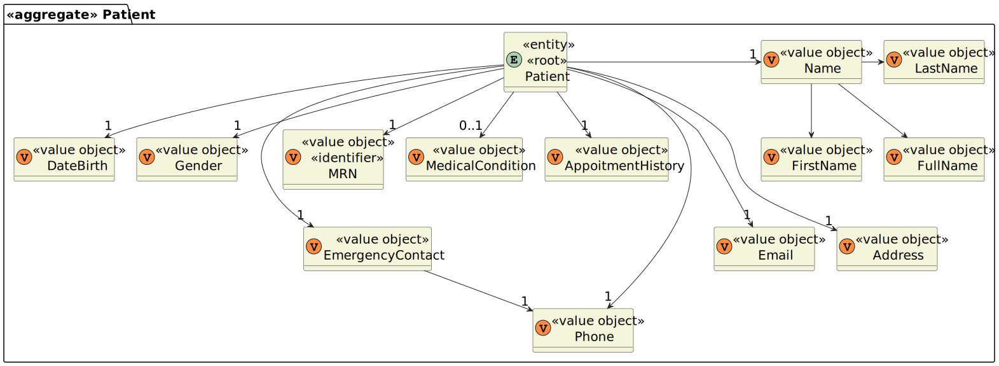
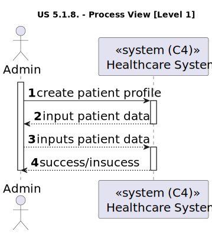
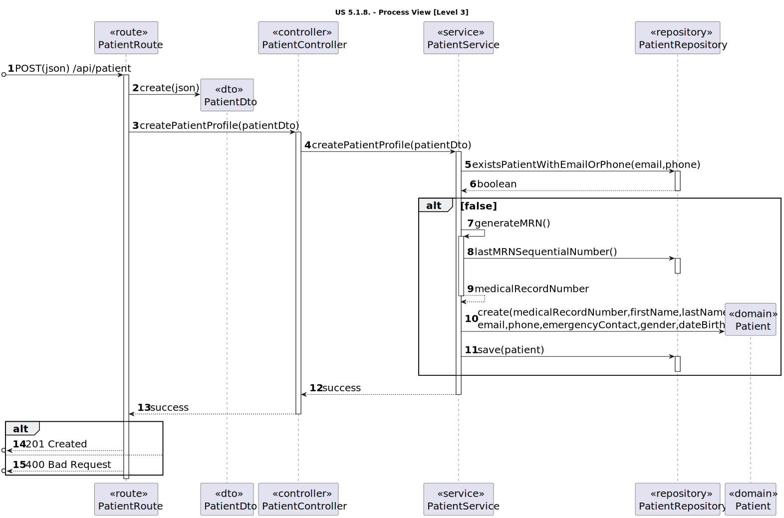

# US 6.2.8

<!-- TOC -->
- [US 6.2.8](#us-628)
  - [1. Context](#1-context)
  - [2. Requirements](#2-requirements)
  - [3. Analysis](#3-analysis)
    - [Domain Model](#domain-model)
  - [4. Design](#4-design)
    - [4.1. Realization](#41-realization)
      - [Logical View](#logical-view)
      - [Process View](#process-view)
        - [Level 1](#level-1)
        - [Level 2](#level-2)
        - [Level 3](#level-3)
      - [Development View](#development-view)
      - [Physical View](#physical-view)
<!-- TOC -->

## 1. Context

This is the first time this user story is worked on.

## 2. Requirements

**US 6.2.8:** As an Admin, I want to create a new patient profile, so that I can register their personal details and medical history.

**Acceptance Criteria:**

- 6.2.8.1:  Admins can input patient details such as first name, last name, date of birth, contact information, and medical history.

- 6.2.8.2: A unique patient ID (Medical Record Number) is generated upon profile creation.

- 6.2.8.3: The system validates that the patient’s email and phone number are unique.

- 6.2.8.4: The profile is stored securely in the system, and access is governed by role-based permissions.

**Dependencies/References:**

This user story does not have dependencies.

**Client Clarifications:**

> **Question:** How are duplicate patient profiles handled when registered by both the patient and admin?
>
> **Answer:** The system checks the email for uniqueness. The admin must first create the patient record, and then the patient can register using the same email.

> **Question:** Can a user have both patient and healthcare staff profiles?
>
> **Answer:** No, a user cannot have both profiles. Staff and patients have separate identifications.

> **Question:**  It is specified that the admin can input some of the patient's information (name, date of birth, contact information, and medical history.). Do they also input the omitted information (gender, emergency contact and allergies/medical condition)?
>
> **Answer:** The admin can not input medical history nor allergies. they can however input gender and emergency contact.

> **Question:** What's the difference between Medical Records and Appointment History?
>
> **Asnwer:** The appointment history in this case is the list of surgeries the patient has had in the past and the scheduled or requested operations. A medical record is a comprehensive and organized collection of information about a patient's medical history, diagnoses, treatments, and healthcare interactions.

> **Question:** In an allergy record, is it necessary to include the date of diagnosis and the name of the doctor who made it?
What defines an allergy and one medical condition?
>
> **Asnwer:** Allergies is is a free text field. the doctor will fill it in as best-suited

> **Question:** Can you give an example of a Patient's medical record?
>
> **Asnwer:** Since this system is mostly concerned with surgery, the medical record information is mostly free text. (see: [patient medical record example](patient-record-example.txt) )

> **Question:** What format(s) of the date of birth will they need to enter? Furthermore, what will be the format of the Medical Record Number generated after recording the data?
>
> **Answer:** From a usability perspective, dates should be presented to the user using the operating system's locale definitions. since for this sprint you are building an API, you should use a standard format like ISO 8601. Medical record numbers are generated by the system following the format YYYYMMnnnnnn where YYYY and MM are the year and month of the registration and nnnnnn is a sequential number.

## 3. Analysis

In this functionality, the admin can create a patient profile by registering their personal details. The admin is required to input the following information:

- Name (first and last name)
- Date of birth
- Contact information (email and phone number)
- Gender
- Emergency Contact

Upon creating the profile, a unique medical record number will be generated and assigned to the patient, serving as the identifiable attribute for each profile.

It's important to note that the patient profile must be created before the patient can register themselves as a user. As specified in the acceptance criteria, the contact information (email and phone number) must be unique. Therefore, the system must verify that no other profile or user already exists with the same email or phone number.

### Domain Model

**Note:** MRN refers to the medical record number.

## 4. Design

### 4.1. Realization

The logical, physical, development and scenario views diagrams are generic for all the use cases of the backoffice component.

#### Logical View

The diagrams can be found in the [team decision views folder](../../team-decisions/views/general-views.md#1-logical-view).

#### Process View

##### Level 1

##### Level 2

_[This diagram is not relevant.]_

##### Level 3

#### Development View

The diagrams can be found in the [team decision views folder](../../team-decisions/views/general-views.md#3-development-view).

#### Physical View

The diagrams can be found in the [team decision views folder](../../team-decisions/views/general-views.md#4-physical-view).
