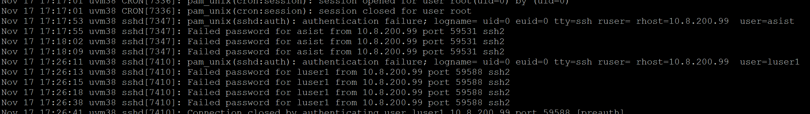
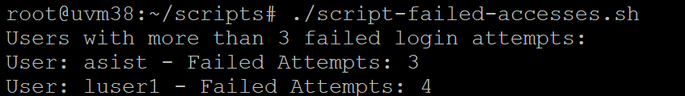

# US 6.4.8

<!-- TOC -->
- [US 6.4.8](#us-648)
  - [1. Context](#1-context)
  - [2. Requirements](#2-requirements)
  - [3. Analysis](#3-analysis)
  - [4. Design](#4-design)
    - [4.1. Realization](#41-realization)
  - [5. Implementation](#5-implementation)
  - [6. Testing](#6-testing)
<!-- TOC -->


## 1. Context

This is the first time this user story is worked on.

## 2. Requirements

**US 6.4.8:** As system administrator, I want to get users with more than 3 incorrect accesses attempts.

## 3. Analysis

For this user story, a script needs to be developed to count users' incorrect access attempts by analyzing the `/etc/log/auth.log` file. The script should then record information for users with more than three failed attempts in a specific results file. If this file does not exist when the script runs, it should be created automatically.

References: [monitoring-failed-login-attempts-on-linux](https://www.networkworld.com/article/969378/monitoring-failed-login-attempts-on-linux.html)

## 4. Design

### 4.1. Realization

The developed script will scan the `/etc/log/auth.log` file to identify and report users with more than 3 failed login attempts.
Here's a brief breakdown of what the script will do:

- Checks for the Log File: Verify if `/etc/log/auth.log` exists to ensure it can proceed.
- Parses the Log: Use `grep` to filter out lines that indicate failed password attempts.
- Extracts Usernames: Use `awk` to pull out the username field from each failed attempt.
- Counts Occurrences: Sort the usernames and use `uniq -c` to count how many times each user failed to log in.
- Filters Results: Use `awk` again to only show users with more than 3 failed attempts.
- Prints the Output: Displays a formatted list showing the usernames and the number of failed attempts.

## 5. Implementation

```
#!/bin/bash

LOG_FILE="/var/log/auth.log"

if [ ! -f "$LOG_FILE" ]; then
    echo "Log file not found: $LOG_FILE"
    exit 1
fi

echo "Users with more than 3 failed login attempts:"

grep "Failed password" "$LOG_FILE" | awk '{print $(NF-5)}' | sort | uniq -c | awk '$1 >= 3' | while read -r count user; do
    echo "User: $user - Failed Attempts: $count"
done
```

## 6. Testing

I intentionally triggered failed login attempts for the users `asist` and `luser1`, as shown in:



I then executed the script, anticipating that the users `asist` and `luser1` would be displayed, and that is exactly what happened, as shown in:

