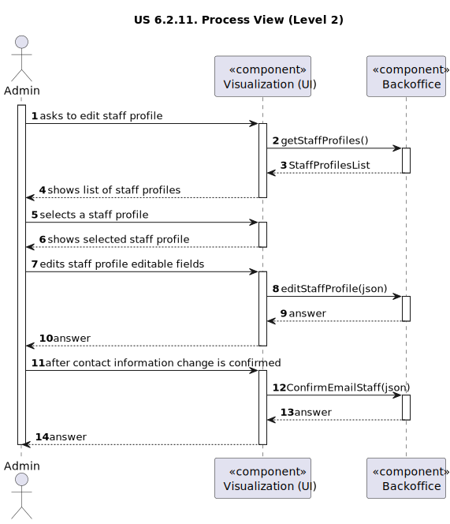

# US 6.2.11

<!-- TOC -->
* [US 6.2.11](#us-6211)
  * [1. Context](#1-context)
  * [2. Requirements](#2-requirements)
  * [3. Analysis](#3-analysis)
    * [System Sequence Diagram](#system-sequence-diagram)
    * [Domain Model](#domain-model)
  * [4. Design](#4-design)
    * [4.1. Realization](#41-realization)
      * [Logical View](#logical-view)
      * [Process View](#process-view)
        * [Level 1](#level-1)
        * [Level 2](#level-2)
        * [Level 3](#level-3)
      * [Development View](#development-view)
      * [Physical View](#physical-view-)
    * [4.3. Applied Patterns](#43-applied-patterns)
<!-- TOC -->

## 1. Context

This is to implement the user interface of a previous user story.

## 2. Requirements

**US 6.2.11:** As an Admin, I want to edit a staff's profile, so that I can update their information.

**Acceptance Criteria:**

- **6.2.11.1.** Admins can search for and select a staff profile to edit.

- **6.2.11.2.** Editable fields include contact information and specialization.

- **6.2.11.3** The system logs all profile changes, and any changes to contact information trigger a confirmation email
to the staff member.

- **6.2.11.4** The edited data is updated in real-time across the system.

**Dependencies/References:**

**6.2.10:** The Admin must create first the staff profile, so that it can be edited.

**Client Clarifications:**

> **Question:** Good afternoon, I would like to know if the system's objective is to differentiate specializations for
> each type of staff. In other words, do we need to ensure that a specific specialization can only be assigned,
> for example, to a staff member who is a doctor, or do we consider that any specialization existing in the system
> can be assigned to any staff member, leaving it to the responsibility of the person creating the profiles to assign
> valid specializations according to the staff's role?
>
> **Answer:** The specializations are independent of whether the professional is a doctor or a nurse.

> **Question:** What is the intended search criterion to find the employee profile? 
> 
>
> **Answer:** It should be possible to search for employees by their employee ID, license number, name, specialization, or phone number.

> **Question:** In user story 5.1.12, it’s mentioned that the admin can only enter the first name, last name,
> contact information, and specialization. However, in user story 5.1.13, it states that the admin can edit the
> contact information, availability slots, and specialization. Should the admin only be able to edit the
> parameters they originally entered, or does it make sense for them to also edit the availability slots? 
> 
>
> **Answer:** Consider editing the availability slots as a separate operation and outside the scope of this requirement.

> **Question:** We would like to ask if you have any specific set of functionalities or design in mind for the UIs of
> the previous user stories, or if this is left up to the team responsible for the aesthetic aspects of the application.
>
> **Answer:** The aesthetic component is up to the development team’s discretion. Just try to follow web application
> best practices and usability guidelines.

## 3. Analysis

This functionality centers in the edit of a staff's profile by the Admin, so he can update the staff information.

First the Admin will search for the staff profile he wants to edit and then select it. Then can be selected the follow
editable fields:
- contact information (email and phone)
- specialization

In the case of choosing to change sensitive data, such as contact information, triggers and email notification to the
staff member.

All the edited data that is changed, will be updated in real-time across the system.

### System Sequence Diagram

### Domain Model

## 4. Design

### 4.1. Realization

The logical, physical, development and scenario views diagrams are generic for all the use cases of the backoffice component.

#### Logical View

The diagrams are available in the [team decision views folder](../../team-decisions/views/general-views.md#1-logical-view).

#### Process View

##### Level 1

##### Level 2

##### Level 3
- _Visualization_ 
  

- _MDBackoffice_
  
  

#### Development View

The diagrams are available in the [team decision views folder](../../team-decisions/views/general-views.md#3-development-view).

#### Physical View 

The diagrams are available in the [team decision views folder](../../team-decisions/views/general-views.md#4-physical-view).

### 4.3. Applied Patterns

> #### **Repository Pattern**
>
>* **Components:** StaffRepository
>
> The repositories handle data access and retrieval, isolating the database interaction logic from services and other
> layers. This approach abstracts the persistence logic, promoting separation of concerns.

> #### **DTO (Data Transfer Object) Pattern**
>
>* **Components:** StaffDTO, EditStaffDTO, EmailMessageDTO
>
> DTOs are utilized to transfer data between layers, particularly from the controller layer to the service layer and
> vice versa. Their main purpose is to convey data in a structured and decoupled manner without revealing the internal
> representations of entities. Additionally, this pattern is not required to adhere to business rules.

> #### **Facade Pattern**
>
>* **Components:** StaffService, EmailService, UserService, TokenService
>
> These services function as a facade, simplifying the interaction with lower-level components such as repositories.
> The controller communicates with these service facades, concealing the complexity from the upper layers.
