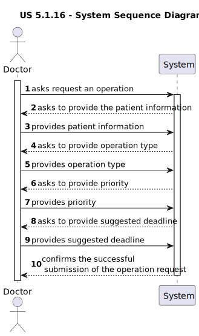
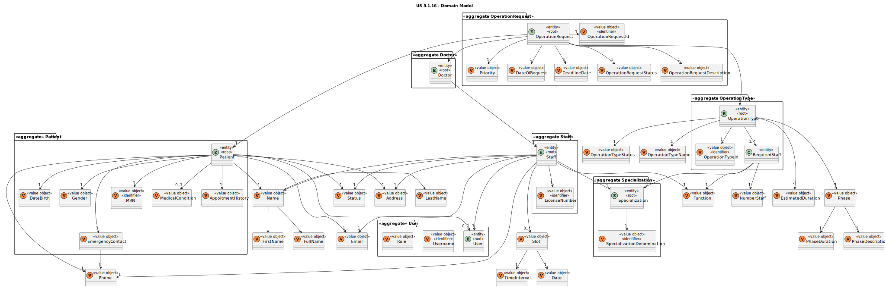
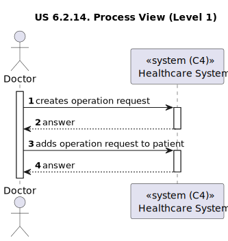
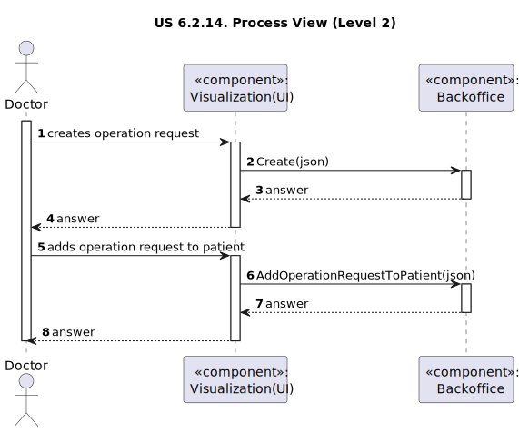
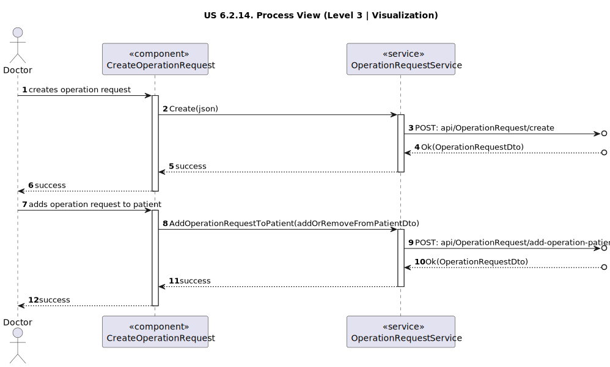
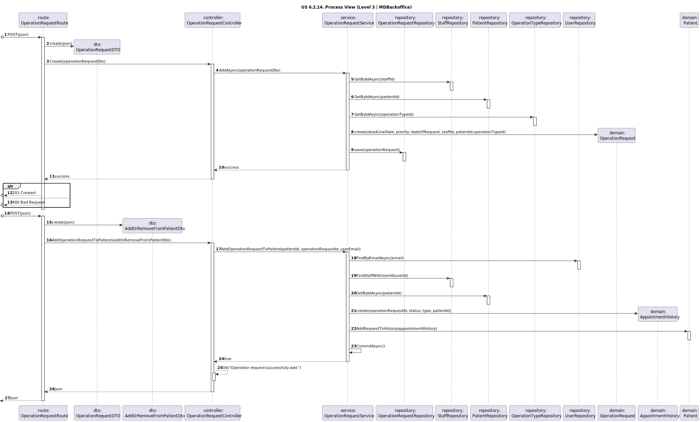

# US 6.2.14

<!-- TOC -->
* [US 6.2.14](#us-6214)
  * [1. Context](#1-context)
  * [2. Requirements](#2-requirements)
  * [3. Analysis](#3-analysis)
    * [System Sequence Diagram](#system-sequence-diagram)
    * [Domain Model](#domain-model)
  * [4. Design](#4-design)
    * [4.1. Realization](#41-realization)
      * [Logical View](#logical-view)
      * [Process View](#process-view)
        * [Level 1](#level-1)
        * [Level 2](#level-2)
        * [Level 3](#level-3)
      * [Development View](#development-view)
      * [Physical View](#physical-view)
    * [4.2. Applied Patterns](#42-applied-patterns)
<!-- TOC -->

## 1. Context

This is to implement the user interface of a previous user story.

## 2. Requirements

**US 6.2.14:** As a Doctor, I want to request an operation, so that the Patient has access to the necessary healthcare.

**Acceptance Criteria:**

- **6.2.14.1:** Doctors can create an operation request by selecting the patient, operation type, priority, and
suggested deadline.

- **6.2.14.2:** The system validates that the operation type matches the doctor's specialization.

- **6.2.14.3:** The operation request includes:

  - Patient ID
  - Doctor ID
  - Operation Type
  - Deadline
  - Priority

- **6.2.14.4** The system confirms successful submission of the operation request and logs the request in the patient's
medical history.

**Dependencies/References:**

**6.2.6:** The Admin must create first the patient record, so that can be scheduled an operation request.

**6.2.10:** The Admin must create first the staff profile, so that can be scheduled an operation request.

**6.2.18:** There must exist operation types, so that can be scheduled an operation request.

**Client Clarifications:**

> **Question:** Is it mandatory for patients to have a user account to schedule a surgery?
>
> **Answer:** No, patients are not required to have a user account. The system administrator creates patient profiles.

> **Question:** What is the difference between appointment, surgery, and operation?
>
> **Answer:** Surgery is a medical procedure (e.g., hip surgery), while an operation request is when a doctor
> schedules that surgery for a patient. An appointment is the scheduled date for the operation, determined by the
> planning module

> **Question:** Can the same doctor who requests a surgery perform it?
>
> **Answer:**  Not necessarily. The planning module may assign different doctors based on availability and optimization.

> **Question:** In the project document it mentions that each operation has a priority. How is an operation's priority
> defined? Do they have priority levels defined? Is it a scale? Or any other system?
>
> **Answer:** Elective Surgery: A planned procedure that is not life-threatening and can be scheduled at a convenient
> time (e.g., joint replacement, cataract surgery).
> Urgent Surgery: Needs to be done sooner but is not an immediate emergency. Typically, within days
> (e.g., certain types of cancer surgeries).
> Emergency Surgery: Needs immediate intervention to save life, limb, or function. Typically performed within hours
> (e.g., ruptured aneurysm, trauma).

> **Question:** How does a Doctor suggests a deadline date for an appointment? Does it have any criteria? Or do they
> just wing it?
>
> **Answer:** The doctor will decide the "best" due date based on their experience. they will enter it in the system as
> an indication so that the planning module eventually takes that into account alongside priority and other criteria.

> **Question:** "The appointment type should match the staff’s specializations and room availability (...)". Can you
> explain this part of the project documentation?
> We'd assume that appointment type would be something like a consultation, a surgery or a meeting, and specialization
> would be Dermatology, Neurology, Pediatrics, etc...
> Is it supposed to match the operation type? Or that in itself is a different concept? Like Biopsy, Heart Surgery and
> so on...
>
> **Answer:** This system only deals with surgeries, thus the appointments are "scheduled surgeries". If the operation
> type indicates that an orthopedic doctor and nurse are needed, the scheduling cannot be done for staff that do not
> have that specialization.

> **Question:** Can a doctor make more than one operation request for the same patient? 
>If so, is there any limit or rules to follow? For example, doctors can make another
>operation request for the same patient as long as it's not the same operation type?
>
> **Answer:**  it should not be possible to have more than one "open" surgery request (that is, a surgery that is 
> requested or scheduled but not yet performed) for the same patient and operation type.

> **Question:** Does the system adds automically the operation request to the medical history of the patient?
>
> **Answer:** No need. it will be the doctor's responsibility to add it.

> **Question:** We would like to ask if you have any specific set of functionalities or design in mind for the UIs of
> the previous user stories, or if this is left up to the team responsible for the aesthetic aspects of the application.
>
> **Answer:** The aesthetic component is up to the development team’s discretion. Just try to follow web application
> best practices and usability guidelines.

## 3. Analysis

The main objective of this functionality is to create operation requests. To achieve that, the Doctor needs to select the
following information:
- Patient
- Operation Type
- Priority
- Suggested Deadline

Then the system checks if the operation type matches the doctor's specialization. As a result, the operation request
should include:
- Patient ID
- Doctor ID
- Operation Type
- Deadline
- Priority

Finally, the system confirms that the operation request submission as successful and logs the request in the patient's
medical history.

### System Sequence Diagram

### Domain Model

## 4. Design

### 4.1. Realization

The logical, physical, development and scenario views diagrams are generic for all the use cases of the backoffice component.

#### Logical View

The diagrams can be found in the [team decision views folder](../../team-decisions/views/general-views.md#1-logical-view).

#### Process View

##### Level 1

##### Level 2

##### Level 3

- _Visualization_ 
  

- _MDBackoffice_
  

#### Development View

The diagrams are available in the [team decision views folder](../../team-decisions/views/general-views.md#3-development-view).

#### Physical View

The diagrams are available in the [team decision views folder](../../team-decisions/views/general-views.md#4-physical-view).

### 4.2. Applied Patterns

> #### **Repository Pattern**
>
>* **Components:** StaffRepository, OperationRequestRepository, PatientRepository, OperationTypeRepository
>
> The repositories handle data access and retrieval, isolating the database interaction logic from services and other
> layers. This approach abstracts the persistence logic, promoting separation of concerns.

> #### **DTO (Data Transfer Object) Pattern**
>
>* **Components:** OperationRequestDTO, AddOrRemoveFromPatientDto
>
> DTOs are utilized to transfer data between layers, particularly from the controller layer to the service layer and
> vice versa. Their main purpose is to convey data in a structured and decoupled manner without revealing the internal
> representations of entities. Additionally, this pattern is not required to adhere to business rules.

> #### **Facade Pattern**
>
>* **Components:** StaffService
>
> These services function as a facade, simplifying the interaction with lower-level components such as repositories.
> The controller communicates with these service facades, concealing the complexity from the upper layers.
