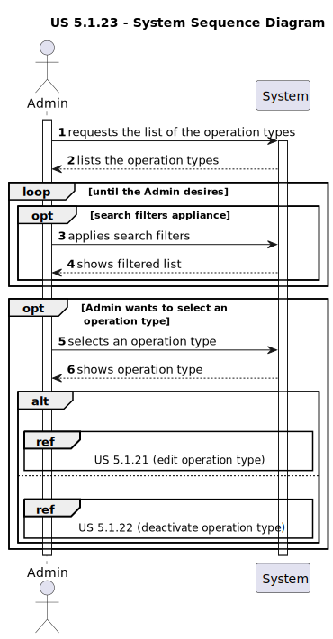
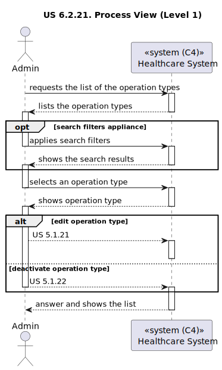
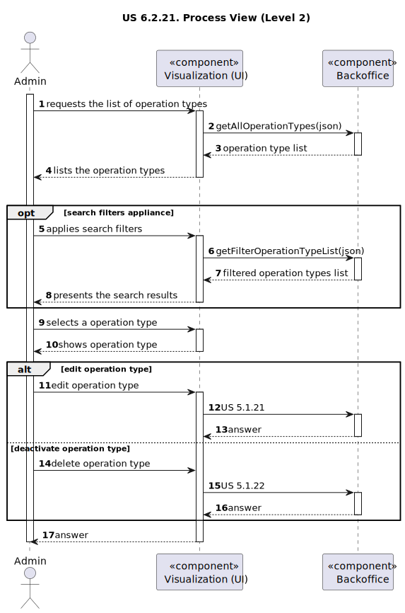
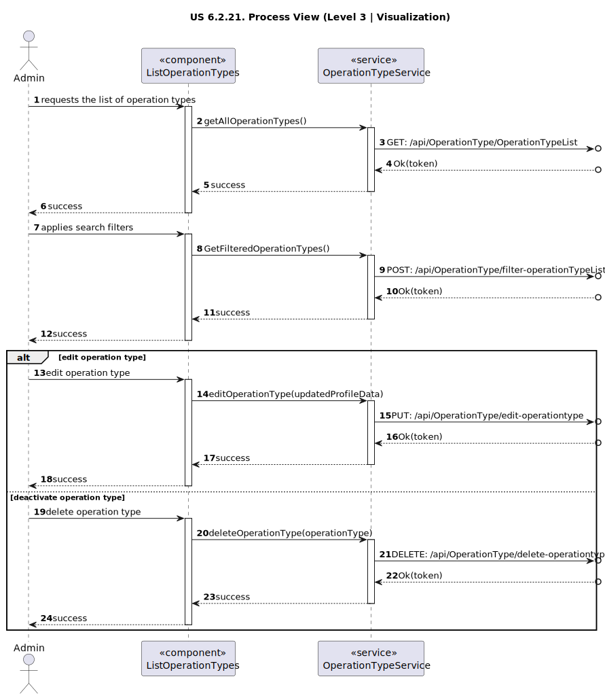
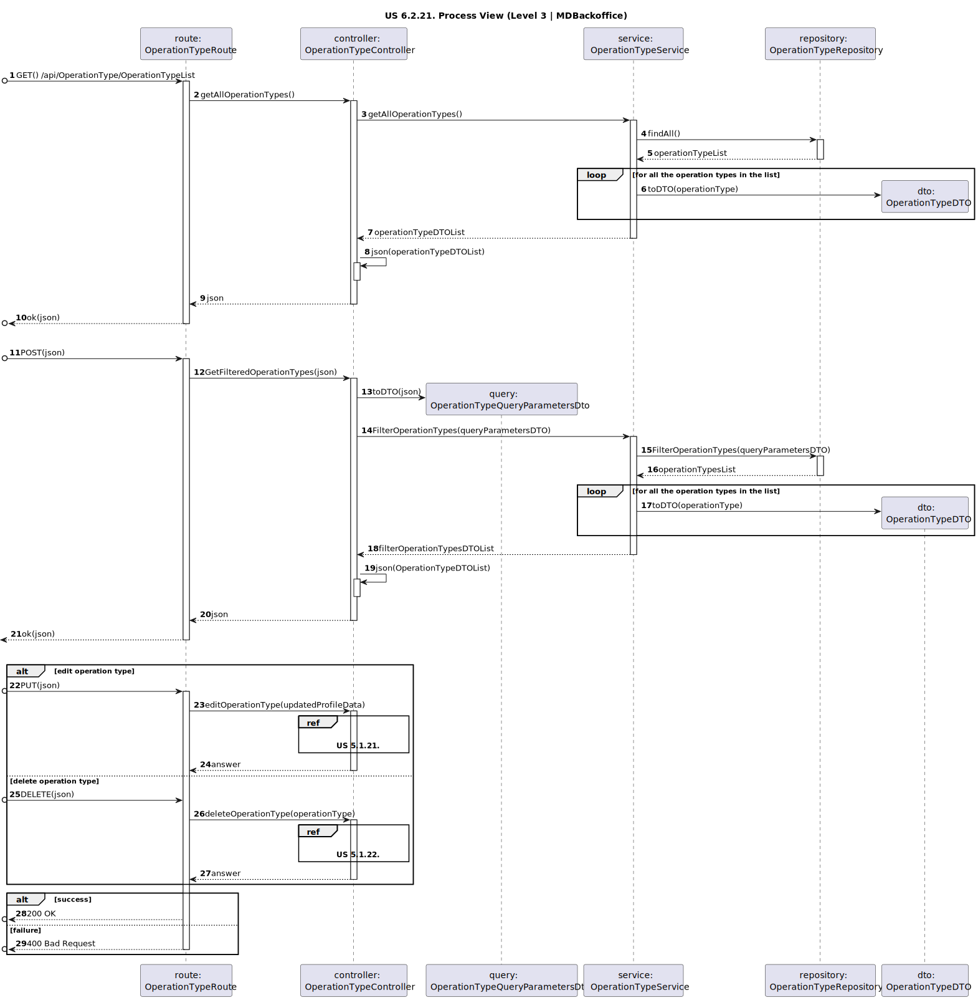

# US 6.2.21

<!-- TOC -->
* [US 6.2.21](#us-6221)
  * [1. Context](#1-context)
  * [2. Requirements](#2-requirements)
  * [3. Analysis](#3-analysis)
    * [System Sequence Diagram](#system-sequence-diagram)
  * [4. Design](#4-design)
    * [4.1. Realization](#41-realization)
      * [Logical View](#logical-view)
      * [Process View](#process-view)
        * [Level 1](#level-1)
        * [Level 2](#level-2)
        * [Level 3](#level-3)
      * [Development View](#development-view)
      * [Physical View](#physical-view)
    * [4.2. Applied Patterns](#42-applied-patterns)
<!-- TOC -->

## 1. Context

This is to implement the user interface of a previous user story.

## 2. Requirements

**US 6.1.21:** As an Admin, I want to list/search operation types, so that I can se the details, edit, and remove
operation types.

**Acceptance Criteria:**

- **6.2.21.1:** Admin can search and filter operation types by name, specialization, or status (active/inactive).

- **6.2.21.2:** The system displays operation types in a searchable list with attributes such as name, required staff,
and estimated duration.

- **6.2.21.3:** Admins can select an operation type to view, edit, or deactivate it.

**Dependencies/References:**

**6.2.18:** There must exist operation types, so they can be listed and removed.
**6.2.19:** The functionality to edit operation types.
**6.2.20:** The functionality to deactivate operation types.

**Client Clarifications:**

> **Question:** What filters are you looking for in the search/list of staff and patient profiles? 
> And what about operation types?
>
> **Answer:**  Filters can include doctor specialization, name, or email to refine search results.

> **Question:** Should actions like removing an operation type be accessed only through specific methods?
>
> **Answer:** Yes, operations like removal or deactivation should be available via specific API methods.

> **Question:** Is removing an operation type the same as deactivating it?
>
> **Answer:** Yes, deactivating makes the operation type unavailable for future use but retains historical data.

> **Question:** Hello Mr. Client. The filters are And or OR. For example, if I filter for a Patient named John and
> Age 24, do you want every John who is 24 years old or every Patient who is called John or is 24 years old
>
> **Answer:** If more than one search/filter parameter is used, the combination of filters should be considered as AND.

> **Question:** We would like to ask if you have any specific set of functionalities or design in mind for the UIs of
> the previous user stories, or if this is left up to the team responsible for the aesthetic aspects of the application.
>
> **Answer:** The aesthetic component is up to the development team’s discretion. Just try to follow web application
> best practices and usability guidelines.

## 3. Analysis

The main objective of this functionality is to list or search operation types, so they can be selected and check their
details, edit or remove them. To achieve that, the Admin can filter the operation types by:
- Name
- Specialization
- Status (Active/Inactive)

Once the filters are applied, the system displays operation types in a searchable list with the following attributes:
- Name
- Required Staff
- Estimated Duration

Finally, the admin can select an operation type to:
- Edit
- Deactivate

### System Sequence Diagram

## 4. Design

### 4.1. Realization

The logical, physical, development and scenario views diagrams are generic for all the use cases of the backoffice component.

#### Logical View

The diagrams are available in the [team decision views folder](../../team-decisions/views/general-views.md#1-logical-view).

#### Process View

##### Level 1

##### Level 2

##### Level 3

- _Visualization_ 
  

- _MDBackoffice_ 
  

#### Development View

The diagrams are available in the [team decision views folder](../../team-decisions/views/general-views.md#3-development-view).

#### Physical View

The diagrams are available in the [team decision views folder](../../team-decisions/views/general-views.md#4-physical-view).

### 4.2. Applied Patterns

> #### **Repository Pattern**
>
>* **Components:** OperationTypeRepository
>
> The repositories handle data access and retrieval, isolating the database interaction logic from services and other 
> layers. This approach abstracts the persistence logic, promoting separation of concerns.

> #### **DTO (Data Transfer Object) Pattern**
>
>* **Components:** OperationTypeQueryParametersDto, OperationTypeDTO
>
> DTOs are utilized to transfer data between layers, particularly from the controller layer to the service layer and 
> vice versa. Their main purpose is to convey data in a structured and decoupled manner without revealing the internal 
> representations of entities. Additionally, this pattern is not required to adhere to business rules.

> #### **Facade Pattern**
>
>* **Components:** OperationTypeService
>
> These services function as a facade, simplifying the interaction with lower-level components such as repositories. 
> The controller communicates with these service facades, concealing the complexity from the upper layers.
