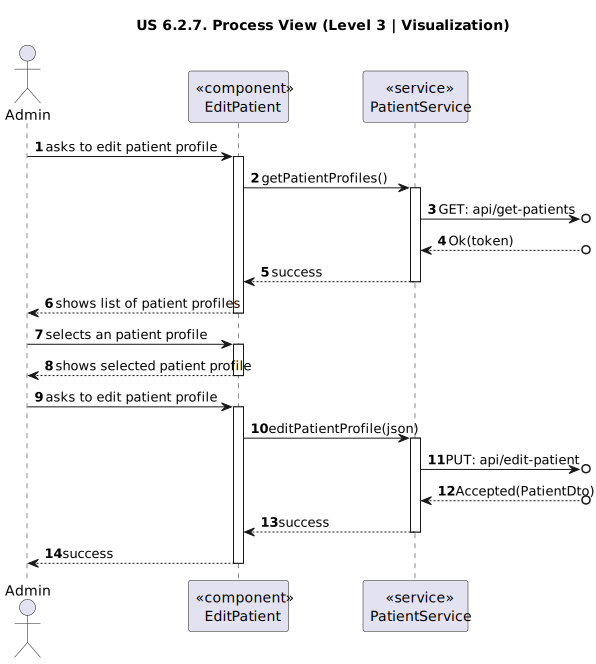

# US 6.2.7

<!-- TOC -->
* [US 6.2.7](#us-627)
  * [1. Context](#1-context)
  * [2. Requirements](#2-requirements-)
  * [3. Analysis](#3-analysis)
    * [System Sequence Diagram](#system-sequence-diagram)
    * [Domain Model](#domain-model)
  * [4. Design](#4-design)
    * [4.1. Realization](#41-realization)
      * [Logical View](#logical-view)
      * [Process View](#process-view)
        * [Level 1](#level-1)
        * [Level 2](#level-2)
        * [Level 3](#level-3)
      * [Development View](#development-view)
      * [Physical View](#physical-view)
    * [4.3. Applied Patterns](#43-applied-patterns)
<!-- TOC -->

## 1. Context

This is to implement the user interface of a previous user story.

## 2. Requirements 

**US 6.2.7:** As an Admin, I want to edit an existing patient profile, so that I can update their information when needed.

**Acceptance Criteria:**

- **6.2.7.1.** Admins can search for and select a patient profile to edit.

- **6.2.7.2.** Editable fields include name, contact information, medical history, and allergies.

- **6.2.7.3:** Changes to sensitive data (e.g., contact information) trigger an email notification to the patient.

- **6.2.7.4:** The system logs all profile changes for auditing purposes.

**Dependencies/References:**

**6.2.6:** The Admin must create first the patient record, so that it can be edited.

**Client Clarifications:**

> **Question:** In an allergy record, is it necessary to include the date of diagnosis and the name of the doctor who made it?
> What defines an allergy and one medical condition?
>
> **Answer:** Allergies is a free text field. The doctor will fill it in as best-suited.

> **Question:** As I understand it, a patient's profile has plenty of information about the user, such as name, contact
> information (phone and email), preferences, appointment history, medical records, etc.
>
> What data do you consider to be identifiable? Are medical and appointment records deemed identifiable from your 
> perspective? What data from the user's profile can be retained in the system after the legal time frame related to the
> GDPR has passed?
>
> Also, how much time do you want to be set as the time frame for deletion and retention of data in the system? Is the 
> user informed on how many days are left for the deletion of its data? Like by email or somewhere in the UI of their
> account?
>
> **Answer:** It is part of the team's work for the GDPR module to define the policy

> **Question:** In the context of US 5.1.9, second acceptance criteria "Changes to sensitive data (e.g., contact
> information) trigger an email notification to the patient.", what classifies as "sensitive data".
>
> **Answer:** This is part of the team's responsibilities in the scope of GDPR and the privacy policy you will define.

> **Question:** In this US an admin can edit a user profile. Does the system display a list of all users or the admin
> searches by ID? Or both?
>
> **Answer:** This requirement is for the editing of the user profile. from a usability point of view, the user should
> be able to start this feature either by searching for a specific user or listing all users and selecting one.
> note that we are not doing the user interface of the system in this sprint.

> **Question:** Regarding the editing of patient information, is contact information the only sensitive data? Is it the 
> only data that triggers an email notification?
>
> **Answer:** It's part of your responsibilities within the scope of the data protection module and in accordance with
> the policy you define.

> **Question:** When one of the contents that administrator edits is a sensitive content (eg. email), the notification 
> is sent for what patient's email, the email in patient account, the old email of patient or the new email of patient?
>
> **Answer:** If the email is changed, the notification should be sent to the "old" email

> **Question:** We would like to ask if you have any specific set of functionalities or design in mind for the UIs of 
> the previous user stories, or if this is left up to the team responsible for the aesthetic aspects of the application.
>
> **Answer:** The aesthetic component is up to the development team’s discretion. Just try to follow web application 
> best practices and usability guidelines.

## 3. Analysis

This functionality centers in the edit of a patient profile by the Admin, so he can update the patient information.

First the Admin will search for the patient profile he wants to edit and then select it. Then can be selected the follow
editable fields:
- name
- contact information (email and phone)
- medical history
- allergies

In the case of choosing to change sensitive data, such as contact information, triggers and email notification to the
patient. 

The system will log all the profile changes for auditing purposes.

### System Sequence Diagram

### Domain Model

## 4. Design

### 4.1. Realization

The logical, physical, development and scenario views diagrams are generic for all the use cases of the backoffice component.

#### Logical View

The diagrams are available in the [team decision views folder](../../team-decisions/views/general-views.md#1-logical-view).

#### Process View

##### Level 1

##### Level 2

##### Level 3

- _Visualization_ 
  

- _MDBackoffice_
  

#### Development View

The diagrams are available in the [team decision views folder](../../team-decisions/views/general-views.md#3-development-view).

#### Physical View

The diagrams are available in the [team decision views folder](../../team-decisions/views/general-views.md#4-physical-view).

### 4.3. Applied Patterns

> #### **Repository Pattern**
>
>* **Components:** PatientRepository
>
> The repositories handle data access and retrieval, isolating the database interaction logic from services and other
> layers. This approach abstracts the persistence logic, promoting separation of concerns.

> #### **DTO (Data Transfer Object) Pattern**
>
>* **Components:** PatientDTO, EmailMessageDTO, EditPatientDTO
>
> DTOs are utilized to transfer data between layers, particularly from the controller layer to the service layer and
> vice versa. Their main purpose is to convey data in a structured and decoupled manner without revealing the internal
> representations of entities. Additionally, this pattern is not required to adhere to business rules.

> #### **Facade Pattern**
>
>* **Components:** PatientService, LogService, EmailService
>
> These services function as a facade, simplifying the interaction with lower-level components such as repositories.
> The controller communicates with these service facades, concealing the complexity from the upper layers.
