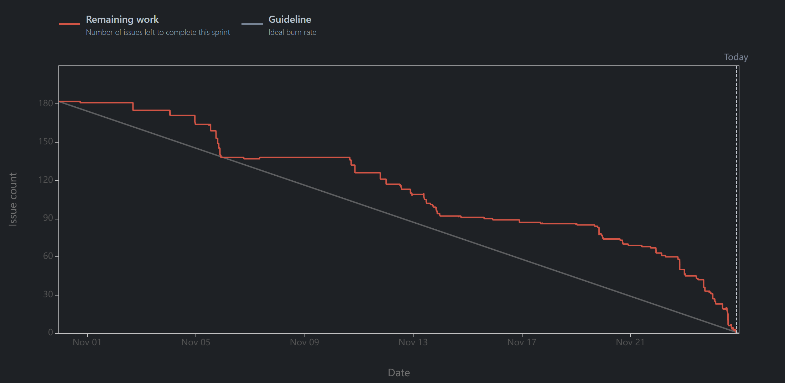

## Sprint Planning

### Team Members

| Name           | Number  |
|----------------|---------|
| Ana Guterres   | 1221933 |
| Matilde Varela | 1220683 |
| José Santos    | 1220738 |
| Rita Barbosa   | 1220841 |

### Task Distribution

| US             | User Stories Assigned                                                                                                                                                                                                                                                                                                                                                                                                                                                       | Testing team member                                      |
|----------------|-----------------------------------------------------------------------------------------------------------------------------------------------------------------------------------------------------------------------------------------------------------------------------------------------------------------------------------------------------------------------------------------------------------------------------------------------------------------------------|----------------------------------------------------------|
| Ana Guterres   | [us-6.1.1](./1221933/us-6.1.1/readme.md); [us-6.1.4](./1221933/us-6.1.4/readme.md); [us-5.1.2](1221933/us-5.1.2/readme.md); [us-6.2.7](1221933/us-6.2.7/readme.md); [us-6.2.11](1221933/us-6.2.11/readme.md); [us-6.2.14](1221933/us-6.2.14/readme.md); [us-6.2.21](1221933/us-6.2.21/readme.md);[us-6.3.1](./us-6.3.1/readme.md) [us-6.4.3](./1221933/us-6.4.3/readme.md); [us-6.4.7](./1221933/us-6.4.7/readme.md); [us-6.5.2](./1221933/us-6.5.2/readme.md);             | José [e2e : [us-6.2.14](1221933/us-6.2.14/readme.md) ]   |
| José Santos    | [us-6.1.2](./1220738/us-6.1.2/readme.md); [us-6.2.1](./1220738/us-6.2.1/readme.md); [us-5.1.1](1220738/us-5.1.1/readme.md); [us-6.2.8](./1220738/us-6.2.8/readme.md); [us-6.2.12](./1220738/us-6.2.12/readme.md); [us-6.2.16](./1220738/us-6.2.16/readme.md); [us-6.2.19](./1220738/us-6.2.19/readme.md); [us-6.3.1](./us-6.3.1/readme.md); [us-6.4.1](./1220738/us-6.4.1/readme.md); [us-6.4.4](./1220738/us-6.4.4/readme.md); [us-6.5.3](./1220738/us-6.5.3/readme.md);   | Ana                                                      |
| Matilde Varela | [us-6.1.3](./1220683/us-6.1.3/readme.md); [us-6.2.3](1220683/us-6.2.3/readme.md); [us-6.2.4](1220683/us-6.2.4/readme.md); [us-6.2.9](1220683/us-6.2.9/readme.md); [us-6.2.13](1220683/us-6.2.13/readme.md); [us-6.2.15](1220683/us-6.2.15/readme.md); [us-6.2.18](1220683/us-6.2.18/readme.md); [us-6.3.3](./us-6.3.3/readme.md); [us-6.4.2](./1220683/us-6.4.2/readme.md); [us-6.4.5](./1220683/us-6.4.5/readme.md); [us-6.5.1](./1220683/us-6.5.1/readme.md);             | Rita  [e2e : [us-6.2.4](1220683/us-6.2.4/readme.md) ]    |
| Rita Barbosa   | [us-6.1.5](./1220841/us-6.1.5/readme.md); [us-6.2.2](./1220841/us-6.2.2/readme.md); [us-6.2.5](./1220841/us-6.2.5/readme.md); [us-6.2.6](./1220841/us-6.2.6/readme.md); [us-6.2.10](./1220841/us-6.2.10/readme.md); [us-6.2.17](./1220841/us-6.2.17/readme.md); [us-6.2.20](./1220841/us-6.2.20/readme.md); [us-6.3.3](./us-6.3.3/readme.md); [us-6.4.6](./1220841/us-6.4.6/readme.md); [us-6.4.8](./1220841/us-6.4.8/readme.md); [us-6.5.4](./1220841/us-6.5.4/readme.md); | Matilde  [e2e : [us-6.2.6](1220841/us-6.2.6/readme.md) ] |

**Note:** All team members will collaborate on developing the user
stories [us-6.3.2](./us-6.3.2/readme.md), [us-6.6.1](./us-6.6.1/readme.md); [us-6.6.2](./us-6.6.2/readme.md).

### Observations

To ensure smooth project management and progress tracking, we've implemented the following aspects:

1. **Project Management Tool:** Jira has been chosen as our project management tool and will follow the same
   organizational setup we've previously used to maintain consistency.

2. **User Story Breakdown:** Each user story has been divided into smaller, manageable tasks in line with the
   engineering process. These tasks include analysis, requirements gathering, design, immediate implementation after
   design completion, and testing. This structure provides a clearer understanding of the progress for each user story
   and helps facilitate an organized division of commits, addressing concerns raised by some team members about work
   visibility and task tracking.

3. **Module Coordination:** We've designated a coordinator for each module, responsible for ensuring that all aspects of
   their module are well-integrated and properly implemented, which supports more effective cross-module consistency.

4. **Separation of Implementation and Testing:** In order to maintain objectivity and improve quality, the testing of
   each user story will be conducted by a team member other than the one who implemented it. This ensures that all code
   is reviewed and validated by a fresh perspective, helping to identify any overlooked issues.

5. **Code Reviews:** During the implementation phase, there will be at least one code review for each user story to
   ensure quality and adherence to coding standards. The code review will be performed by the same team member
   responsible for testing the user story. Additional reviews may be conducted based on the complexity and state of the
   project. This process helps in catching potential issues early and improves the overall quality of the codebase.

6. **Task Deadlines:** Deadlines have been set for each of the tasks to ensure the team consistently progresses towards
   project goals. This also ensures that everyone remains accountable, preventing anyone from falling behind or slacking
   off.

7. **Sprint Closure:** The final day of each sprint will be reserved for reviewing the work completed, conducting
   self-evaluations, and holding a sprint retrospective. This means that all planned tasks must be completed by the day
   before the sprint ends. If any tasks are left unfinished due to a lack of responsibility or effort from a team
   member, they will be held accountable in subsequent evaluations, reinforcing the importance of commitment and
   accountability.

8. **Daily Logs:** Each team member will maintain daily logs to track and document their work. This helps in providing
   transparency and allows for better progress tracking, ensuring that everyone is contributing to the project
   consistently.

These practices have been put in place to enhance team collaboration, ensure timely delivery of tasks, and maintain
high-quality standards throughout the project.

#### DoR - Definition of Ready

The Definition of Ready (DoR) ensures that backlog items are prepared before being included in a sprint. An item is ready when its requirements and acceptance criteria are clear, all dependencies are identified and resolved, and client clarifications are addressed. It must also be small enough to fit within a sprint, technically feasible, and prioritized with effort estimates provided. This ensures the team has all necessary information and resources to start work effectively.

#### DoD - Definition of Done

The Definition of Done (DoD) ensures that items are fully completed and meet quality standards. An item is done when all phases—requirements, design, implementation, and testing—are complete, with dependencies resolved and acceptance criteria met. Code must pass all tests, undergo review, and meet quality standards. Documentation and client sign-off are required. This guarantees the deliverable is ready for use or deployment.

## Sprint Retrospective

* **Burndown Chart**

* **What Went Well:**
  1. Teamwork Effectiveness:
        * Our teamwork remains highly effective, enabling smooth collaboration and productivity.

  2. Proactive Issue Resolution:
        * We successfully implemented the suggestions from the previous retrospective. Issues were raised earlier, allowing for quicker resolutions and minimizing delays.

  3. Adaptability:
        * The team demonstrated impressive adaptability, adjusting swiftly and effectively to both the new work environment and the subject matter.

* **Challenges Faced:**
  1. Topic Complexity:
        * The high complexity of certain topics hindered the continuous flow of work, causing delays.

  2. Technology Integration:
        * Integrating Angular with Three.js proved to be significantly more challenging than anticipated, resulting in considerable delays in our progress.

  3. Impact of New Technologies:
        * The additional technologies introduced as part of the requirements disrupted the timely completion of our tasks.

* **Areas for Improvement:**
  1. Prioritization of Course-Evaluated Work:
        * We need to prioritize tasks directly tied to course assessments to better manage workloads and avoid becoming overwhelmed.

## [Self-Assessment](3dg-g38-autoavaliacao.pdf)

## [Honor Pledge](3dg-g38-compromisso-honra.pdf)
