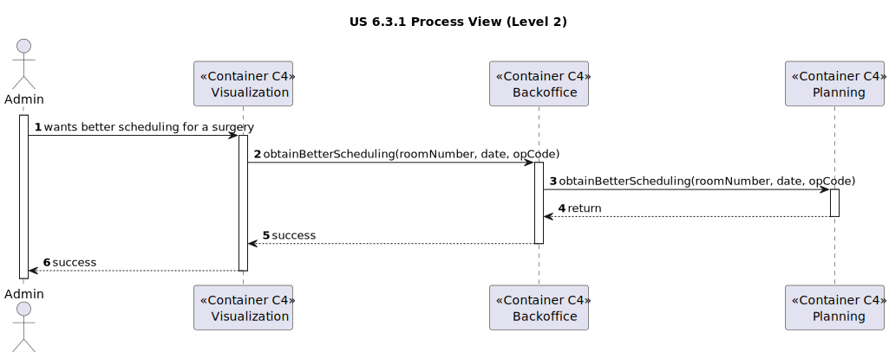
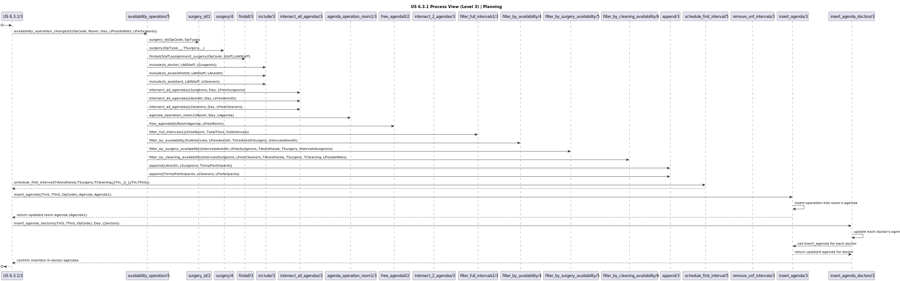

# US 6.3.1

<!-- TOC -->
* [US 6.3.1](#us-631)
  * [1. Context](#1-context)
  * [2. Requirements](#2-requirements)
  * [3. Analysis](#3-analysis)
  * [4. Design](#4-design)
    * [4.1. Realization](#41-realization)
      * [Logical View](#logical-view)
      * [Process View](#process-view)
        * [Level 1](#level-1)
        * [Level 2](#level-2)
        * [Level 3](#level-3)
          * [Level 3 - Visualization](#level-3---visualization)
          * [Level 3 - MDBackoffice](#level-3---mdbackoffice)
          * [Level 3 - Planning](#level-3---planning)
      * [Development View](#development-view)
      * [Physical View](#physical-view)
<!-- TOC -->

## 1. Context

This is the first time this user story is worked on.

## 2. Requirements

**US 6.3.1:** As an Admin, I want to obtain the better scheduling of a set of operations (surgeries) in a certain 
operation room in a specific day.

**Acceptance Criteria:**

- **6.3.1.1:** The better scheduling is considered as the sequence of operations that finished early.

- **6.3.1.2:** The scheduling algorithm must take into account any constraints for each surgery, such as the number of 
doctors or other required staff, specifically concerning their time availability during the day. 

- **6.3.1.3:** The user interface must allow the Admin to enter relevant parameters for the scheduling process, 
including: room number, date, etc.

- **6.3.1.4:** The system should generate the plan and show it to the user on the screen.

- **6.3.1.5:** The UI can block while waits for the planning module response.

**Dependencies/References:**

**US 6.2.15 & 6.2.16:** The changes made to the operation requests should be notified to the Planning module.

**US 6.1.1:** There needs to exist an integrated UI to be able to obtain the better schedule.

## 3. Analysis

The primary goal of this user story is to develop the better scheduling of a set of operations for a specific
operation room in a specific day. To be able to achieve this is important to have in mind some important constrains:

  * number of doctors
  * number of other staffs
  * staff availability

An approach may be implementing an algorithm that generates all the possible surgeries sequences and then select the
best one. This approach will only work for until a certain number of surgeries, which means that for a larger number,
other algorithm should be used.

The user interface should allow the Admin to input all necessary parameters to initiate the scheduling process easily.
It should provide feedback during processing, even if temporarily unresponsive, and display the final schedule
comprehensively once ready.

## 4. Design

### 4.1. Realization

The logical, physical, development and scenario views diagrams are generic for all the use cases of the backoffice component.

The goal of this design is to create an interface and backend structure that allows an Admin to generate an optimal surgery schedule. This schedule will be computed by a planning module in SWI Prolog, leveraging constraints on room availability, doctor/staff requirements, and operation durations to find the sequence that completes the operations earliest.

#### Logical View

The diagrams can be found in the [team decision views folder](../team-decisions/views/general-views.md#1-logical-view).

#### Process View

##### Level 1

##### Level 2

##### Level 3
###### Level 3 - Visualization

###### Level 3 - MDBackoffice

###### Level 3 - Planning

#### Development View

The diagrams can be found in the [team decision views folder](../team-decisions/views/general-views.md#3-development-view).

#### Physical View

The diagrams can be found in the [team decision views folder](../team-decisions/views/general-views.md#4-physical-view).

