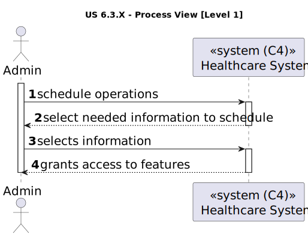

# US 6.3.3

<!-- TOC -->
* [US 6.3.3](#us-633)
  * [1. Context](#1-context)
  * [2. Requirements](#2-requirements)
  * [3. Analysis](#3-analysis)
  * [4. Design](#4-design)
    * [4.1. Realization](#41-realization)
      * [Logical View](#logical-view)
      * [Process View](#process-view)
        * [Level 1](#level-1)
        * [Level 2](#level-2)
        * [Level 3](#level-3)
      * [Development View](#development-view)
      * [Physical View](#physical-view)
<!-- TOC -->

## 1. Context

This is the first time this user story is worked on.

## 2. Requirements

**US 6.3.3:** As an Admin, I want to obtain a good schedule, not necessarily the better, in useful time to be adopted.

**Acceptance Criteria:**

- 6.3.3.1: The system generates a "good" (non-optimal but efficient) schedule using heuristics or informed methods (e.g., greedy algorithms, rule-based scheduling).
- 6.3.3.2: The system prioritizes generating a schedule that is close to optimal but does so within a reasonable time frame (e.g., under 30 seconds).
- 6.3.3.3: The user must have a user interface to start the process (enter any additional parameters the planning algorithm
needs, e.g., room number, date, which heuristic to use).

**Dependencies/References:**

This functionality is dependent on a knowledge database with information of all components in the system, such as patients,
staff, rooms, appointments, specializations, operation types and operation requests.

**Client Clarifications:**

> No client clarifications.

## 3. Analysis

An operation room is assigned to a set of scheduled operations, however, in case of urgent operations, some appointments
might be delayed or even cancelled. Therefore, the good use of an operation room is 75/80% to accommodate unexpected urgent
operations.

Scheduling of the operations sequence is the central component of the Planning module, allocating resources over a period
of time to perform a certain number of tasks/operations.

A lot of factors must be taken into consideration for the scheduling:
- room availability
- staff availability
- operation type's duration
- operation appointment priority
- compatibility of operations request's times

Only after checking all of those constraints can the scheduling beginning. The following diagram provides clarity regarding
all the moving parts in an operation request execution and the resources and time allocated:

The algorithm to find a good scheduling with heuristics is similar with the _**Travelling Salesman Problem**_, without the need
to return to the original point.

## 4. Design

### 4.1. Realization

The logical, physical, development and scenario views diagrams are generic for all the use cases of the backoffice component.

#### Logical View

The diagrams can be found in the [team decision views folder](../team-decisions/views/general-views.md#1-logical-view).

#### Process View

##### Level 1

##### Level 2

##### Level 3

- _Visualization_ 

- _MDBackoffice_ 

#### Development View

The diagrams can be found in the [team decision views folder](../team-decisions/views/general-views.md#3-development-view).

#### Physical View

The diagrams can be found in the [team decision views folder](../team-decisions/views/general-views.md#4-physical-view).
