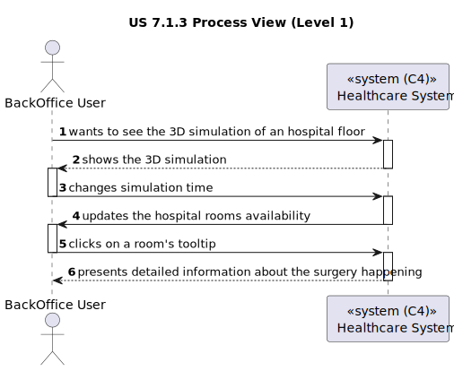
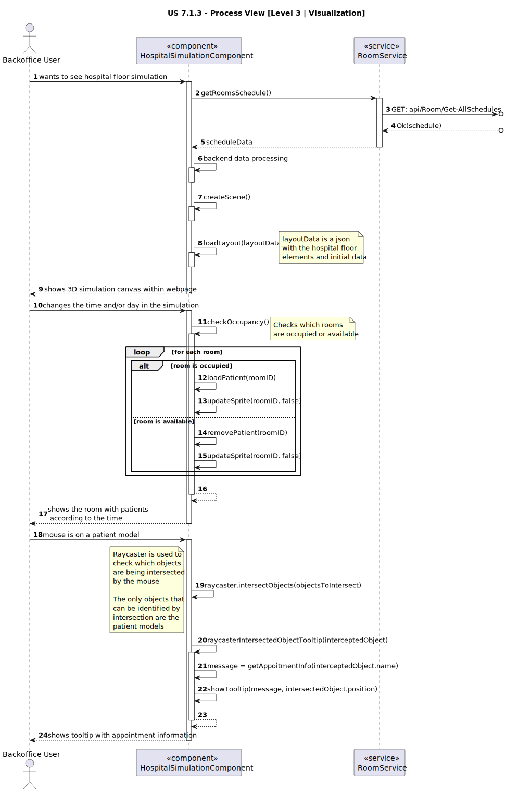
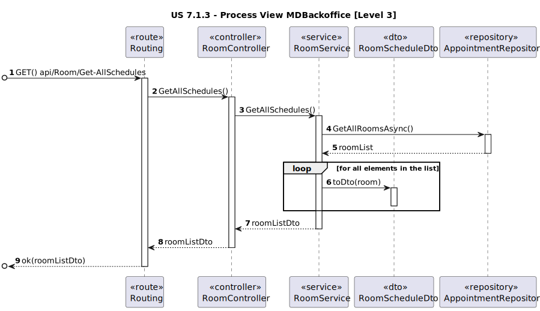

# US 7.1.3

<!-- TOC -->
* [US 7.1.3](#us-713)
  * [1. Context](#1-context)
  * [2. Requirements](#2-requirements)
  * [3. Analysis](#3-analysis)
  * [4. Design](#4-design)
    * [4.1. Realization](#41-realization)
      * [Logical View](#logical-view)
      * [Process View](#process-view)
        * [Level 1](#level-1)
        * [Level 2](#level-2)
        * [Level 3](#level-3)
      * [Development View](#development-view)
      * [Physical View](#physical-view)
      * [4.1.3 Development View](#413-development-view)
      * [4.1.4 Physical View](#414-physical-view)
<!-- TOC -->

## 1. Context

This is the second time this user story is worked on.

## 2. Requirements

**US 7.1.3:** As healthcare staff, I want the information showed on the 3D visualization module about room availability 
to be in sync with the schedule that was generated by the planning module.

**Acceptance Criteria:**

No acceptance criteria yet.

**Dependencies/References:**

This user story is dependent on the information provided by the Planning module.

**Client Clarifications:**

> **Question:** As was stated previously, the number of rooms in the 3D representation must be consistent with the number of rooms that can be scheduled in the Planning/Optimization Module. 
However, let's say that, while we have the 3D representation open, someone creates a new Surgery Room. Must that new room be loaded dynamically?
>
> **Answer:** It is not necessary to do it "hot wired". The next time the 3D view is loaded it should pick up the new surgery room. Keep in mind that creating a new surgery room is not something that happens frequently...

> **Question:** What information is expected to come from the planning module that is to be visualized in the 3D representation? Do we assume that, at the moment, the only information that is showed is the room ID and a human in the surgical table if the room is currently being occupied?
>
> **Answer:** The system must show if the room is occupied or not. The occupancy of a room is a result of the scheduling done by the planning module. If a room is occupied, the system must show a 3D human model and a tooltip with the information about the surgery type and operation request. preferably,
> the tooltip should act as a link to the operation detail page where the user can see all the details of the operation. The user must have a way to "set" the current time of the visualization. That is, the 3D visualization module must not depend directly on the PC clock.

> **Question:** In this sprint there are 2 methods to get the operations schedule of a room: the better one and the good one. The Admin has access to both methods, but both decide the room schedules, therefore affecting the room availability. Is there a way to know which method is used to actually determine the room availability and operation scheduling, so that the data in the 3D visualization module is in sync with the Planning module?
>
> **Answer:** The user can select which method to use to generate the schedule of a certain time-period. After the schedule is generated, the data about room availability for those days must be updated. If the user runs the scheduling again for the same time period, using a different algorithm or not, The new/updated schedule must be used to update the room's availability.

## 3. Analysis

After the planning module updates the database with the new room schedules, the 3D representation must be in sync with the new data.

Each room must know its schedule and when It's available or not.

When a surgery is happening, the 3D visualization must adequately represent its occupation by displaying a patient laid 
down on the surgical table.

Each room must have a sprite with the indication of the room ID and, when a surgery is happening, with the operation type
and request basic information (Operation name, start time and end time).

This tooltip should link to a more complex view of that surgery.

This simulation must also contain a clock which the user can set its time, not making it dependent on a machine's clock.
The rooms occupation must be represented accordingly.

If the operation schedule is updated, then the 3D representation must be in-sync (this can happen on a page reload).

## 4. Design

### 4.1. Realization

The logical, physical, development and scenario views diagrams are generic for all the use cases of the backoffice component.

#### Logical View

The diagrams can be found in the [team decision views folder](../../team-decisions/views/general-views.md#1-logical-view).

#### Process View

The 3D visualization is a component itself

##### Level 1

##### Level 2

_[This diagram is not relevant.]_

##### Level 3

- _Visualization_

- _MDBackoffice_

#### Development View

The diagrams can be found in the [team decision views folder](../../team-decisions/views/general-views.md#3-development-view).

#### Physical View

The diagrams can be found in the [team decision views folder](../../team-decisions/views/general-views.md#4-physical-view).

#### 4.1.3 Development View

The diagrams can be found in the [team decision views folder](../../team-decisions/views/general-views.md#3-development-view).

#### 4.1.4 Physical View

The diagrams can be found in the [team decision views folder](../../team-decisions/views/general-views.md#4-physical-view).