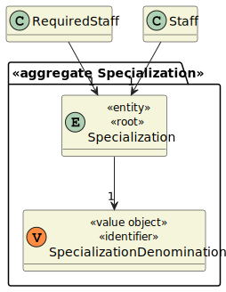

# US 7.2.11

<!-- TOC -->
* [US 7.2.11](#us-7211)
  * [1. Context](#1-context)
  * [2. Requirements](#2-requirements)
  * [3. Analysis](#3-analysis)
    * [Domain Model](#domain-model)
  * [4. Design](#4-design)
    * [4.1. Realization](#41-realization)
    * [Process View](#process-view)
      * [Level 1](#level-1)
      * [Level 2](#level-2)
      * [Level 3](#level-3)
      * [4.1.3 Development View](#413-development-view)
      * [4.1.4 Physical View](#414-physical-view)
    * [4.2. Applied Patterns](#42-applied-patterns)
    * [4.2. Tests](#42-tests)
  * [5. Implementation](#5-implementation)
  * [6. Integration/Demonstration](#6-integrationdemonstration)
  * [7. Observations](#7-observations)
<!-- TOC -->

## 1. Context

* This is the first time this user story is being requested.

## 2. Requirements

**US 7.2.11:** As an Admin, I want to add new Specializations, so that I can update or correct information about the staff and operation type (procedure).

**Acceptance Criteria:**

No criteria.

**Dependencies/References:**

This feature is related to the existence of an operation type (US 5.1.20).

**Client Clarifications:**

> **Question:** The Specialization consist in what? Just a name or are there more fields?
>
> **Answer:** A specialization has a code (for example, based on SNOMED CT (Systematized Nomenclature of Medicine - Clinical Terms)), a designation and an optional longer description.

## 3. Analysis

Specializations define the area of which a staff is the most proficient in. Through specialization, one can understand what
staff is required for an operation type, so when scheduling one operation/assigning staff, that factor must be taken into
consideration.

What defines a specialization is:

* Code (can be based on SNOMED CT (Systematized Nomenclature of Medicine - Clinical Terms))
* Denomination
* Description (optional)

### Domain Model

## 4. Design

### 4.1. Realization

The logical, physical, development and scenario views diagrams are generic for all the use cases of the backoffice component.
These diagrams can be found in the [generic views diagrams compilation file](../../team-decisions/views/general-views.md).

The process view levels are here presented as they represent a process specific to each user story.

### Process View

#### Level 1

> TBD

#### Level 2

As this level does not add any additional information regarding the user story's execution flow from level 1's diagram, 
it's diagram was deemed irrelevant.

#### Level 3

- _Visualization_ 
> TBD

- _MDBackoffice_
> TBD

#### 4.1.3 Development View

The diagrams can be found in the [team decision views folder](../../team-decisions/views/general-views.md#3-development-view).

#### 4.1.4 Physical View

The diagrams can be found in the [team decision views folder](../../team-decisions/views/general-views.md#4-physical-view).
  
### 4.2. Applied Patterns

> TBD

### 4.2. Tests

_// To do //_

## 5. Implementation

> TBD

## 6. Integration/Demonstration

> TBD

## 7. Observations
