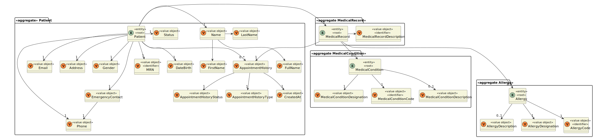
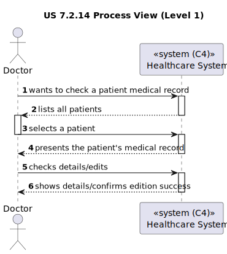
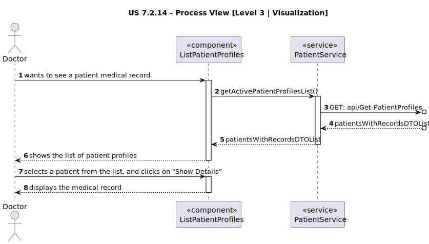
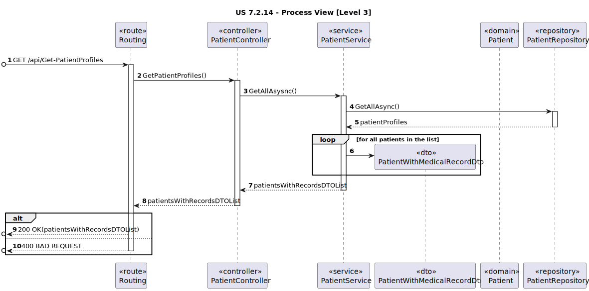

# US 7.2.14

<!-- TOC -->
* [US 7.2.14](#us-7214)
  * [1. Context](#1-context)
  * [2. Requirements](#2-requirements)
  * [3. Analysis](#3-analysis)
    * [Domain Model](#domain-model)
  * [4. Design](#4-design)
    * [4.1. Realization](#41-realization)
    * [Process View](#process-view)
      * [Level 1](#level-1)
      * [Level 2](#level-2)
      * [Level 3](#level-3)
      * [4.1.3 Development View](#413-development-view)
      * [4.1.4 Physical View](#414-physical-view)
    * [4.2. Applied Patterns](#42-applied-patterns)
    * [4.2. Tests](#42-tests)
  * [5. Implementation](#5-implementation)
  * [6. Integration/Demonstration](#6-integrationdemonstration)
  * [7. Observations](#7-observations)
<!-- TOC -->


## 1. Context

* This is the first time this user story is being requested.

## 2. Requirements

**US 7.2.14:** As a Doctor, I want to include the access of the Patient Medical Record during the patient profile visualization and management, so that I manage it in that context.

**Acceptance Criteria:**

> No criteria.

**Dependencies/References:**

This feature is related to the existence of a patient profile (US 5.1.8).

**Client Clarifications:**

> **Question:** "As a Doctor, I want to include the access of the Patient Medical Record during the patient profile visualization and management, so that I manage it in that context." This US implies that the Doctor has access to the patient profile management functionalities, but those functionalities are assigned to the Admin according to the previous Sprint. Should we give the Doctor those permissions too?
>
> **Answer:** For clarification, the Admin will be able to manage the user profile (as of sprint A) while the doctor will be able to manage the medical history/medical record. Treat those as two separate responsibilities by two different user roles. Keep in mind that during Sprint A, the medical record was a free text field, and now we are adding a "full-fledged" medical record management feature.


## 3. Analysis

The patient medical record has the patient's profile information, its appointment history and allergies. This profile
should be accessible to doctors through a list with each entry referring to a patient. This file can be edited but not 
removed unless the patient decided to delete its account.

Another [file](medical-record-conditions-example.md) acts as a reference for the patient medical record medical conditions.

Taking this into consideration, the following points define the new structure of the Patient Medical Record:

> * Patient Information
> * Medical History
>   * Allergies
>   * Medical Conditions
> * Appointment History
> * Additional space for observations (free text)

### Domain Model



**Observation:** MRN refers to the medical record number.

## 4. Design

### 4.1. Realization

The logical, physical, development and scenario views diagrams are generic for all the use cases of the backoffice component.
These diagrams can be found in the [generic views diagrams compilation file](../../team-decisions/views/general-views.md).

The process view levels are here presented as they represent a process specific to each user story.

### Process View

#### Level 1



#### Level 2

As this level does not add any additional information regarding the user story's execution flow from level 1's diagram, 
it's diagram was deemed irrelevant.

#### Level 3

- _Visualization_



- _MDPatientManagement_


#### 4.1.3 Development View

The diagrams can be found in the [team decision views folder](../../team-decisions/views/general-views.md#3-development-view).

#### 4.1.4 Physical View

The diagrams can be found in the [team decision views folder](../../team-decisions/views/general-views.md#4-physical-view).
  
### 4.2. Applied Patterns

> #### **Repository Pattern**
>
>* **Components:** PatientRepository, LogRepository
>
> The repositories are responsible for data access and retrieval, separating the logic for interacting with the database
> from the services and other layers. This pattern helps in abstracting the persistence logic.


> #### **DTO (Data Transfer Object) Pattern**
>
>* **Components:** PatientWithMedicalRecordDto
>
> DTOs are used to transfer data between layers, especially from the controller layer to the service layer or vice versa.
> The purpose is to carry data in a structured and decoupled way without exposing internal entity representations directly.
> This pattern does not need to follow business rules.


> #### **Facade Pattern**
>
>* **Components:** PatientService
>
> These services act as a Facade to simplify interaction with lower-level components like repositories. The Controller
> interacts with these service facades, keeping the complexity hidden from the higher layers.


### 4.2. Tests

This functionality was tested with:

* Unit tests for the controller.
* Unit tests for the service.
* Unit tests for the allergy entity.
* Integration tests for controller and service.
* Integration tests with Postman.
* Unit tests for the visualization component


## 5. Implementation

To integrate the medical record with the patient viewing and management, we do exactly like US 6.2.9, but when we fetch
the patient profiles we also fetch the medical records.

When a patient profile is selected, then a button appears showing the medical record with the same medical record number.

```
ngOnInit(): void {
    this.addFilter();
    this.fetchAllergies();
    this.fetchMedicalConditions();
    this.fetchPatients();
    this.fetchPatientsMedicalRecords();
}
```

```
fetchPatientsMedicalRecords(): void {
  this.service.getAllMedicalRecords().subscribe({
    next: (data) => { (this.medicalRecords = data),
    console.log(this.medicalRecords) },
    error: (error) => console.error('Error fetching medical records:', error),
  });
}
```

```
toggleMedicalRecord(patient: PatientWithId): void {
        this.fullPatient = patient;
        this.fullPatientMedicalRecord = this.medicalRecords.find(record => record.id === patient.patientId)!;
        this.medicalRecord = this.fullPatientMedicalRecord;
        this.showMedicalRecord = true;
        this.editingMedicalRecord = false;
  }
```

## 6. Integration/Demonstration

This feature is available only to users that are Doctors, under the Patient dropdown, as "Patient Medical Records".

## 7. Observations

Other features such as edition and search for medical conditions and allergies where also integrated into this feature.
