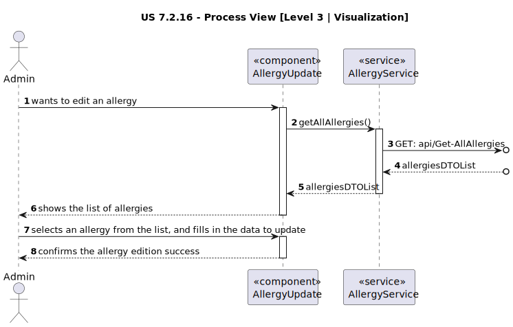
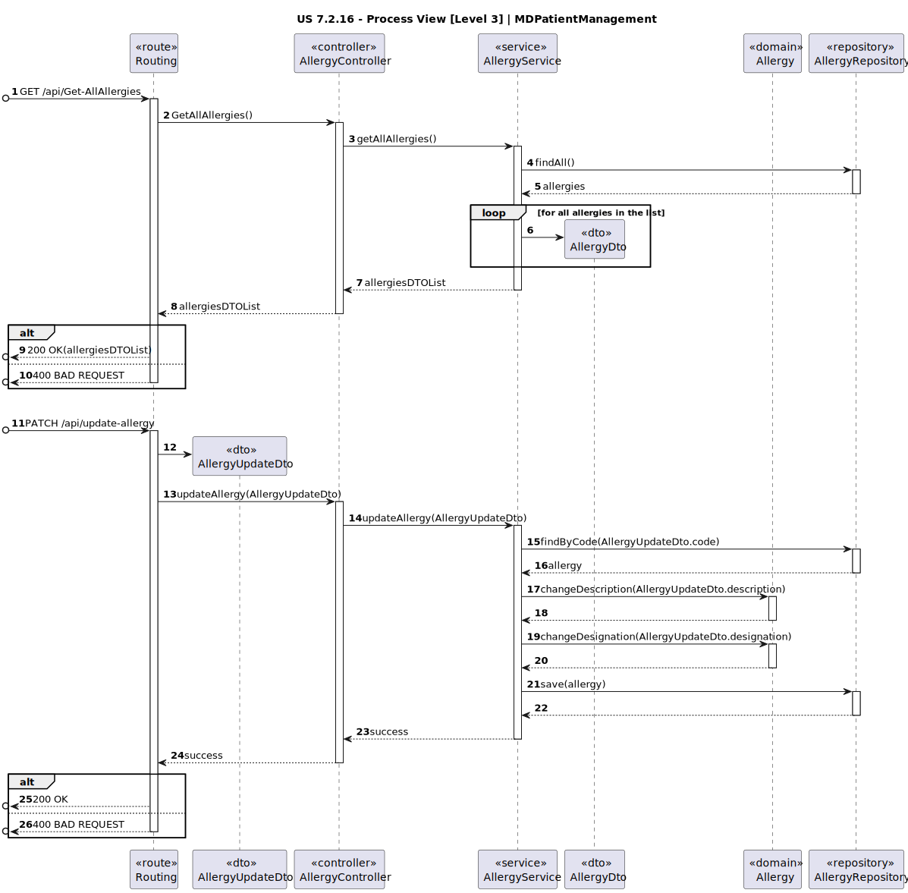

# US 7.2.16

<!-- TOC -->
* [US 7.2.16](#us-7216)
  * [1. Context](#1-context)
  * [2. Requirements](#2-requirements)
  * [3. Analysis](#3-analysis)
    * [Domain Model](#domain-model)
  * [4. Design](#4-design)
    * [4.1. Realization](#41-realization)
    * [Process View](#process-view)
      * [Level 1](#level-1)
      * [Level 2](#level-2)
      * [Level 3](#level-3)
      * [4.1.3 Development View](#413-development-view)
      * [4.1.4 Physical View](#414-physical-view)
    * [4.2. Applied Patterns](#42-applied-patterns)
    * [4.2. Tests](#42-tests)
  * [5. Implementation](#5-implementation)
  * [6. Integration/Demonstration](#6-integrationdemonstration)
<!-- TOC -->

## 1. Context

* This is the first time this user story is being requested.

## 2. Requirements

**US 7.2.14:** As Admin, I want to update an allergy.

**Acceptance Criteria:**

> No criteria.

**Dependencies/References:**

This feature is related to the existence of an allergy (US 7.2.2).

**Client Clarifications:**

> No questions.

## 3. Analysis

After an allergy is registered in the system, then it can be edited.
The only field that can be edited is the description, which is optional.

### Domain Model

**Observation:** MRN refers to the medical record number.

## 4. Design

### 4.1. Realization

The logical, physical, development and scenario views diagrams are generic for all the use cases of the backoffice component.
These diagrams can be found in the [generic views diagrams compilation file](../../team-decisions/views/general-views.md).

The process view levels are here presented as they represent a process specific to each user story.

### Process View

#### Level 1

#### Level 2

As this level does not add any additional information regarding the user story's execution flow from level 1's diagram, 
it's diagram was deemed irrelevant.

#### Level 3

- _Visualization_

- _MDPatientManagement_

#### 4.1.3 Development View

The diagrams can be found in the [team decision views folder](../../team-decisions/views/general-views.md#3-development-view).

#### 4.1.4 Physical View

The diagrams can be found in the [team decision views folder](../../team-decisions/views/general-views.md#4-physical-view).
  
### 4.2. Applied Patterns

> #### **Repository Pattern**
>
>* **Components:** AllergyRepository
>
> The repositories are responsible for data access and retrieval, separating the logic for interacting with the database
> from the services and other layers. This pattern helps in abstracting the persistence logic.

> #### **DTO (Data Transfer Object) Pattern**
>
>* **Components:** AllergyUpdateDto, AllergyDto
>
> DTOs are used to transfer data between layers, especially from the controller layer to the service layer or vice versa.
> The purpose is to carry data in a structured and decoupled way without exposing internal entity representations directly.
> This pattern does not need to follow business rules.

> #### **Facade Pattern**
>
>* **Components:** AllergyService
>
> These services act as a Facade to simplify interaction with lower-level components like repositories. The Controller
> interacts with these service facades, keeping the complexity hidden from the higher layers.

### 4.2. Tests

_// To do //_

## 5. Implementation

> TBD

## 6. Integration/Demonstration

This feature is accessible only to Admin users, under Allergy, as "Edit Allergy".

After selecting an allergy, inputting new information, and submitting, a message will appear regarding the success or
failure of the edition.

