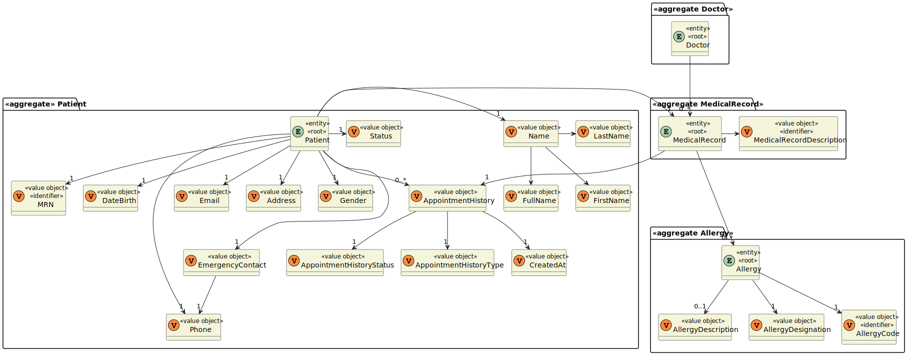
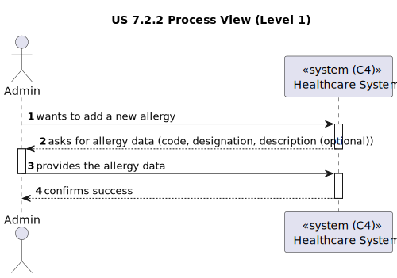
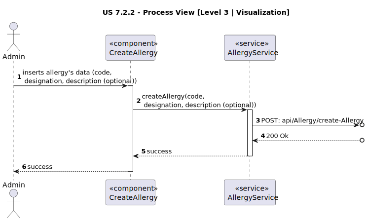
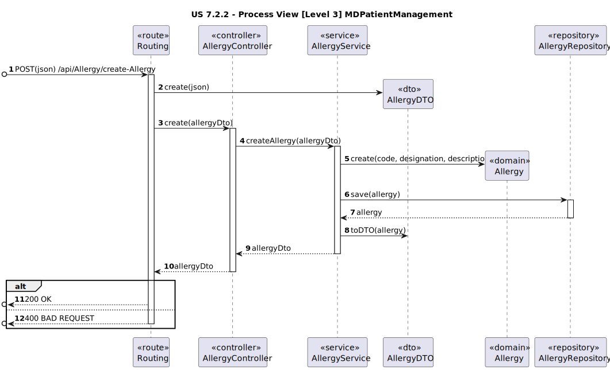

# US 7.2.2

<!-- TOC -->
* [US 7.2.2](#us-722)
  * [1. Context](#1-context)
  * [2. Requirements](#2-requirements)
  * [3. Analysis](#3-analysis)
    * [Domain Model](#domain-model)
  * [4. Design](#4-design)
    * [4.1. Realization](#41-realization)
    * [Process View](#process-view)
      * [Level 1](#level-1)
      * [Level 2](#level-2)
      * [Level 3](#level-3)
      * [4.1.3 Development View](#413-development-view)
      * [4.1.4 Physical View](#414-physical-view)
    * [4.2. Applied Patterns](#42-applied-patterns)
    * [4.2. Tests](#42-tests)
  * [5. Implementation](#5-implementation)
  * [6. Integration/Demonstration](#6-integrationdemonstration)
  * [7. Observations](#7-observations)
<!-- TOC -->


## 1. Context

* This is the first time this user story is being requested.

## 2. Requirements

**US 7.2.2:** As an Admin, I want to add new Allergy, so that the Doctors can use it to update the Patient Medical Record.

**Acceptance Criteria:**

- **7.2.2.1.** | The code identifying the Allergy must follow SNOMED CT or ICD-11 formats.

**Dependencies/References:**

This feature is related to the existence of a patient profile (US 5.1.8) and a patient medical record (US 7.2.14).

**Client Clarifications:**

> **Question:** What information is to be known in an Allergy? Like designation, and anything more?
>
> **Answer:** It consists of a code (for instance, SNOMED CT (Systematized Nomenclature of Medicine - Clinical Terms) or ICD-11 (International Classification of Diseases, 11th Revision)), a designation and an optional longer description.


> **Question:** I would like to ask you if there is a list of allergies that you would prefer us to use in the system by default, if so, which ones?
>
> **Answer:**
> default medical conditions (ICD-11):
>
> * A04.0 Cholera
> * A08.0: Rotavirus enteritis
> * B20: Human Immunodeficiency Virus (HIV) disease
> * B50: Plasmodium falciparum malaria
> * 2A20.0: Malignant neoplasm of lung
> * 2F44.0: Malignant neoplasm of the breast
> * 3A01.1: Iron deficiency anemia
> * 4A44: Hereditary hemochromatosis
> * 5A11: Type 1 diabetes mellitus
> * 5B55: Obesity
> * 6A80: Major depressive disorder
> * 6C40: Generalized anxiety disorder
> * FB20.1: Osteoporosis with pathological fracture
> * FB81.1: Osteoarthritis of the knee
> * FB81.2: Osteoarthritis of the hip
> * FB80.1: Rheumatoid arthritis
> * FA24.0: Fracture of femur
> * FA22.0: Fracture of radius and ulna
> * FA21.0: Dislocation of shoulder
> * FB70.0: Low back pain


## 3. Analysis

Allergies are conditions that a patient has, and those must be registered in the Patient Medical Record. The following
information must be given to register an allergy into the system:

* Code (SNOMED CT or ICD-11)
* Designation
* Description (optional)

### Domain Model



**Observation:** MRN refers to the medical record number.

## 4. Design

### 4.1. Realization

The logical, physical, development and scenario views diagrams are generic for all the use cases of the backoffice component.
These diagrams can be found in the [generic views diagrams compilation file](../../team-decisions/views/general-views.md).

The process view levels are here presented as they represent a process specific to each user story.

### Process View

#### Level 1



#### Level 2

As this level does not add any additional information regarding the user story's execution flow from level 1's diagram, 
it's diagram was deemed irrelevant.

#### Level 3

- _Visualization_




- _MDPatientManagement_



#### 4.1.3 Development View

The diagrams can be found in the [team decision views folder](../../team-decisions/views/general-views.md#3-development-view).

#### 4.1.4 Physical View

The diagrams can be found in the [team decision views folder](../../team-decisions/views/general-views.md#4-physical-view).
  
### 4.2. Applied Patterns

> #### **Repository Pattern**
>
>* **Components:** AllergyRepository
>
> The repositories are responsible for data access and retrieval, separating the logic for interacting with the database
> from the services and other layers. This pattern helps in abstracting the persistence logic.


> #### **DTO (Data Transfer Object) Pattern**
>
>* **Components:** AllergyDto
>
> DTOs are used to transfer data between layers, especially from the controller layer to the service layer or vice versa.
> The purpose is to carry data in a structured and decoupled way without exposing internal entity representations directly.
> This pattern does not need to follow business rules.


> #### **Facade Pattern**
>
>* **Components:** AllergyService
>
> These services act as a Facade to simplify interaction with lower-level components like repositories. The Controller
> interacts with these service facades, keeping the complexity hidden from the higher layers.

### 4.2. Tests

This functionality was tested with:

* Unit tests for the controller.
* Unit tests for the service.
* Unit tests for the allergy entity.
* Integration tests for controller and service.
* Integration tests with Postman.
* Unit tests for the visualization component
* E2E tests.


## 5. Implementation

This feature has an Angular component with a form for submission.

```
onSubmit(form: NgForm): void {
  if (form.valid) {
    this.isSubmitted = true;
    this.service.createAllergy(this.allergy.code, this.allergy.designation, this.allergy.description!);
  } else {
    this.isSubmitted = false;
  }
}
```
Once this form is submitted, the allergy service is responsible for making the request to the MDPatientManagement module
and receiving its response.

```
public createAllergy(code : string, designation : string, description : string) {
  const url = `${this.theServerURL}/Allergy/create-allergy`;
  let allergy: Allergy = {
    code : code,
    designation: designation,
    description: description
  };

  this.http.post<Allergy>(url, allergy, this.httpOptions)
    .pipe(catchError(this.handleError<Allergy>('Create allergy')))
    .subscribe(data => {
      this.log(`Allergy: ${data.designation} was successfully created.`);
    });
}
```

In the MDPatientManagement module, first we check, in routes, if the user making the request is an administrator and if 
the request body as the required structure. If so, then we proceed.

In AllergyRoute:
```
route.post('/create-allergy',
    middlewares.isAuth,
    middlewares.isAuthz(["Admin"]),
    celebrate({
      body: Joi.object({
        code : Joi.string().required(),
        designation : Joi.string().required(),
        description : Joi.string()
      })
    }),
    (req, res, next) => ctrl.createAllergy(req, res, next) );
```

In AllergyService:

```
async createAllergy(allergyDTO: IAllergyDTO): Promise<Result<IAllergyDTO>> {
  try {

    const allergyOrError = await Allergy.create( allergyDTO );
    if (allergyOrError.isFailure) {
      return Result.fail<IAllergyDTO>(allergyOrError.errorValue());
    }

    const allergyResult = allergyOrError.getValue();

    await this.allergyRepo.save(allergyResult);

    const allergyDTOResult = AllergyMap.toDTO( allergyResult ) as IAllergyDTO;
    return Result.ok<IAllergyDTO>( allergyDTOResult )
  } catch (e) {
    throw e;
  }
}
```

## 6. Integration/Demonstration

To run this feature, one must be logged in with an Admin account. This feature is accessible through the Admin sidebar,
Allergy dropdown, "Create Allergy".


Fill in the input fields with valid and submit. A message will appear regarding the success of failure of the submission.


## 7. Observations

Between ICD-11 and SNOMED code types, we chose ICD-11.