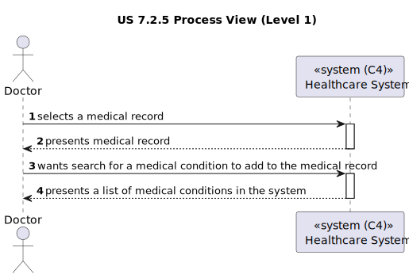

# US 7.2.5

<!-- TOC -->
* [US 7.2.5](#us-725)
  * [1. Context](#1-context)
  * [2. Requirements](#2-requirements)
  * [3. Analysis](#3-analysis)
    * [Domain Model](#domain-model)
  * [4. Design](#4-design)
    * [4.1. Realization](#41-realization)
    * [Process View](#process-view)
      * [Level 1](#level-1)
      * [Level 2](#level-2)
      * [Level 3](#level-3)
      * [4.1.3 Development View](#413-development-view)
      * [4.1.4 Physical View](#414-physical-view)
    * [4.2. Applied Patterns](#42-applied-patterns)
    * [4.2. Tests](#42-tests)
  * [5. Implementation](#5-implementation)
  * [6. Integration/Demonstration](#6-integrationdemonstration)
<!-- TOC -->


## 1. Context

* This is the first time this user story is being requested.

## 2. Requirements

**US 7.2.5:** As a Doctor, I want to search for Medical Conditions, so that I can use it to update the Patient Medical Record.

**Acceptance Criteria:**

**US 7.2.5.1:** The functionality must have a way to cancel the search when the doctor changes their mind, effectively
dividing this US's functionality into 2, searching and then possibly adding.

**US 7.2.5.2:** The functionality must implement a rudimentary search system to show the medical conditions that can be added.

**US 7.2.5.3:** The functionality must not show the already added medical conditions OR inform the user they already have been added.

**Dependencies/References:**

This feature is related to the existence of a patient profile (US 5.1.8) and a patient medical record (US 7.2.14).

**Client Clarifications:**

> **Question:** What do you define as Medical Condition? Is it an allergy?
>
> **Answer:** They are two different things. A Medical Condition represents a diagnosed health issue or disease. Examples: Diabetes, Hypertension, Asthma, etc.


> **Question:** Regarding User Story 7.2.5, we would like to confirm how the search for medical conditions should work. Should the search return all registered medical conditions, or should it allow filtering based on a specific parameter? If it’s based on a parameter, could you specify which one?
>
> **Answer:** This requirement is related to the adding/updating of an medical condition entry in the medical record. Thus, when the doctor is adding or editing a medical condition entry, they must be able to search for medical condition by code or designation instead of entering the "id" directly or selecting it from a drop down.


> **Question:** I would like to ask you if there is a list of medical conditions that you would prefer us to use in the system by default, and if so, which ones? We'd also like to ask if when you say “I want to search for Medical Conditions, so that I can use it to update the Patient Medical Record” what the last part implies?
Is the search done to immediately add to the patient profile or is it just a search done to get information about a medical condition, for example?
>
> **Answer:** 
> default medical conditions (ICD-11):
>
> * A04.0 Cholera
> * A08.0: Rotavirus enteritis
> * B20: Human Immunodeficiency Virus (HIV) disease
> * B50: Plasmodium falciparum malaria
> * 2A20.0: Malignant neoplasm of lung
> * 2F44.0: Malignant neoplasm of the breast
> * 3A01.1: Iron deficiency anemia
> * 4A44: Hereditary hemochromatosis
> * 5A11: Type 1 diabetes mellitus
> * 5B55: Obesity
> * 6A80: Major depressive disorder
> * 6C40: Generalized anxiety disorder
> * FB20.1: Osteoporosis with pathological fracture
> * FB81.1: Osteoarthritis of the knee
> * FB81.2: Osteoarthritis of the hip
> * FB80.1: Rheumatoid arthritis
> * FA24.0: Fracture of femur
> * FA22.0: Fracture of radius and ulna
> * FA21.0: Dislocation of shoulder
> * FB70.0: Low back pain
>
> > We would also like to ask if when you say “I want to search for Medical Conditions, so that I can use it to update the Patient Medical Record” what does the last part imply? when the doctor is editing the patient's medical record, he or she should have the possibility of inserting entries for allergies and/or medical conditions via allergy/medical condition search

## 3. Analysis

When a doctor is looking through a patient's medical record, he has the possibility of updating it. One of the areas that
is subject to change is the one regarding medical conditions.

The search for medical conditions will be integrated in the patient medical record update. This search will be used to add
medical conditions to the medical record.

Regarding backend, a method will be needed to retrieve all the medical conditions that are persisted within the database.

### Domain Model


## 4. Design

### 4.1. Realization

The logical, physical, development and scenario views diagrams are generic for all the use cases of the backoffice component.
These diagrams can be found in the [generic views diagrams compilation file](../../team-decisions/views/general-views.md).

The process view levels are here presented as they represent a process specific to each user story.

### Process View

#### Level 1



#### Level 2

As this level does not add any additional information regarding the user story's execution flow from level 1's diagram, 
it's diagram was deemed irrelevant.

#### Level 3

- _Visualization_


- _MDPatientManagement_

  

#### 4.1.3 Development View

The diagrams can be found in the [team decision views folder](../../team-decisions/views/general-views.md#3-development-view).

#### 4.1.4 Physical View

The diagrams can be found in the [team decision views folder](../../team-decisions/views/general-views.md#4-physical-view).
  
### 4.2. Applied Patterns

> #### **Repository Pattern**
>
>* **Components:** MedicalConditionRepository
>
> The repositories are responsible for data access and retrieval, separating the logic for interacting with the database
> from the services and other layers. This pattern helps in abstracting the persistence logic.


> #### **DTO (Data Transfer Object) Pattern**
>
>* **Components:** CreateAllergyDto
>
> DTOs are used to transfer data between layers, especially from the controller layer to the service layer or vice versa.
> The purpose is to carry data in a structured and decoupled way without exposing internal entity representations directly.
> This pattern does not need to follow business rules.


> #### **Facade Pattern**
>
>* **Components:** MedicalConditionService
>
> These services act as a Facade to simplify interaction with lower-level components like repositories. The Controller
> interacts with these service facades, keeping the complexity hidden from the higher layers.


### 4.2. Tests

This functionality was tested with:

* Unit tests for the controller.
* Unit tests for the service.
* Unit tests for the allergy entity.
* Integration tests for controller and service.
* Integration tests with Postman.
* Unit tests for the visualization component

## 5. Implementation

For this feature, all medical conditions are fetched.

```
public getAllMedicalConditions(): Observable<MedicalCondition[]> {
  const url = `${this.theServerURL}/medicalCondition/get-all-medical-conditions`;

  return this.http.get<MedicalCondition[]>(url, this.httpOptions)
    .pipe(
      map((data: MedicalCondition[]) => data.map(condition => condition), ),
      catchError(this.handleError<MedicalCondition[]>('Get Medical Condition', []))
    );
}
```

When a doctor adds a medical condition to a patient's medical record, a dropdown menu is displayed, allowing the doctor to choose the desired condition.

```
 <div>
          <p-dropdown [options]="allMedicalConditionsDesignations" #inputRef placeholder="Select Medical Condition">
          </p-dropdown>
          <button type="button" (click)="addMedicalCondition(inputRef.value)">Add</button>
        </div>

        <br>
```

```
addMedicalCondition(inputValue: string): void {
    console.log(inputValue);
    if (inputValue.trim()) {
      const fullCondition = this.allFullMedicalConditions.find(
        (condition) => condition.designation.toLowerCase() === inputValue.toLowerCase()
      );

      if (fullCondition) {
        const conditionExists = this.medicalRecord.medicalConditions.some(
          (condition) => condition.designation.toLowerCase() === fullCondition.designation.toLowerCase()
        );

        if (!conditionExists) {
          this.medicalRecord.medicalConditions.push({ ...fullCondition });
        } else {
          console.warn('Condition already exists in the list.');
          this.message.messageService.add('Condition already exists in the list.')
        }
      } else {
        console.warn('Condition not found in data.');
        this.message.messageService.add('Condition not found in data.')
      }
    }
  }
```

Once selected, the chosen condition is temporarily added to the medical record until the doctor confirms the completion of the editing process.

```
<div *ngFor="let condition of medicalRecord.medicalConditions; let i = index" class="blue-panel">
          <p><strong>Designation:</strong> {{ condition.designation || '-' }}</p>
          <p><strong>Description:</strong> {{ condition.description || 'No description.' }}</p>
          <p><strong>Symptoms:</strong> {{ condition.symptoms || 'No symptons described.' }}</p>
          <button (click)="removeMedicalCondition(i)">Remove</button>
          <br>
        </div>

```

## 6. Integration/Demonstration

For this functionality, all the medical conditions are retrieved.

When a doctor is adding a medical condition to a medical record, a dropdown appears for the doctor to select the medical
condition it desires.

If selected, a new entry is added to the medical record temporarily, until edition completion confirmation is obtained.
